# Effects of dark energy on the lensing power spectrum

One of the main goals of measuring cosmic shear is to make accurate and precise measurements of dark energy, and
hopefully provide constraints on the type of dark energy that we observe.
In order to do this, we need to understand how dark energy affects the theoretical lensing power spectrum.

As weak lensing is sensitive to the evolution of the matter distribution, we want to see how this varies as we
look into different models of dark energy. Here, we compare the standard ΛCDM model, where dark energy is a
cosmological constant with equation-of-state parameter _w_=-1, with the *w*CDM model, where the dark energy
equation-of-state varies with scale factor *a* as

 

as suggested in [astro-ph/0208512](https://arxiv.org/pdf/astro-ph/0208512.pdf).

Plotted below is the ratio of the total matter and dark energy densities as a function of scale factor, normalised
to the critical density, for both models where *w*0 = -0.9 and *w*a = 0.1.

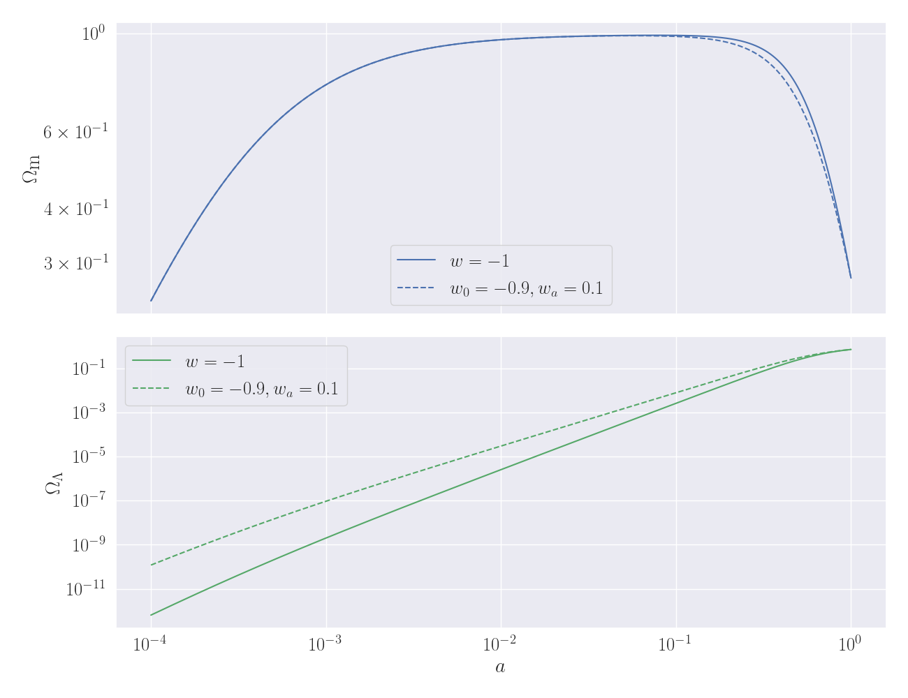

Here, we see that the evolution of the dark energy density is higher in the *w*CDM model over ΛCDM, which corresponds
to a slightly smaller matter density between *a*~0.1 and *a*~1. Since the matter density is smaller, we expect
to find slightly suppressed growth of structure in this model which would lead to a smaller lensing power spectrum.  
The lensing power spectra for these two models is plotted below, and follows what we expect given the above plot.

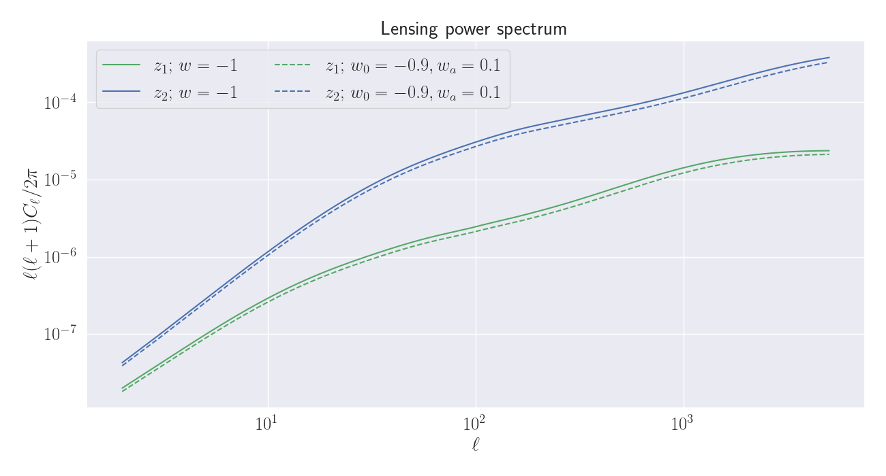

Here, we find that the *w*CDM model predicts a slightly smaller amplitude of the lensing power spectra, which makes
sense given the smaller matter density evolution in this model. We note that the two models predict the same shape
of the power spectrum, just slightly different amplitudes.

## Galaxy counts power spectum

We can also look at the effect of the varying dark energy equation-of-state parameter on the observed galaxy count density
power spectrum.

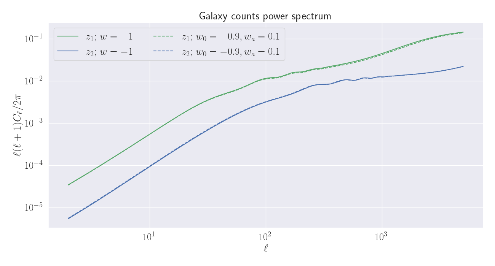

Here, we see that the difference between the two models are very small, and so a much smaller effect than that of the
different matter power spectrum, as shown below.

## Effects on the matter power spectrum

We can extend this analysis of the differences between the ΛCDM and *w*CDM models by looking at the raw matter
power spectrum. Of course the lensing power spectrum is just an extension of the matter power spectrum,
we expect to see the same features as above (the *w*CDM model having a smaller amplitude than ΛCDM), however as the matter
power spectrum can be constrained using multiple independent methods, it is a useful analysis to do.

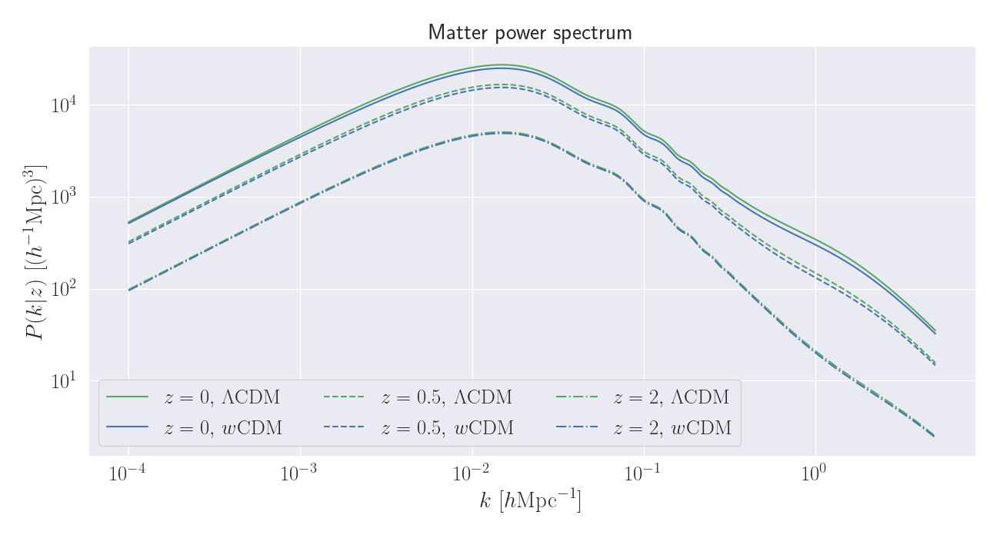

In this plot, we show the non-linear matter power spectrum at three redshifts for both models (same *w*0 and *w*a values
as above). We see that, as expected, the amplitude of the *w*CDM model is below that of the ΛCDM model, which is because
the additional dark energy density acts to create additional acceleration causing the growth of structure to be suppressed.  
To get a better idea of how the matter power spectrum is damped at each redshift bin, we can take the ratio of the *w*CDM
power spectrum with the ΛCDM one at each redshift value, which is shown below.

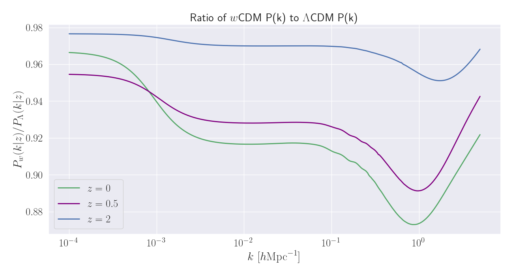

Here, we see that the effect of the additional dark energy serves to damp the matter power spectrum, with respect to
the fiducial ΛCDM model. We see that this damping effect grows with redshift, expect on the very largest scales.

## Degeneracy between decreased *A*s and dark energy

In the above plots, we have shown that an increase in the dark energy density over the universe's expansion history serves
to decrease the amplitude of the lensing power spectrum. This amplitude will be very tightly constrained by weak lensing
surveys, and so we need to know all tha factors that may affect this survey, not just the effects of dark energy.  
Since weak lensing arises from the large-scale structure of the universe, the amplitude of the weak lensing signal
is directly proportional to how much matter there is in between us and the source galaxy. This large-scale structure
has formed and evolved from the primordial density perturbations that were generated during inflation. The inflationary
power spectrum is usually characterised in the following way

 

where *k\** is the pivot scale, usually taken to be 0.05 Mpc-1, *A*_s is the scalar amplitude at the pivot
scale, and *n*_s is the scalar spectral index. Here, a value of *n*_s = 1 would indicate scale invariance, *n*_s < 1 is a
red spectrum, and *n*_s > 1 is a blue spectrum. Using this, we can take our previous two lensing power spectra for the
ΛCDM and *w*CDM models and change the *A*_s value for the ΛCDM model to reduce the lensing spectra. The results of this
is shown in the figure below.

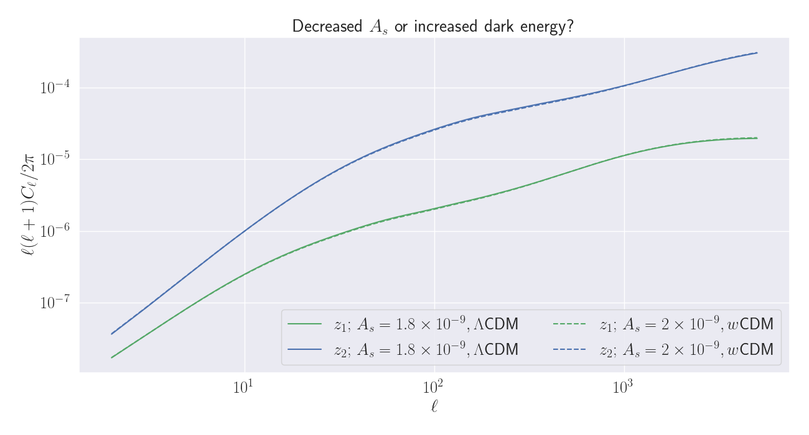

Here, we see that the two lensing power spectra are almost identical, which is because the decreased *A*_s value has
lowered the ΛCDM spectrum to the level of the *w*CDM spectrum. Hence, if we only measure the amplitude of the spectrum
it would be hard to distinguish if we have extra dark energy present or a lower primordial amplitude.

## Redshift evolution of the matter and lensing power spectra

In the above plots, we have shown that the effects of additional dark energy on the lensing and matter power spectra change
as we consider the redshift that we evaluate these spectra at. So here, we want to be able to accurately track the redshift
evolution of the perturbations for the two spectra for three different scales: a linear scale, a quasi-linear scale, and a fully non-linear scale. 

### Matter power spectrum evolution

We first consider the evolution of the matter power spectrum. To do so, we need to evaluate the non-linear matter power
spectrum over a range of redshift values. Here, we choose to evaluate it at 20 logarithmically-spaced *z* values from
*z* of 0.1 to 5. This is shown in the following figure:

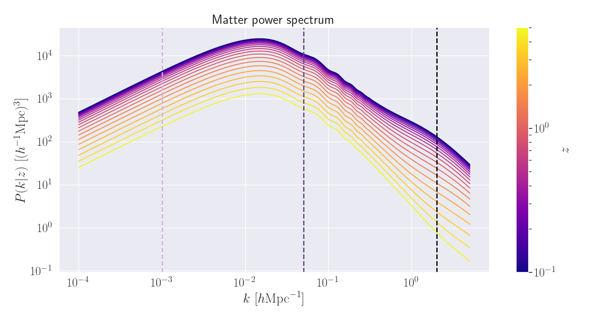

Here, we see the usual redshift evolution of the matter power spectrum, where the amplitude of the density perturbations
grow with redshift due to gravitational collapse.  
Now that we have the redshift evolution, we can focus on specific scales and see how they evolve with redshift. Here, we
have chosen three *k* wavenumbers: *k* = 1 x 10-3 for the linear scale, *k* = 5 x 10-2 for the
quasi-linear scale, and *k* = 2 x 100 for the non-linear scale. These are shown as the dashed vertical lines
on the above plot.  
Evaluating the matter power spectrum for the ΛCDM and *w*CDM models and extracting the amplitudes at these *k* values
gives us the following evolution plot.

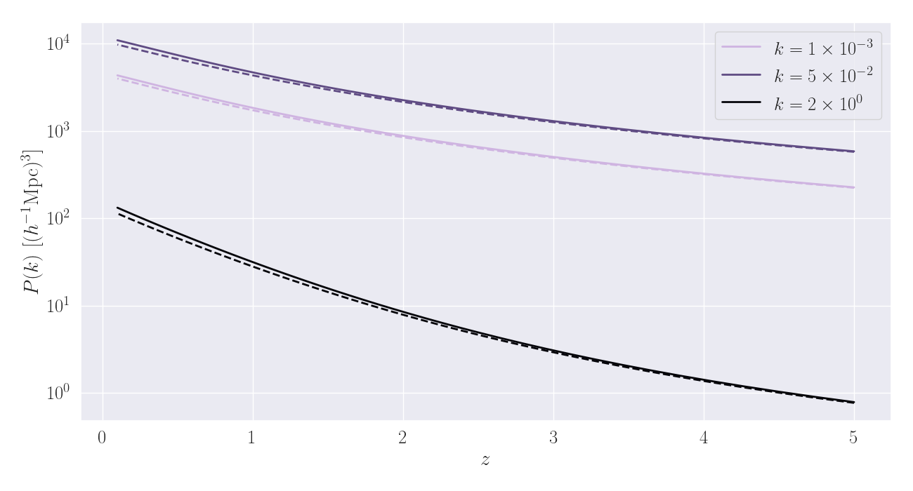

Here, the solid lines correspond to the ΛCDM model, and the dashed lines are for our *w*CDM model with *w*_0 = 0.9 and
*w_a* = 0.2.

### Lensing power spectrum evolution

We can repeat much of the same analysis as above, but now for the lensing power spectrum. Evaluating this on the same 20
redshift values gives us

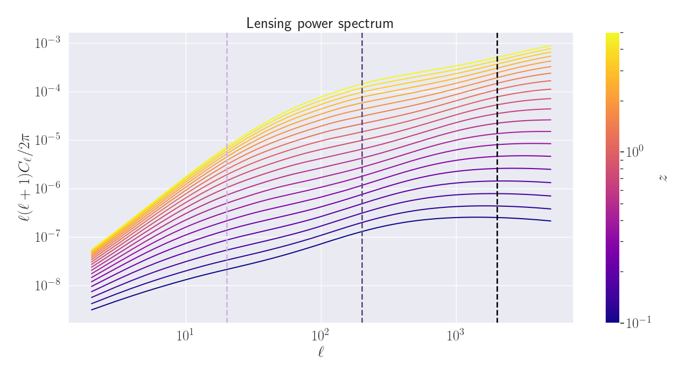

Where we now see that the amplitude of the spectra grow with redshift, because light has travelled further to get to us,
and so had more chances to be gravitationally deflected - and hence galaxy images are sheared more.  
Just like before, we have chosen three *l* values to probe the individual evolution of specific scales. Here, we look at
a linear scale of *l* = 20, a quasi-linear scale of *l* = 200, and a non-linear scale of *l* = 2000. Again, these correspond
to the dashed vertical lines on the above plot.

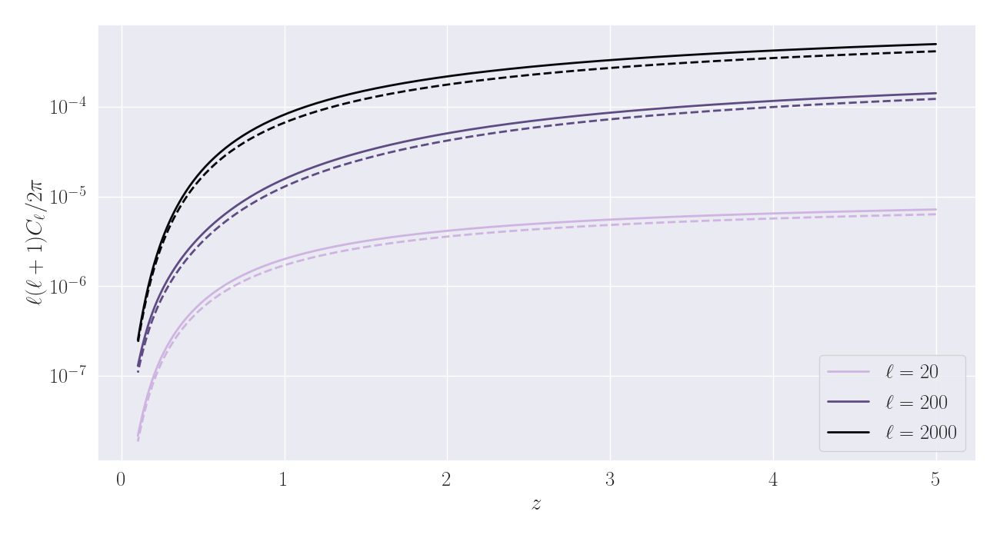

Again, the solid lines are for the ΛCDM model, whereas the dashed lines are for our *w*CDM model. We see that the
quasi-linear and non-linear scales continue to strongly grow in power as we increase the redshift past *z* of two, whereas
the linear scale grows a lot slower.  
We also see that the difference between our two models appears to be larger for the non-linear scales than the linear scales.

## Isolating σ8 dependence

In the above analysis of the *w*CDM model the comparisons between it and the ΛCDM model were done at fixed *A*_s values
(as described above). Then due to the different evolution of the matter perturbations in the two models, the amplitude of the
matter power spectrum today, which is characterised by the observable parameter σ8, is different. However, as we only measure
one value for σ8, what we want to do is to construct our two models such that they give the same σ8 value today and see
if there are any other changes between the two models that may allow us to discriminate between the two models. This is
important as just measuring an amplitude doesn't allow us to constrain the physics of the universe, which is what we are
trying to do.

### A_s as a function of σ8

As σ8 is a derived parameter for a model in CAMB, not an input parameter, we need to work out how σ8 responds to changes
in the primordial density perturbations through A_s. This would then allow us to work out what the corresponding A_s value
would have to be given a σ8 value today.  
To do so, we can run our two models with a range of A_s values and compute the value of σ8 for each of them. Here,
we use a range of 50 A_s values from 1E-9 to 3E-9, which encompasses the observed value of around 2.1E-9.
This gives the following plot

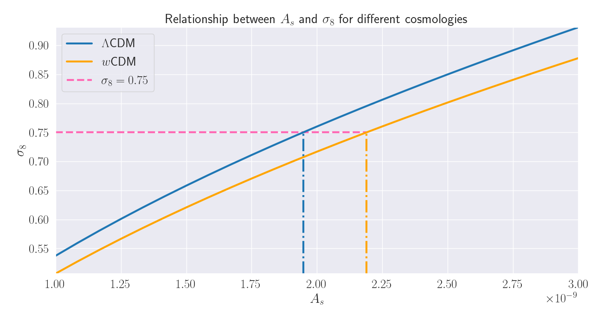

Here, we can see that for a given value of A_s, the *w*CDM model predicts a lower value for σ8 than ΛCDM, which is what
we expected. We can now choose a fiducial value for σ8 which we want both models to predict. This was chosen to be
σ8 = 0.75, as is roughly around the observed value today. This is shown as the dashed horizontal pink line in the above plot.  
From this, we now need to know what values of A_s give this value of σ8. To do so, we numerically inverted this
relationship in the above plot by fitting a cubic spline where the "x" values are the σ8 values, and the "y" values are
the A_s values. Doing so gives us the two A_s values as shown in the dashed vertical blue and orange lines, that exactly
intercept the curves at the correct σ8 value.

### The lensing and matter power spectra with this A_s

Now that we have the required A_s values which give us the correct σ8 values today, we can compute the matter and lensing
power spectra using these. For the matter power spectrum, we find

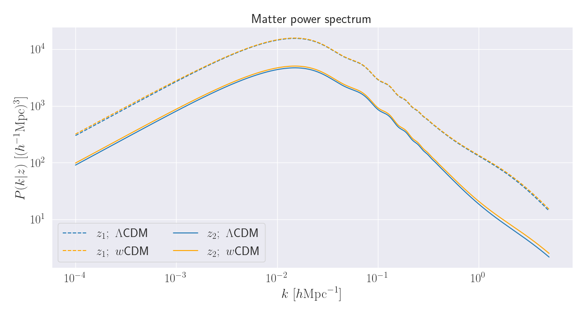

Here, z1 = 0.5 and z2 = 2. We see that for the earlier redshift curves (z2), the *w*CDM model predicts a larger amplitude than
ΛCDM. While this difference does decrease when looking at z1, it is noticeable, especially at very large *and* very
small scales.  
Now evaluating the lensing power spectrum, we find

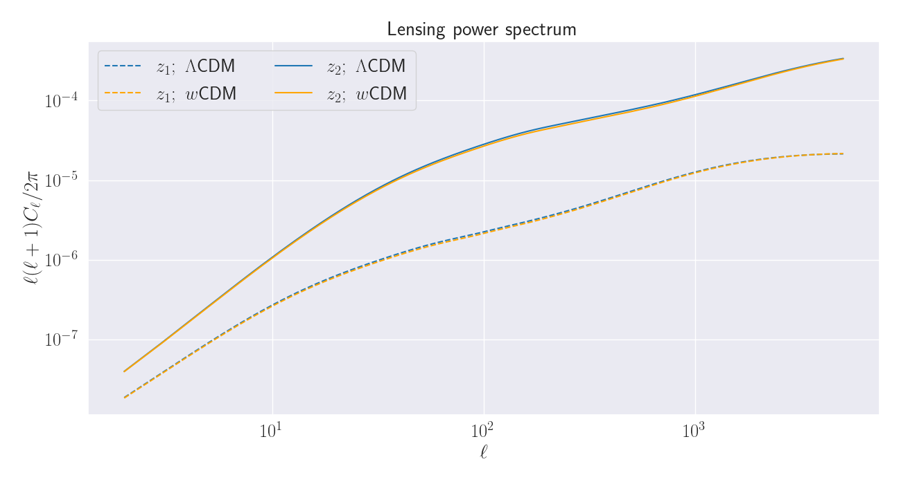

Here, we see the opposite effect to above - the ΛCDM lines are above the *w*CDM lines at a given redshift.  
We can plot the ratio of our *w*CDM model with respect to ΛCDM for these four lines, which gives

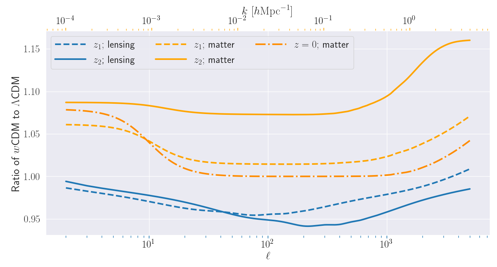

Here, we have plotted the lensing ratios as a function of *l* on the lower *x*-axis, and the matter ratios as a function
of *k* on the upper *x*-axis, for easier comparison between the two models. We see that the lensing power spectra is
almost always smaller for *w*CDM than for ΛCDM, while the matter spectra is always larger, and for the z2 line this is
significantly larger. Also plotted here is the z=0 matter power spectrum ratio, as so we can see that the ratio is
one for the majority of the linear scales, which shows that our normalisation of the σ8 values was correctly done.  
It is interesting to see that on very large and very non-linear scales, the matter power spectrum is significantly
larger for *w*CDM over ΛCDM, which suggests that different scales evolve differently when we introduce evolving dark energy
into the universe's evolution. Hence, the way different scales evolves could be a way to discriminate between different
models of dark energy.

## Differences between w_0 and w_a

In the above discussions, we have been looking at the effects of changing the dark energy equation of state in two ways:
firstly the value today, and secondly its evolution with scale factor as the universe expands. Recalling that we can
parametrise this evolution in the following way

 

we find that we have two values for each model, w_0 and w_a. Hence, we wish to be able to isolate the affects of changing
w_0 or w_a individually and seeing what changes in the observed spectra.

First, we will look at the evolution of the ratio of the matter and dark energy densities with respect to the critical
density, as a function of scale factor. We do this for three models

* The ΛCDM model where dark energy is a fixed cosmological constant, hence w_0 = -1 and w_a = 0,
* A wCDM model where we still have a fixed equation-of-state, but now slightly more positive at w_0 = -0.8 and w_a = 0,
* A wCDM model but where we now consider an evolving equation-of-state where we still have w_0=-1 today, but w_a=0.2

We note that as a -> 0, both wCDM models predict the same equation-of-state value. Calculating the evolution gives us:

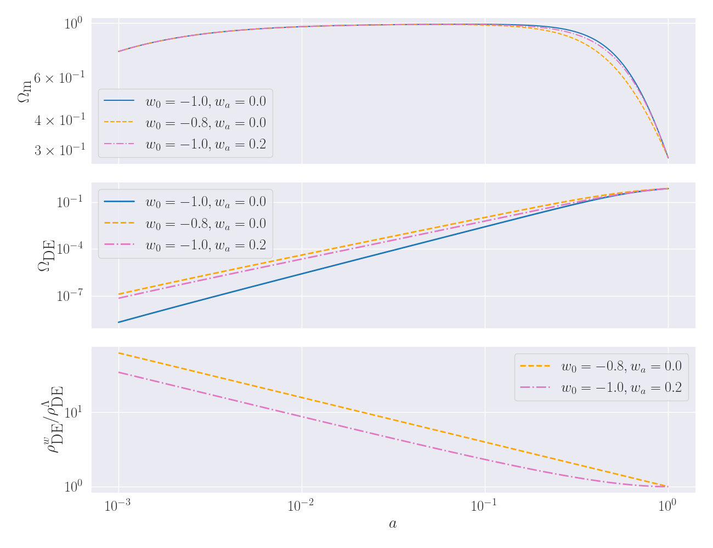

Here, we see that both wCDM models predict a larger dark energy component in the past, and so both predict a lower matter
density at low redshifts. It is interesting to see that the increased dark energy in the third model where we increased
w_a takes a while to kick-in as we look back at decreasing *a*.

### Matter power spectrum

Now that we have the background evolution of our three models, we can see what the matter power spectrum looks like in these
models. Here, z1 = 0.5 and z2 = 2, as usual.

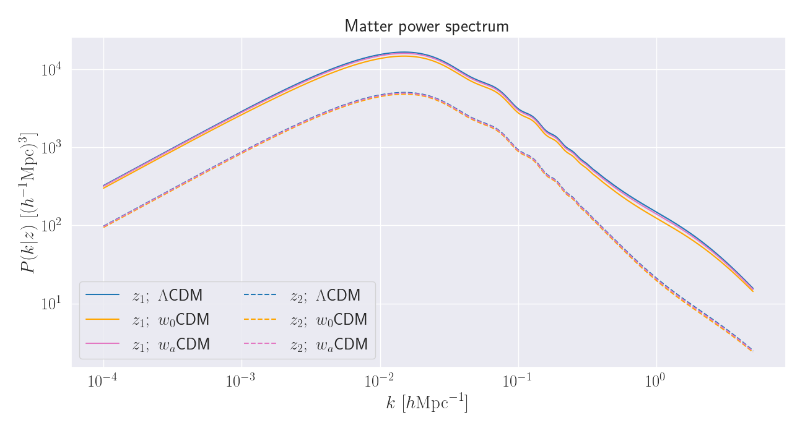

Here, we can just about see that the model with a lower value of w0 predicts a much smaller matter power spectra, whereas
the model with an increased wa value predicts only very smaller values for the spectra. To quantify these differences, we
can take the ratios of the wCDM models with respect to the ΛCDM model

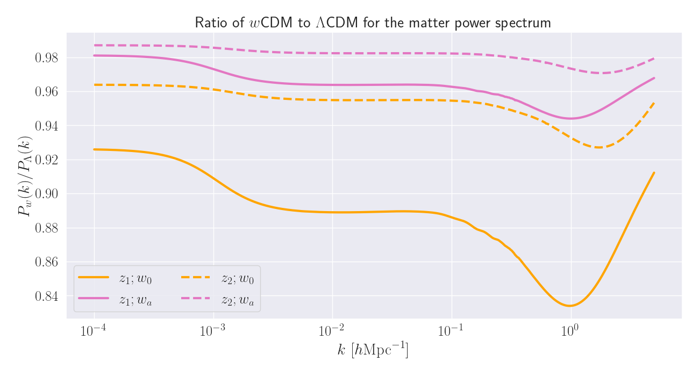

This confirms that by changing the equation-of-state parameter w_0 for the whole evolution causes the largest affect
on the growth of structure as the additional expansion suppresses growth. We also see this characteristic "spoon"-like
behaviour that is present in both models at both redshifts.

### Lensing power spectrum

We can now repeat the same analysis, but now for the lensing power spectrum. Evaluating this for the same models and
redshifts as above gives us

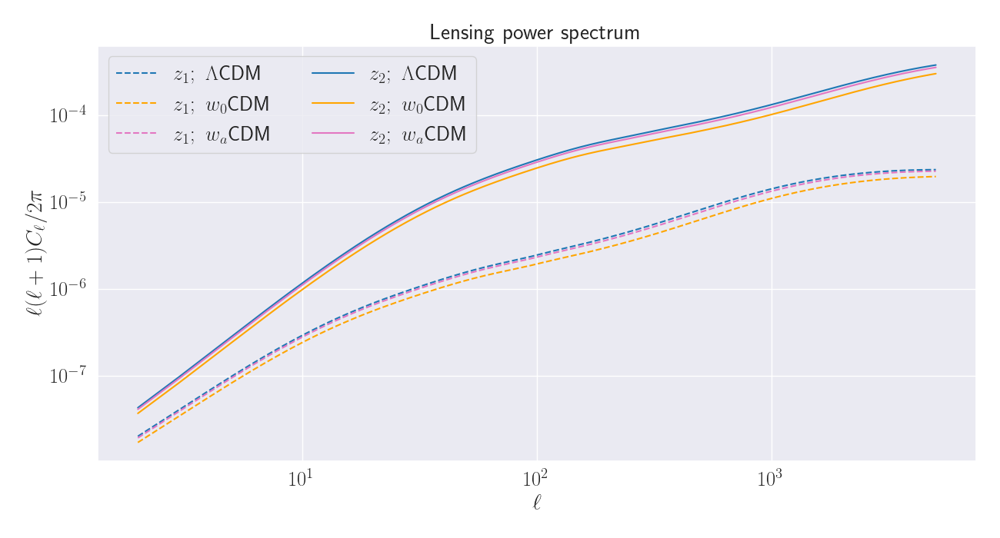
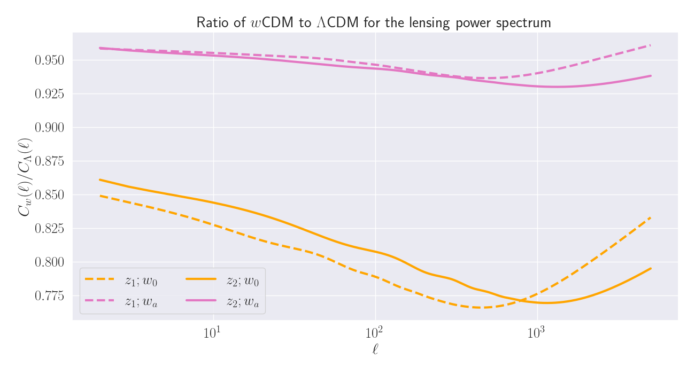

This is exactly as expected given the matter power spectra, the model changing w0 has the largest difference in lensing
power, whereas increasing wa has a much smaller effect.  
We note that the differences in the lensing power spectra is slightly larger than for the matter power spectra, especially
when considering both redshift bins.

# The effects of massive neutrinos

It is widely accepted that neutrinos have mass, but how *much* mass they have is still up for debate. So far, the best
constraints on neutrino masses come from the sum of the individual neutrino masses, Σmν. The latest constraints on
this value comes from Planck 2018 and is

 

which restricts the neutrinos to have quite a small mass, but still not massless!  
Given then non-zero mass, we can now ask what are their effects on the matter and lensing power spectra? To do so, we first
construct a model where all neutrinos are massless, and then calculate results for different sum of the neutrino masses.

## Changing the sum of the neutrino masses

The first thing that we looked at was changing the sum of the neutrino masses. We considered three models

* The first where all neutrinos are massless, i.e. Σmν = 0, to get a base level
* Secondly, where Σmν = 0.10 eV, which is well within the allowed tolerances from Planck, giving reasonable predictions
  for the actual neutrino masses
* Lastly, where Σmν = 0.25 eV, which is larger than the allowed bounds, but lets us exaggerate the effects of neutrinos
  significantly.

### Matter power spectrum

First, let's look at the effects of neutrinos on the matter power spectrum

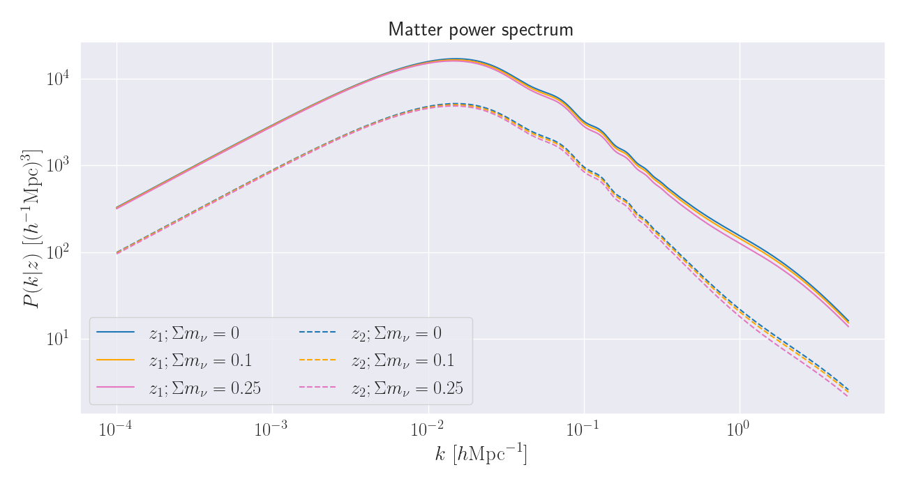

Here, we see that as we increase the sum of the neutrino masses, the large-scale perturbations (small *k*) are relatively
unchanged, however the small-scale, non-linear perturbations are significantly suppressed. This makes sense for two reasons:

1. Neutrinos originally start off as ultra-relativistic particles in the very early universe, and so their energy density
   originally decays as a-4, like radiation. But, as they have a non-zero mass, they later transition to being
   more like ordinary matter, and so their density decays like a-3. This modifies the expansion rate through
   the Friedmann equation, and so we expect the growth of structure to be different for different masses.

2. As neutrinos still move very fast even in the late universe, they can stream out of high-density regions and so damp
   the growth of structure on small-scales. Perturbations on scales smaller than this typical distance that the neutrinos
   can travel are suppressed.

We can look at the detailed differences between our three lines by taking the ratio of the two massive neutrino lines
with respect to the massless neutrinos prediction.

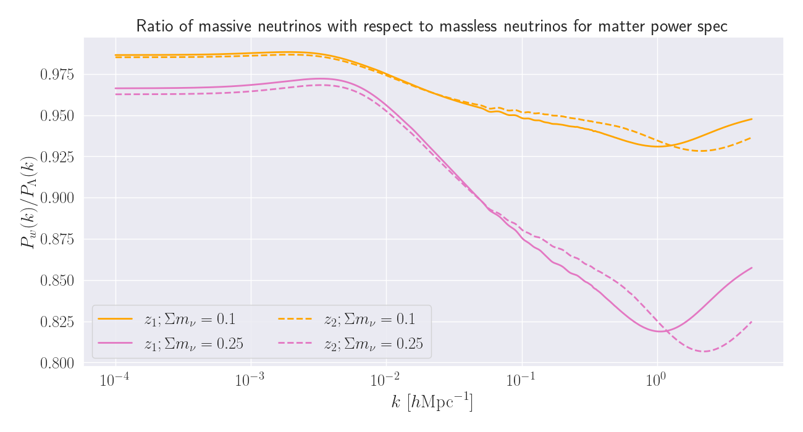

Here, we see this characteristic suppression of the density perturbations on small scales due to this free-streaming.
We also see that this damping behaviour is almost independent of the redshift that we observe the matter power spectrum at.

### Lensing power spectrum

We can now repeat the same analysis, but now looking at the lensing power spectrum

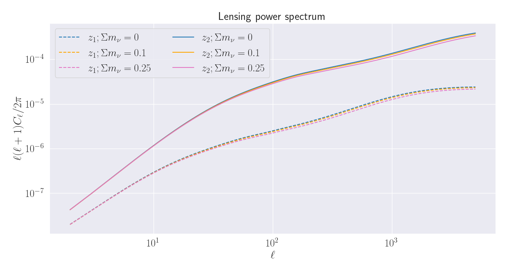

Here, we see the same structure as seen in the matter power spectrum, the small-scale perturbations are suppressed when
increasing the total neutrino masses, and so there is less weak lensing from large-scale structure.

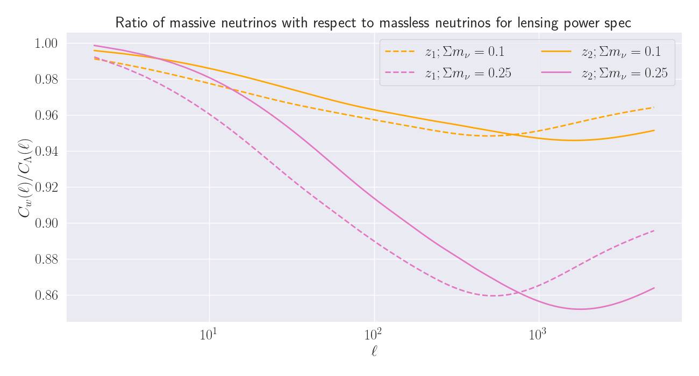

Taking the ratios yield the same results as before, the more massive neutrinos are the more damped the small-scale
perturbations are.

## Changing the number of massive neutrinos

By default, CAMB assumes that there is a single massive neutrino that has all of the mass with two massless neutrinos.
We can change this by manually specifying that there should be three massive neutrinos that have their masses sum to the
provided mass. Their individual masses could then be given by either the 'normal' or 'inverted' mass hierarchy.

To look into how this small affect changes the power spectra, we can take the ratio of the prediction for three massive
neutrinos with respect to a single massive neutrinos, for different total neutrino masses.

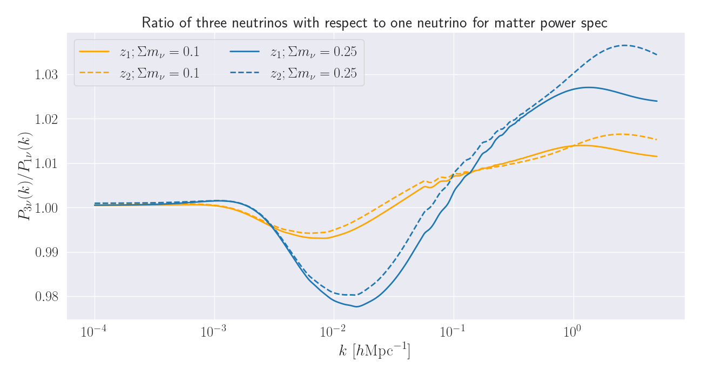

Here, we see some very interesting results: on the very largest scales both models predict the same amplitude, but as we
go to smaller scales (but still well within the linear regime) the prediction for three neutrinos falls significantly below
that for one massive neutrino. This then rises up again when looking at very non-linear scales.  
These effects are present for both sums of neutrino masses, but is more exaggerated for the heavier neutrinos.

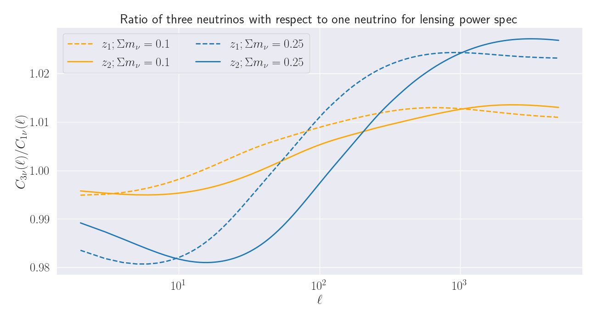

We see the same story when looking at the lensing power spectrum, on the largest scales the three neutrinos power spectrum
falls below that of one massive neutrino, but then rises up on the non-linear scales.

We note that the deviation between these models peaks at around +/- 2% in both spectra.

## Effects of neutrinos on the energy densities

### Decreased dark energy density

In the above plots, we have change the sum of the neutrinos masses while keeping the cold dark matter and baryon densities
today fixed. Furthermore, as we required that our models are for a flat universe (*K* = 0), we find that as we increase
the energy density from neutrinos, we must decrease the dark energy density. We can quantify by taking the ratio of the
dark energy density of the massive neutrino cases with the massless neutrinos, to give

* 99.7% for Σmν = 0.10 eV
* 99.2% for Σmν = 0.25 eV

We see that while this is only a very small difference, the reduced dark energy can have a considerable effect on the
evolution of the universe, such as delaying the epoch of acceleration.

### Decreased matter density parameter

While we are fixing the CDM and baryon density parameters today in our models, the increased neutrino energy density
will serve to decrease the matter density parameter Ωm in the past. We can quantify this difference by plotting the evolution
of Ωm as a function of the scale factor for three different neutrino masses

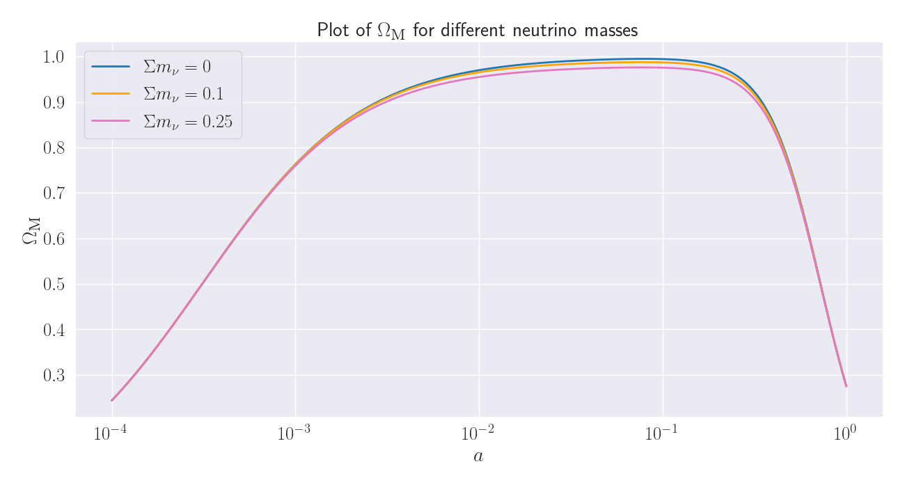

Here we see that as we increase the sum of the neutrino masses, we get a lower value of Ωm. Then as the lensing power
spectrum is proportional to Ωm2, we would naturally expect to see a lower amplitude for larger neutrino masses.

### Increased total energy density

Above, we saw that for increased neutrino masses, Ωm decreased. We also saw that the dark energy density must be smaller
for increased neutrino masses too. From this, we can then ask what the evolution of the total energy density is as we change
the neutrino masses. Here, we take the ratio of the total energy density (from matter, dark energy, radiation, and neutrinos)
for the case of massive neutrinos with respect to the massless neutrino scenario, which gives us

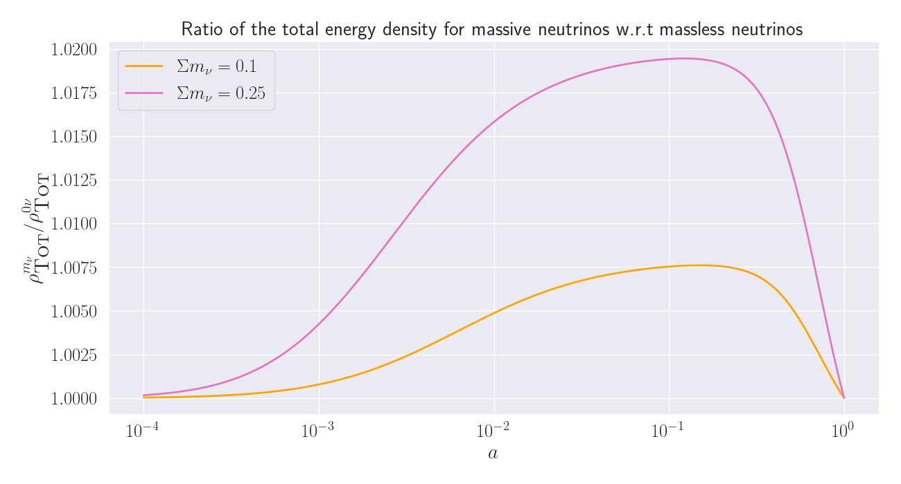

Here, we see that as we increase the neutrino masses we are also increasing the total energy density of the universe,
even though we're having to decrease the dark energy density to compensate.

## Effects of neutrinos on the perturbations

In our above plots, we have seen that the effects of neutrino masses have different effects depending on the scale
of interest. To investigate this further, we can look at how different neutrino masses directly affect the evolution
of the density variables δi. These are defined, for a species *i*, as

 

Hence, these quantify how large the perturbations in the density fields are relative to the mean density.

Here, we evaluate the baryon and cold dark matter density contrasts, along with the "total" density contrast which is
defined as

 

and so we see how the total density contrast evolves for different neutrino masses.  
We evaluate these density contrasts on three different scales: a linear scale of *k* = 1E-3, a quasi-linear scale of
*k* = 5E-2, and a non-linear scale of *k* = 2.

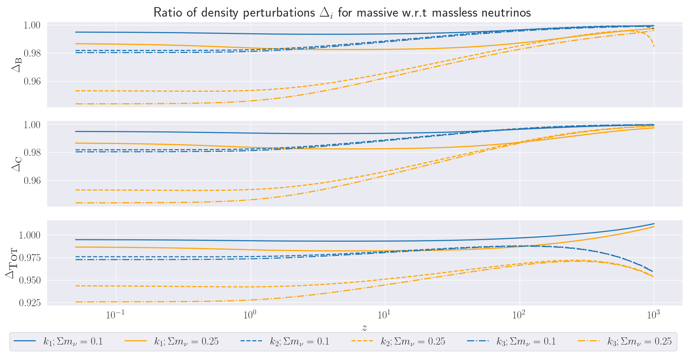

Here, we see what we generally expected from the effects of massive neutrinos: the larger the sum of the neutrino masses
the more the perturbations are damped, and smaller-scales are suppressed more than larger ones.

## Isolating σ8 dependence on neutrino masses

In the above investigation of how different neutrino masses affect the matter and lensing power spectra, we have been
running our simulations with fixed initial conditions: that is we fix As and ns for all models and just vary the neutrino
mass. However, as we can accurately determine the amplitude of the matter power spectrum today, which is parametrised by
σ8, regardless of neutrino masses, we can fix this value and work out what the new spectra are.

### σ8 as a function of As

First, as σ8 is not an input parameter to a CAMB model, we need to run a verity of models with different As values to
compute what the expected σ8 value. This then allows us to invert this relationship to find the approximate value of As
that would give the same σ8 values between the models. Here, we look at five different models

* Σmν = 0, to get a base level of no neutrino masses
* Σmν = 0.10 eV, with both one and three massive neutrinos
* Σmν = 0.25 eV, again with both one and three massive neutrinos

Computing this for our five models gives us

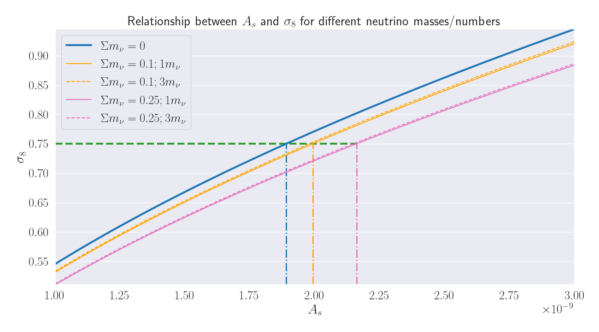

Hence, we now have five different As values that all give the same σ8 value once the models have been evolved to today.

### Effects on the matter power spectrum

First, we looked at evaluating the matter power spectrum for our five models at two redshifts: the solid lines corresponds
to *z* of two, whereas the dashed lines are for *z* = 0.5.

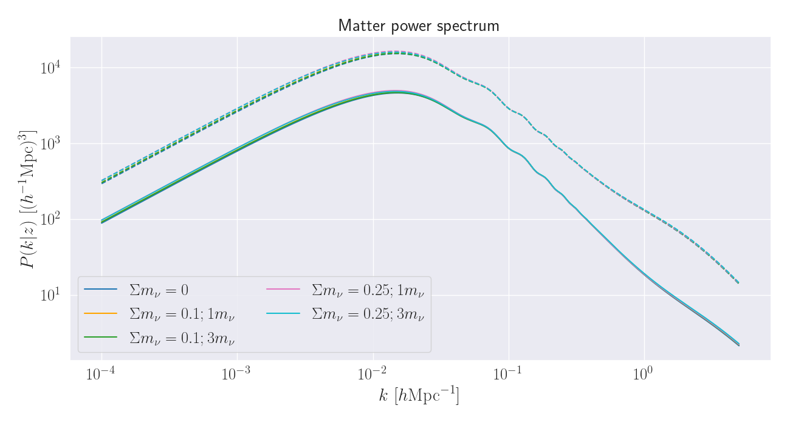

Here, we can (just about) see that the lines for the increased neutrino mass are slightly above the massless neutrino case
on both the very large scales, and very small scales, with the lines merging at intermediate scales. This makes sense as
we have normalised the amplitude at a specific scale, but the detailed physics of increasing the neutrino masses causes
different scales to evolve differently.

To get a better idea of how the different scales evolve when we fix σ8, we can take the ratio of the lines for the
massive neutrino cases with the massless neutrino case, to give

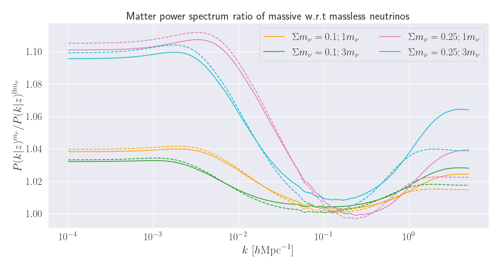

Here, we see that on both very large and small scales, the amplitude of our massive neutrinos is larger than for
massless neutrinos, with this effect growing with the neutrino masses. We also note that there is quite a large redshift
dependence on this growth, especially for the very non-linear scales.

### Effects on the lensing power spectrum

We can now repeat the same analysis, but focusing on the lensing power spectrum now. Here, we use the same five models
and the same two redshift bins, again where the solid lines correspond to *z* of two, whereas the dashed lines
are for *z* = 0.5.

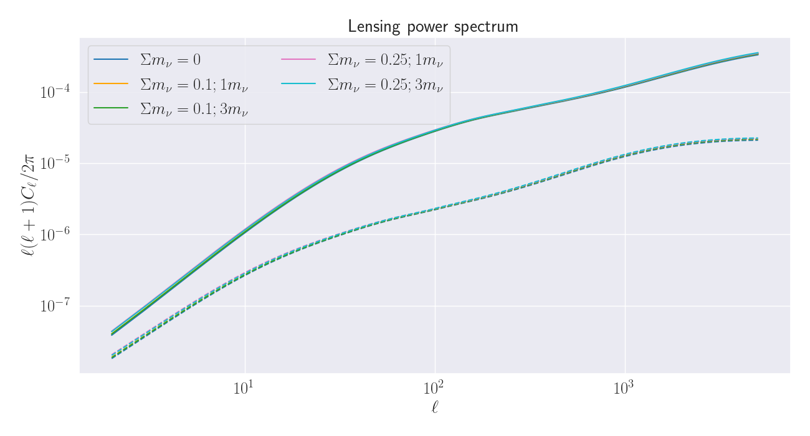

Again, we can just about see that as we increase the neutrino masses, we see that the lensing power spectrum has a larger
amplitude. However, to get a better view of this we again take the ratios

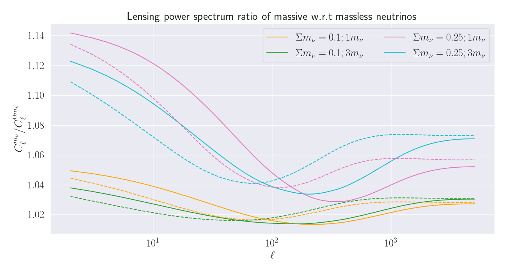

Here, we see the same behaviour as the matter power spectrum: a large increase in power on both the very large scales
(small *l*) and very small scales (large *l*). This difference clearly grows as we increase the neutrino masses, and
is larger for only one massive neutrino than for three massive neutrinos. We also see a strong redshift dependence here.
