# Fisher Matrices

So far, when trying to get parameter constraints I have been using an ensemble of MCMC simulations and averaging their results.
This is quite a slow process as each MCMC simulation can take a while to run, with this increasing dramatically when
many parameters are being sampled over, and the need for many simulations to be run to get accurate ensemble statistics.
Instead, we can use the parameter's Fisher matrix to find approximate parameter constraints much faster as we don't need
to run costly MCMC simulations and can simply evaluate the Fisher matrix. Here, we are evaluating the Fisher matrix
as written in Equation 128 of [1910.09273](https://arxiv.org/pdf/1910.09273.pdf), which evaluates the derivatives of the
Cl coefficients for each parameter for each redshift bin combination and each ell mode independently.

To ensure that we have coded up the Fisher matrix correctly, we can compare the parameter constraints obtained from
the Fisher matrix to those from an MCMC run, which gives

Note that we have used the covariance matrix for the MCMC simulation, and so does not necessarily capture the
non-Gaussian nature of the MCMC analysis. Here, we see excellent agreement between the two methods, and so I am confident
in my Fisher matrix implementation.

## Using Fisher matrices to predict 3x2pt data

The above implementation of the Fisher matrix was for three redshift bins using cosmic shear only. This gave us six
unique spectra, and so while the Cl covariance matrix was a 6x6 matrix, it was possible to compute and code-up by hand.
However, as we want to extend our analysis to galaxy counts spectra and the galaxy-shear cross-spectra, this would give
us 21 unique spectra. This would give us a 21x21 Cl covariance matrix, which is certainly unfeasible to compute by-hand.
Thus, an automated method to compute it was needed and implemented efficiently.  
Using this, we can compute the individual Fisher matrices for the cosmic shear spectra and then galaxy number counts
spectra only, and then the combined Fisher matrix. This gives us

Here, we see that cosmic shear only provides good constraints on Omega_c and _h_, whereas number counts only provide
good constraints on sigma_8, and so combining both probes (and then adding their cross-spectra) provides the tightest
constraints. It is also interesting to see that the degeneracy direction differs between the probes, which is
another useful thing when combining probes.

## Applying this to dark energy

Now that we have a general formalism to compute the Fisher matrix, we can apply this to any combination of cosmological
parameters that `CCL` accepts. Here, we can use it to look at how the dark energy constraints as a function of the
number of ell-modes in our Cl data vector. When we consider three values of ell_max, of 128, 512, and 2048, we find

We can then turn these contours into a single value called the Figure-of-Merit, which encodes how tight the w0-wa
contour is, and gives

This shows that the FoM increases with some power-law as a function of the maximum ell-mode available, and so for any
analysis it is important to include as many ell-modes as possible.

## Pseudo-Cl vs QML for parameter constraints

Here, we are taking the Cl Fisher matrix for the QML method and the Gaussian covariance matrices for the Pseudo-Cl
method as the Cl covariance matrices for our two different methods and running them through my parameter Fisher pipeline.
Here, we are using both the QML method where we have used the (very costly) analytic Fisher matrix and the approximation
of the Fisher matrix using the covariance matrix of the y_l_ values.

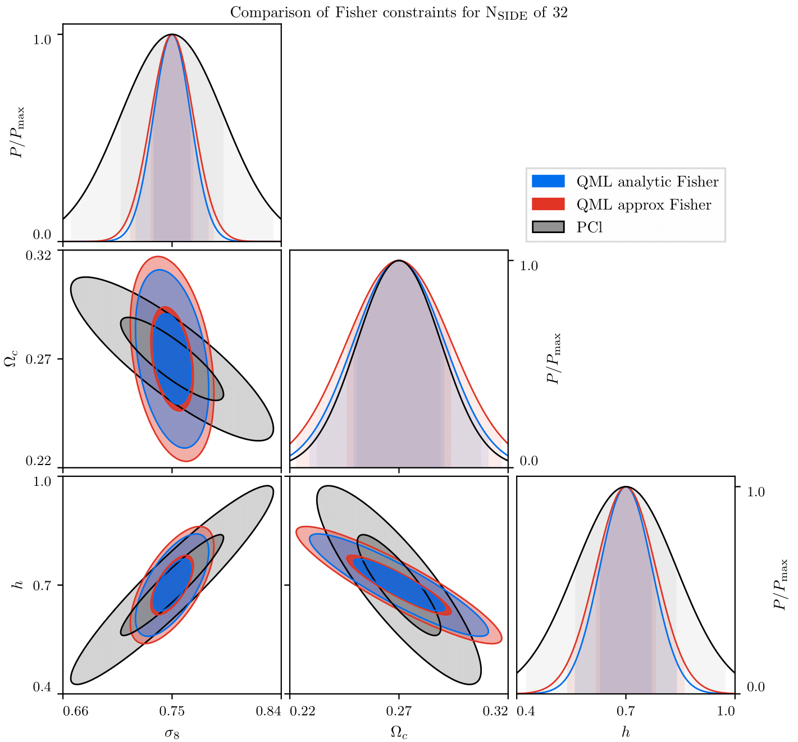

## Properly implementing the Cl Fisher matrix

In my previous QML calculations, I used a naive assumption that the Cl values for a spectra XY was composed of the 
y_l values for that spectra deconvolved with the specific Fisher matrix elements belonging to XY. This is not the case,
as the Cl values for any spectra are a result of the deconvolution of the _entire_ array of y_l values with the **full**
Fisher matrix. My approximation works in the noise-dominated case, as seen before, as then the off-diagonals in the
Fisher matrix are suppressed. With the full pipeline now in place, the results for the Cl variances are as follows:

### TT

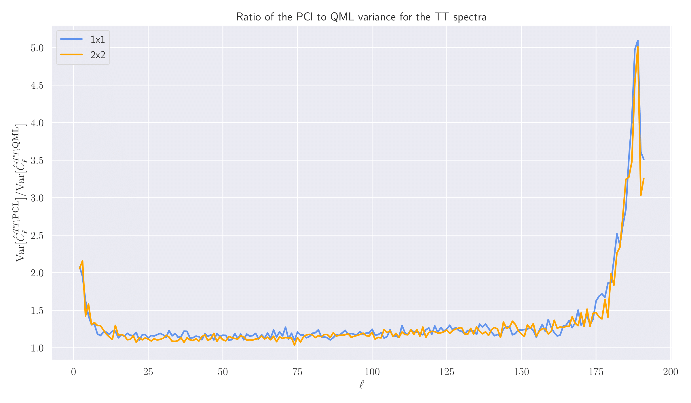

### EE

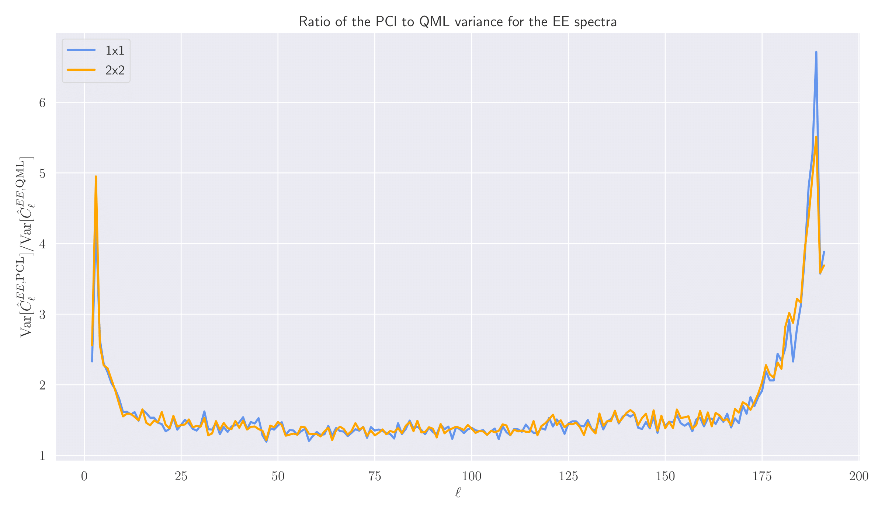

### TE

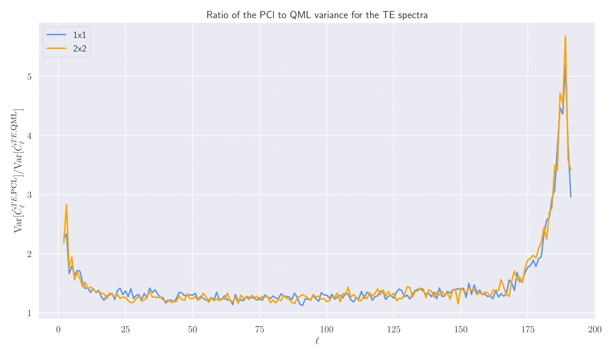

Ignoring the right-hand edge of all these plots, where we are above _l_ > 2 * Nside, we see that the ratio 
of the variances for all three non-zero spectra are consistently above one, which indicates that QML might not tend to
the Pseudo-Cl estimator at high _l_ values, as previously thought. Hence, it is important to push our QML estimators to
larger and larger resolutions to see if this trend continues, or the ratio decays to one eventually.

## Propagating the correct variances to constraints on dark energy

Now that my QML pipeline is working correctly for one redshift bin, we can compute the Fisher matrix for the dark
energy parameters up to an _l_max of 128, giving us

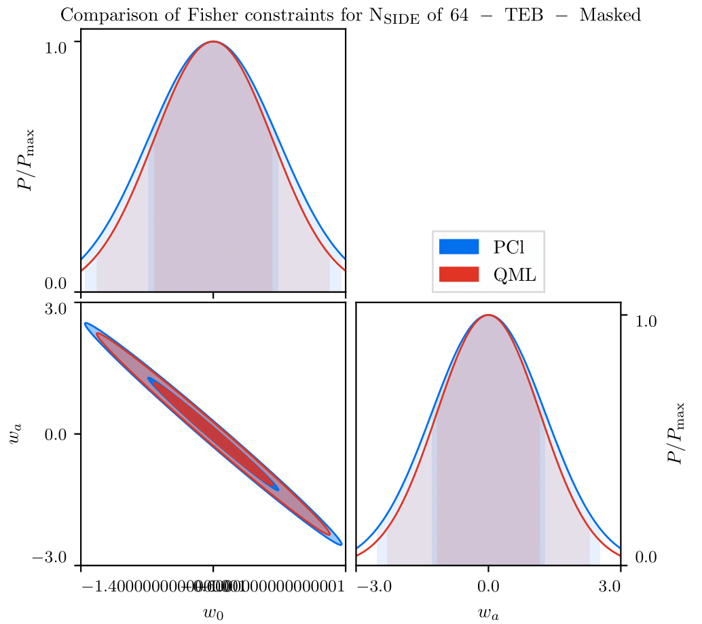

Here we see moderately decreased contours for the QML method over Pseudo-Cls, which we would expect from looking at
the variances alone. However, it is to be noted that the Fisher matrix calculation uses the variances and covariances
of all combinations of Cls, and thus even though the variances of the Cl values may be smaller for QML over PCl,
the off-diagonal terms in the Cl covariance matrix still need to be studied.

## Comparisons of the Figure-of-Merit for different spectra and Nside

Now that I have a pipeline that can produce estimates of the dark energy Figure-of-Merit (FoM) for different spectra
(TT only, EE only, TT EE and TE combined), we can investigate how the FoM changes with resolution for these different 
probes:

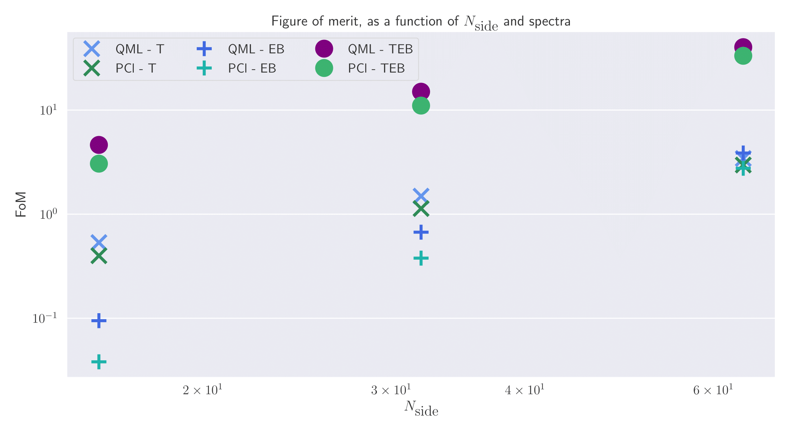

Here we see some interesting behaviour: on a log-log plot it appears that the FoM increases linearly with the
resolution of the map, with QML being slightly more constraining than PCl - though the difference shrinks with 
resolution. We also see that initially, the TT spectra were more constraining than the EE modes, however they both
converg to the same accuracy when increasing the resolution.

## Fisher forecasts using numerical Cl-Fisher matrices

Now that we have an implementation of our numerical Fisher matrices, we can extend our analysis of how the figure of
merit changes between QML and PCl to larger values of Nside.

### The number of maps doesn't seem to matter

When computing the Fisher matrix via finite-differences, it is essential to average over enough maps to get an accurate
prediction for the Cl Fisher matrix. If we look at using only five maps, we can take the ratio of the numerically-estimated
and the analytically-evaluated Cl-Fisher matrices, to get

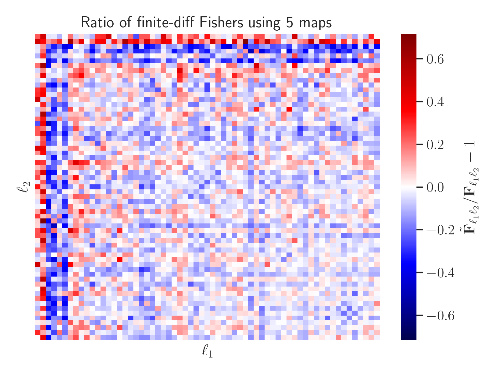

Here, we can see that these ratios are quite large, with over a ±60% error, which is not very precise at all! However,
if we increase the number of maps to five hundred (and thus increase the computational time by a factor of one hundred),
we find the accuracy of the obtained Fisher matrix is vastly improved:

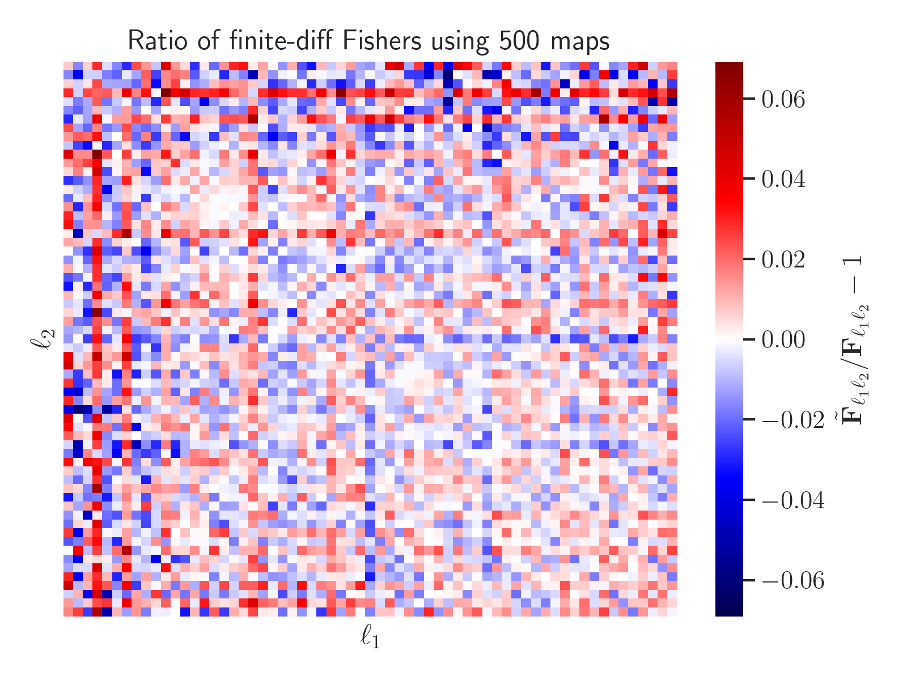

Here, we see an order of magnitude decrease in the ratio, which shows that it's much more accurate.

Knowing that the Cl-Fisher matrix's accuracy vastly improves when averaging over more maps, we can ask if this difference
propagates into the parameter's Fisher matrix. Surprisingly, we find that it makes an almost negligible difference here
when comparing 5 and 500 maps:

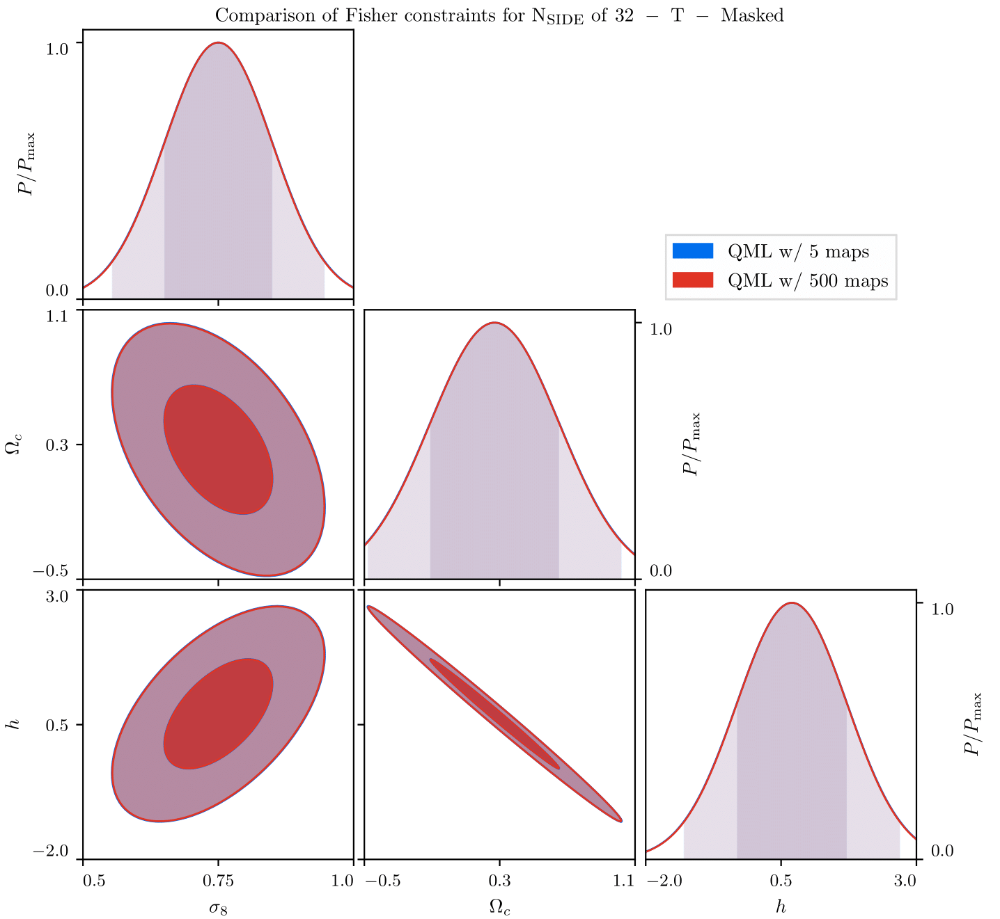

Here, we see that all parameter contours are practically on top of each other, and thus we can use only a handful of
maps to average over.

### Extending Nside

Previously, we were limited by RAM constraints to maps with Nside 64 or less. However, we can extend to at least an
Nside of 128 using our new method, giving:

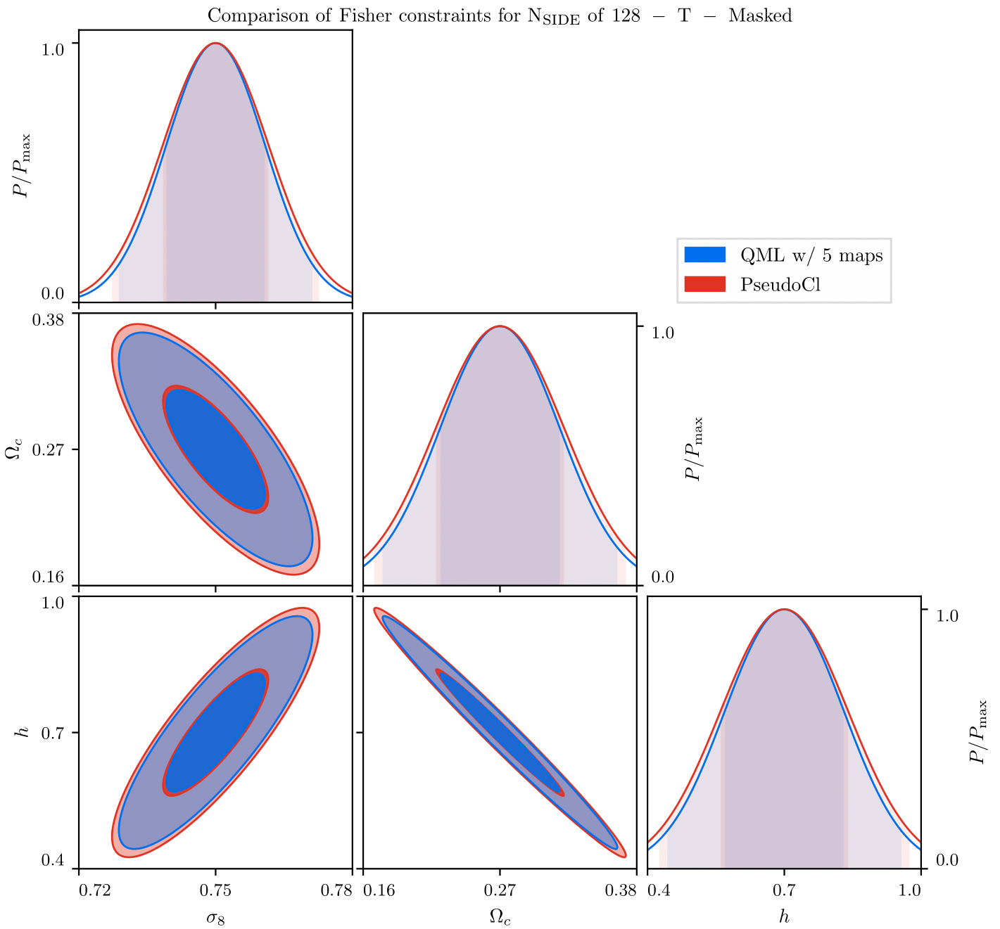

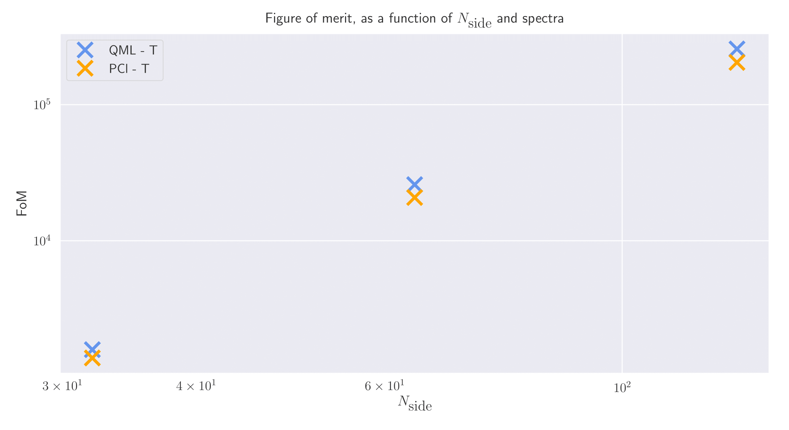

## Looking at the diagonals of the Fisher matrix

Above, we have seen that as we increase the number of maps that we average over, the accuracy of numerical Cl-Fisher
matrix improves. Here, we specifically want to see how the diagonal values (which carry most of the signal in the
Fisher matrix) responds to an increase in the number of maps used:

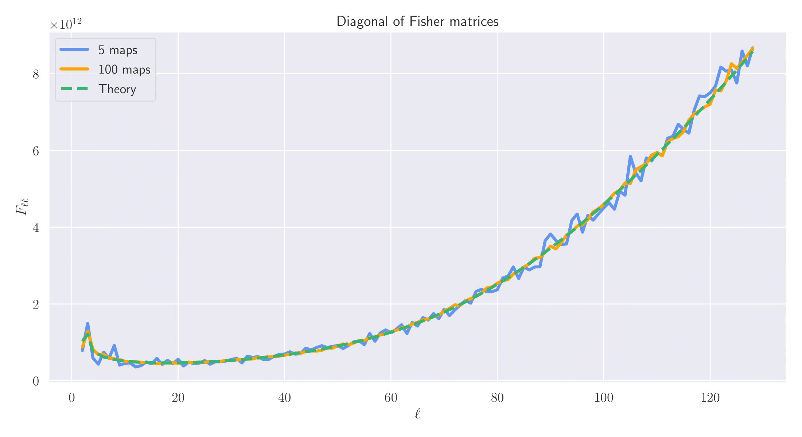

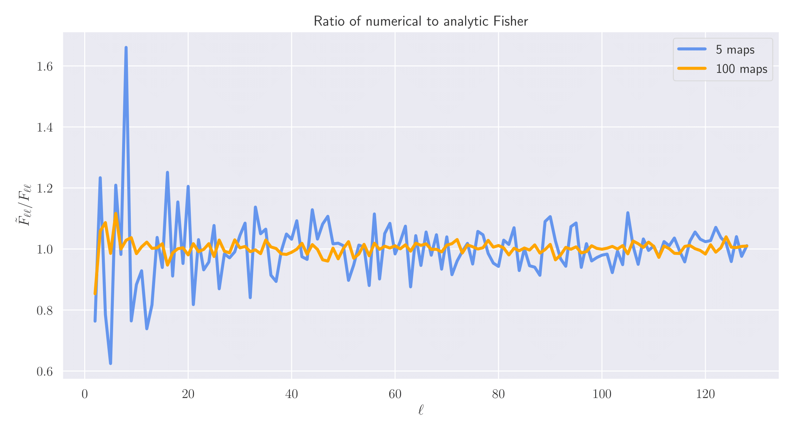

Here, we can see that the noise gradually decreases with _l_, and indicates that at high-_l_ (where the signal is 
largest), we are more accurate.

## Figure of merit for dark energy

Here, we want to see how the figure of merit (FoM) changes as a function of N_side between QML and PCl using different
apodization scales:

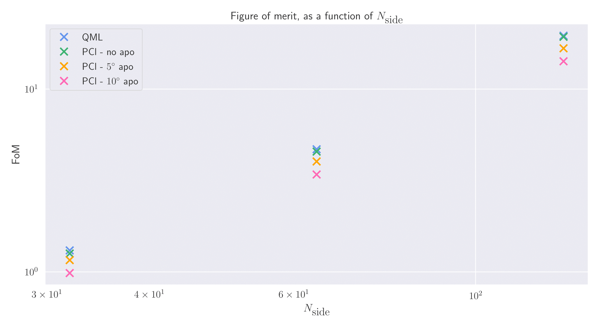

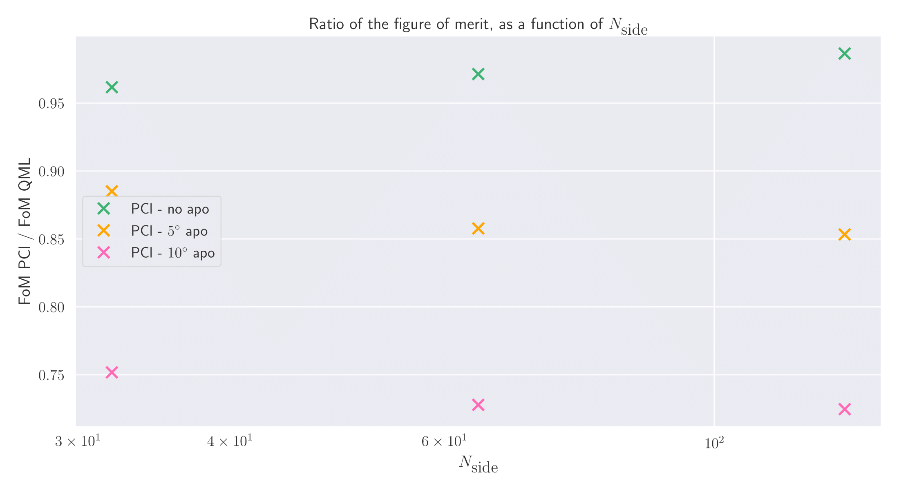

Here, we see that when we apodize the mask we get a roughly constant ratio between PCl and QML.

