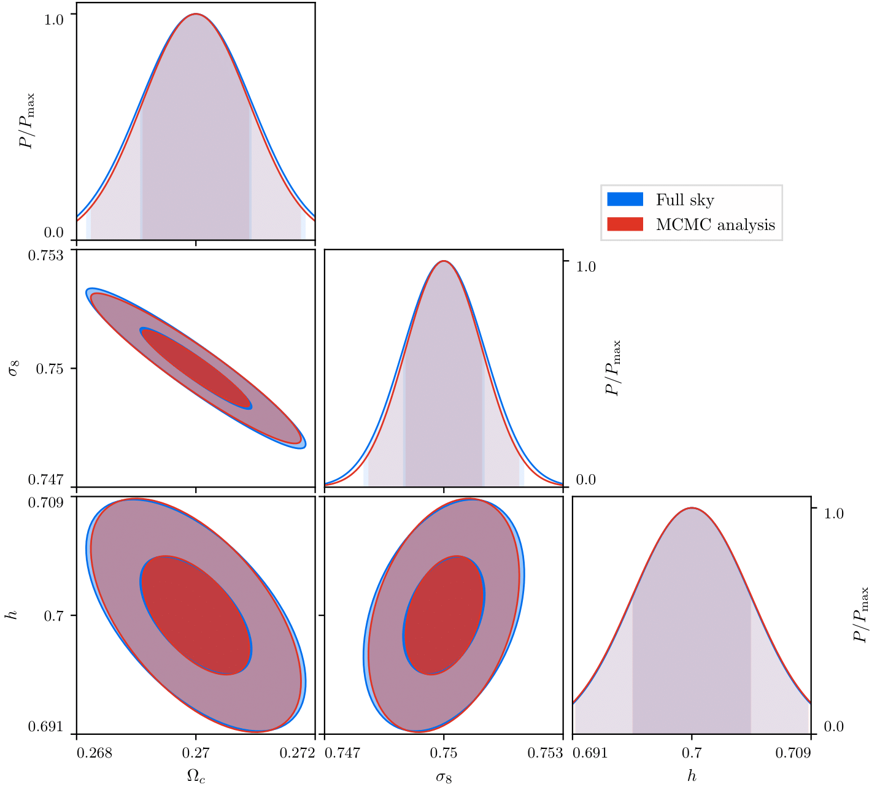
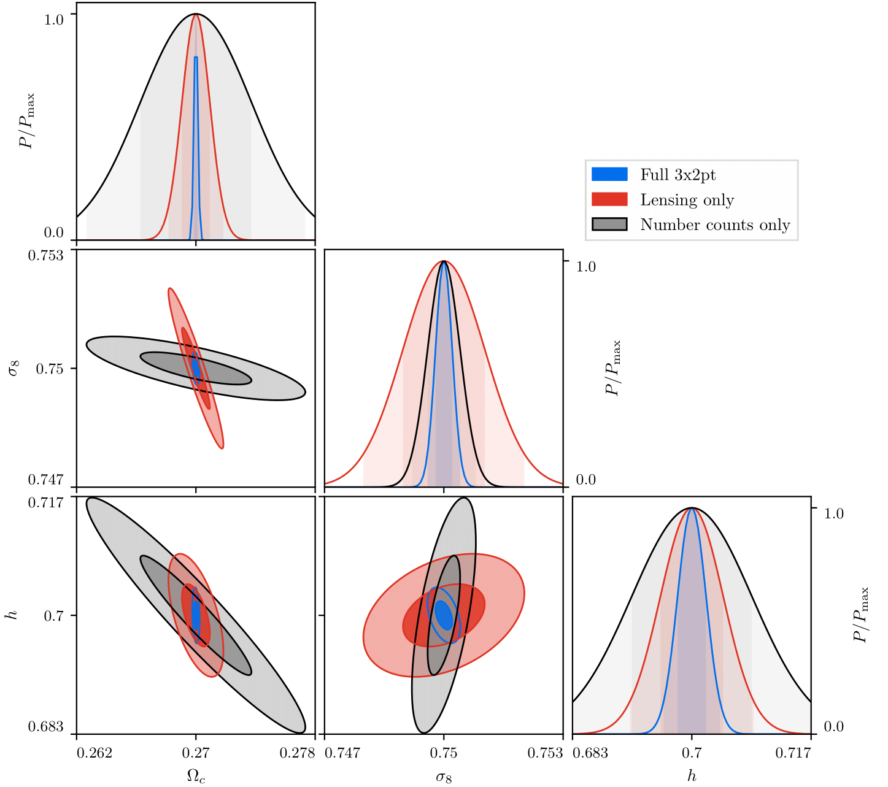
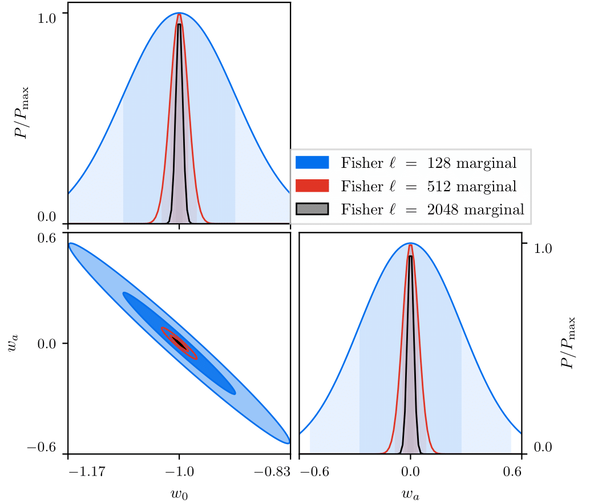
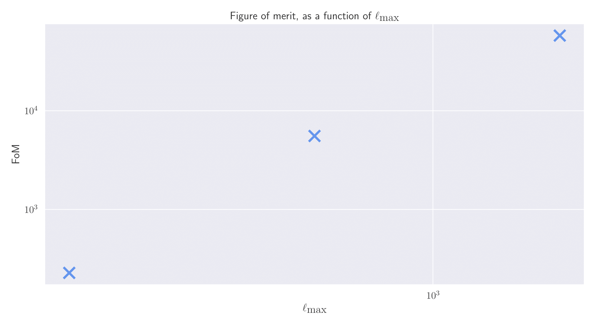

# Fisher Matrices

So far, when trying to get parameter constraints I have been using an ensemble of MCMC simulations and averaging their results.
This is quite a slow process as each MCMC simulation can take a while to run, with this increasing dramatically when
many parameters are being sampled over, and the need for many simulations to be run to get accurate ensemble statistics.
Instead, we can use the parameter's Fisher matrix to find approximate parameter constraints much faster as we don't need
to run costly MCMC simulations and can simply evaluate the Fisher matrix. Here, we are evaluating the Fisher matrix
as written in Equation 128 of [1910.09273](https://arxiv.org/pdf/1910.09273.pdf), which evaluates the derivatives of the
Cl coefficients for each parameter for each redshift bin combination and each ell mode independently.

To ensure that we have coded up the Fisher matrix correctly, we can compare the parameter constraints obtained from
the Fisher matrix to those from an MCMC run, which gives

Note that we have used the covariance matrix for the MCMC simulation, and so does not necessarily capture the
non-Gaussian nature of the MCMC analysis. Here, we see excellent agreement between the two methods, and so I am confident
in my Fisher matrix implementation.

## Using Fisher matrices to predict 3x2pt data

The above implementation of the Fisher matrix was for three redshift bins using cosmic shear only. This gave us six
unique spectra, and so while the Cl covariance matrix was a 6x6 matrix, it was possible to compute and code-up by hand.
However, as we want to extend our analysis to galaxy counts spectra and the galaxy-shear cross-spectra, this would give
us 21 unique spectra. This would give us a 21x21 Cl covariance matrix, which is certainly unfeasible to compute by-hand.
Thus, an automated method to compute it was needed and implemented efficiently.  
Using this, we can compute the individual Fisher matrices for the cosmic shear spectra and then galaxy number counts
spectra only, and then the combined Fisher matrix. This gives us

Here, we see that cosmic shear only provides good constraints on Omega_c and _h_, whereas number counts only provide
good constraints on sigma_8, and so combining both probes (and then adding their cross-spectra) provides the tightest
constraints. It is also interesting to see that the degeneracy direction differs between the probes, which is
another useful thing when combining probes.

## Applying this to dark energy

Now that we have a general formalism to compute the Fisher matrix, we can apply this to any combination of cosmological
parameters that `CCL` accepts. Here, we can use it to look at how the dark energy constraints as a function of the
number of ell-modes in our Cl data vector. When we consider three values of ell_max, of 128, 512, and 2048, we find

We can then turn these contours into a single value called the Figure-of-Merit, which encodes how tight the w0-wa
contour is, and gives

This shows that the FoM increases with some power-law as a function of the maximum ell-mode available, and so for any
analysis it is important to include as many ell-modes as possible.
