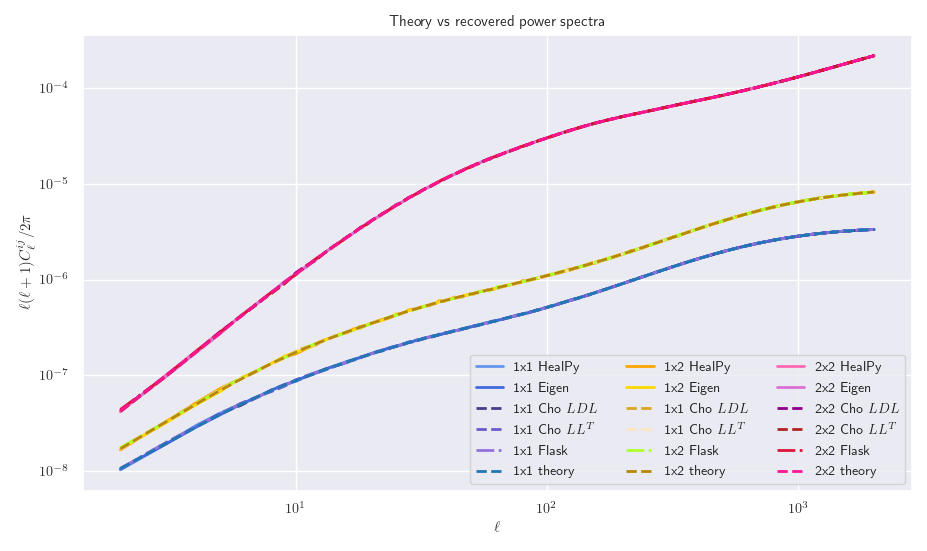
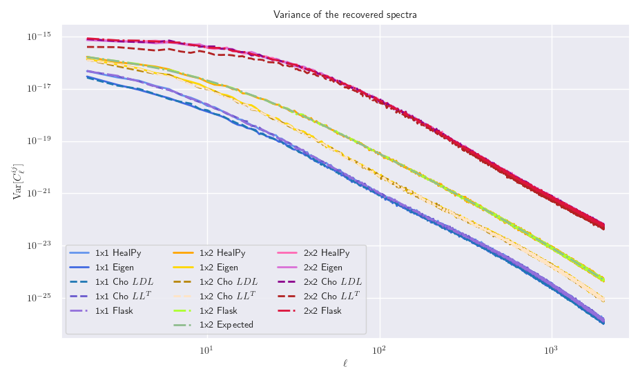
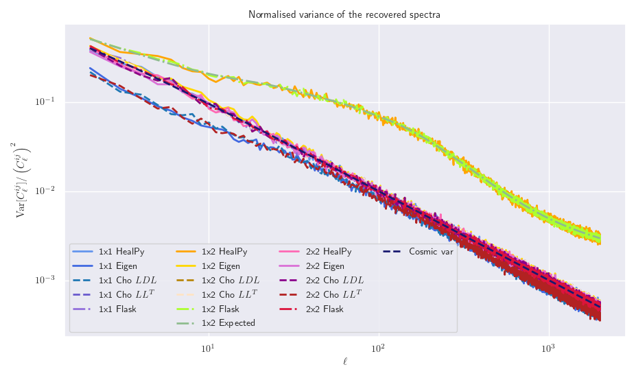
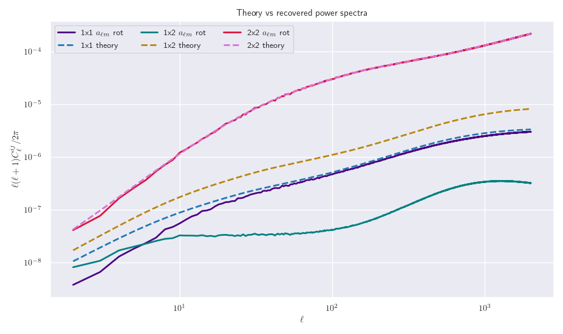

# Generating power spectra with multiple redshift bins

In our previous work, we have looked at correctly generating power spectra for multiple redshift bins that carry
the correct cross-correlations that are essential to the Wishart distribution for the likelihood analysis. 
We noted that my own custom implementation of this generating process (diagonalising the covariance matrix using
its eigenvectors, and then rotating the random realisation) gave the correct average power spectra for the 
auto- and cross-correlations, however the variance of the cross-correlations looked lower than expected.  
Here, we want to look at using a number of different methods that can estimate the power spectrum, and see how their
individual variances vary between the different methods.

## Eigenvector diagonalisation

One way to diagionalise a matrix is to compute its eigenvectors and then matrix multiply sandwich the original 
matrix in between the inverse of the eigenvector matrix and the eigenvector matrix. This then gives us a diagonal
covariance matrix, which we can use to generate our two independent fields.  
In code, this looks like

```python
# Turn list of Cl's into an array of matrices
V_matrix = np.array(list(zip(*[cl[source][lmin:lmax+1] for source in WindowFuncRange(num_bins)] )))
V_matrix = V_matrix.reshape(lmax - (lmin - 1), num_bins, num_bins)

# Compute eigenvalues of the theoretical covariance matrix
V_eval, V_evec = np.linalg.eigh(V_matrix)

# Compute the diagonal covariance matrix
cov_diag = np.linalg.inv(V_evec) @ V_matrix @ V_evec
```

Now that we have a diagonal covariance matrix, we can generate our random realisations for the non-zero terms,
and then rotate them to get the full auto- and cross-correlations

```python
cl_11p = hp.alm2cl(hp.synalm(cov_diag[:, 0, 0]))
cl_22p = hp.alm2cl(hp.synalm(cov_diag[:, 1, 1]))

# Create our new diagonal matrix, with zeros for the cross-correlations
cl_p_matrix = np.array(list(zip(cl_11p, np.zeros(num_l), np.zeros(num_l), cl_22p))).reshape(num_l, 2, 2)

# Now invert the nationalisation process to give proper cross-correlations
my_cl = V_evec @  cl_p_matrix @ np.linalg.inv(V_evec)
```

## Cholesky LDL<sup>T</sup> decomposition

Another way to diagonalise a matrix is to decompose that matrix into a lower triangular matrix and a new diagonal
matrix, we can then generate the diagonal power spectra and rotate back by matrix multiplying by the lower
matrix twice.  
Again, in code this looks like

```python
#* Now try Cholesky-LDL decompoistion
lowers = []
diags = []

# Go through each ell value and compute the diagonal and lower L matrix
for idx in range(len(ells)):
    lu, diag, perm = linalg.ldl(V_matrix[idx])
    
    lowers.append(lu)
    diags.append(diag)

# Convert our list of matrices into an array
lowers = np.array(lowers)
diags = np.array(diags)

cl_11_cho = hp.alm2cl(hp.synalm(diags[:, 0, 0]))
cl_22_cho = hp.alm2cl(hp.synalm(diags[:, 1, 1]))

# Convert Cl values into a Cl matrix
cl_cho_matrix = np.array(list(zip(cl_11_cho, np.zeros(num_l), np.zeros(num_l), cl_22_cho))).reshape(num_l, 2, 2)

# Perform matrix multiplication to reverse the Cholesky decomposition
cho_cl = lowers @ cl_cho_matrix @ lowers
```

## Cholesky LL<sup>T</sup> decomposition

This decomposition is very similar to the LDL method, but now our diagonal matrix is the identity matrix. This has
the advantage because now our alm values can be generated from Gaussian's that have unit variance, instead of one
that depends on the _l_ value. In code, this looks like

```python
# * Perform proper Cholesky L L^T decomposition
choleskys = []
for idx in range(num_l - 2):
    cho = linalg.cholesky(V_matrix[idx+2], lower=True)
    
    choleskys.append(cho)

# Turn list to Numpy array
choleskys = np.array(choleskys)

# Generate cl's from random alm's with unit variance 
cl_11_cho2 = hp.alm2cl(hp.synalm(np.ones(num_l)))
cl_22_cho2 = hp.alm2cl(hp.synalm(np.ones(num_l)))

# Create our new Cl array of matrices
cl_cho_matrix2 = np.array(list(zip(cl_11_cho2, np.zeros(num_l), np.zeros(num_l), cl_22_cho2))).reshape(num_l, 2, 2)

# Multiply by the Cholesky factors to revert the diagionalisation
cho_cl2 = choleskys @ cl_cho_matrix2[2:] @ np.transpose(choleskys, axes=(0, 2, 1))
```

## Using HealPy

```python
# Generate sets of alm with cross-correlations built in
alm11, alm22 = hp.synalm([cl['W1xW1'][0:lmax+1], cl['W1xW2'][0:lmax+1], cl['W2xW2'][0:lmax+1]], new=False)

# Convert alm values to set of Cl values
cl_11, cl_22, cl_12 = hp.alm2cl([alm11, alm22]) 

# Convert the Cl values to our S_matrix
hp_cl = np.array(list(zip(*[cl_11, cl_12, cl_12, cl_22]))).reshape(len(cl_11), num_bins, num_bins)
```

## Results

In addition to our three manual methods of diagionalisation and directly using HealPy, we compare this with 
running Flask many times to get ensemble statistics. The results of this are







## Directly rotating the alm's instead

In all of our above plots, we have been rotating our recovered Cl values, instead of directly rotating the alm
values. Here, we try this alternative approach which should be _identical_, however we can see that something's not
right



The code to generate this is as follows:

```python
alm1 = hp.synalm(cov_diag[:, 0, 0])
alm2 = hp.synalm(cov_diag[:, 1, 1])

# Create our new diagonal matrix of alm values, with zeros in the cross-correlation
alm_eigs = np.array(list(zip(alm1, np.zeros(len(alm1)), np.zeros(len(alm1)), alm2))).reshape(len(alm1), 2, 2)

# For our list of alm values, extract the (ell, m) value at each
ell_vals, m_vals = hp.Alm.getlm(lmax)

eigenvectors_rearrange = []

# Go through each alm value
for i in range(len(alm1)):
    # Find the ell value for this alm
    ell = ell_vals[i]

    # Add the eigenvector at this ell to the list
    eigenvectors_rearrange.append(V_evec[ell])

# Convert list to Numpy array
eigenvectors_rearrange = np.array(eigenvectors_rearrange)

# Now invert the diagionalisation process to give proper cross-correlations for the alm values
new_alm = eigenvectors_rearrange @ alm_eigs @ np.linalg.inv(eigenvectors_rearrange)

# Convert list of alm values to Cl values
cl_11 = hp.alm2cl(new_alm[:, 0, 0])
cl_12 = hp.alm2cl(new_alm[:, 0, 1])
cl_22 = hp.alm2cl(new_alm[:, 1, 1])
```
