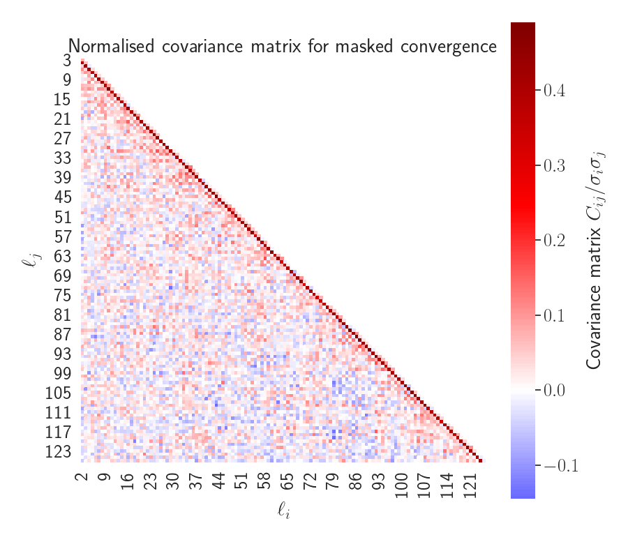
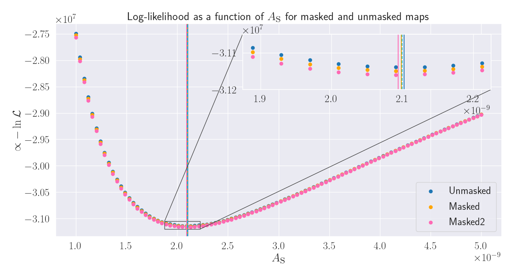
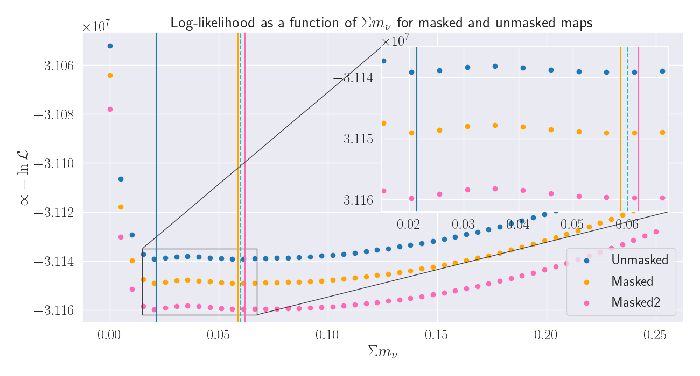
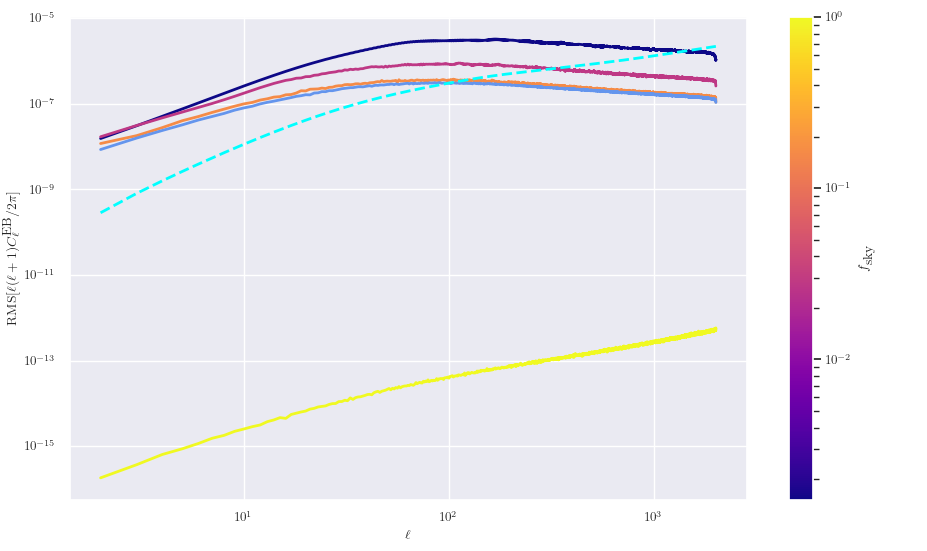
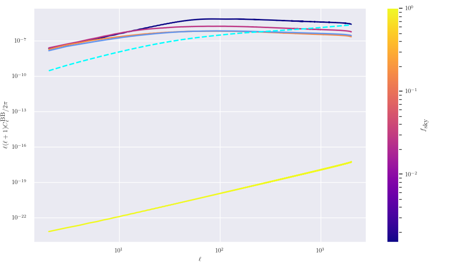
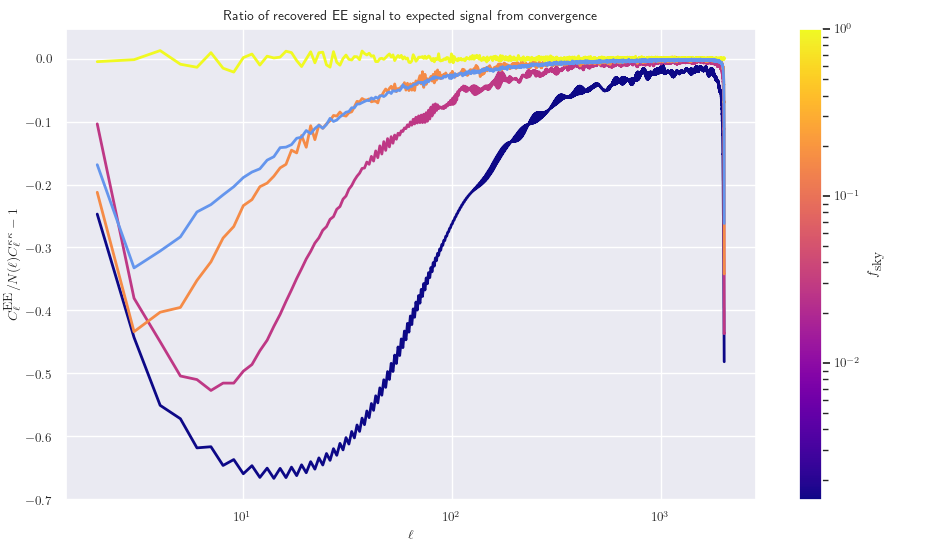
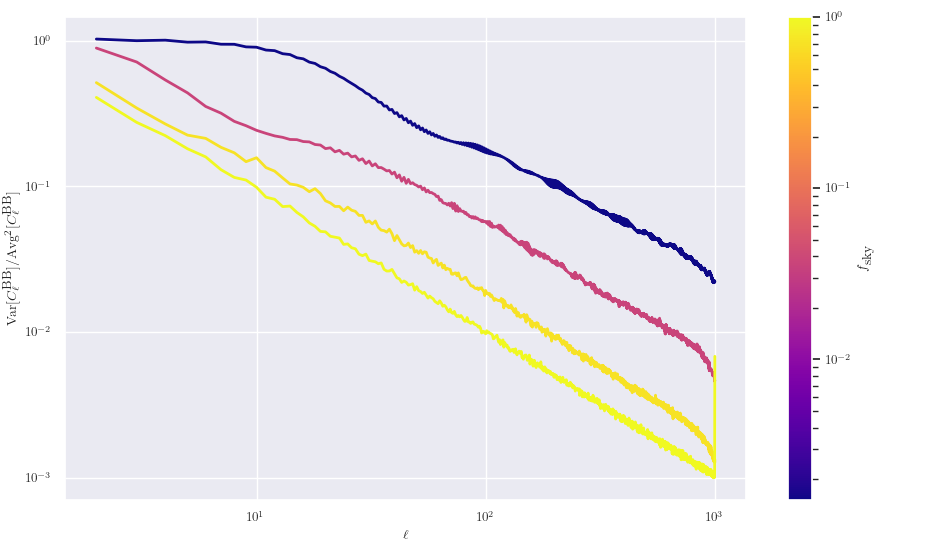
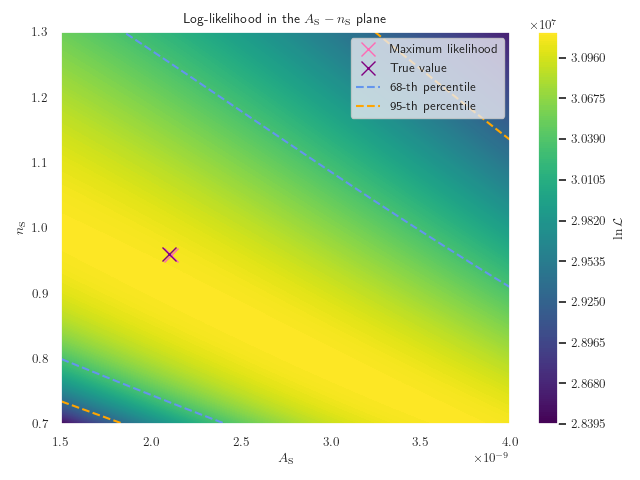
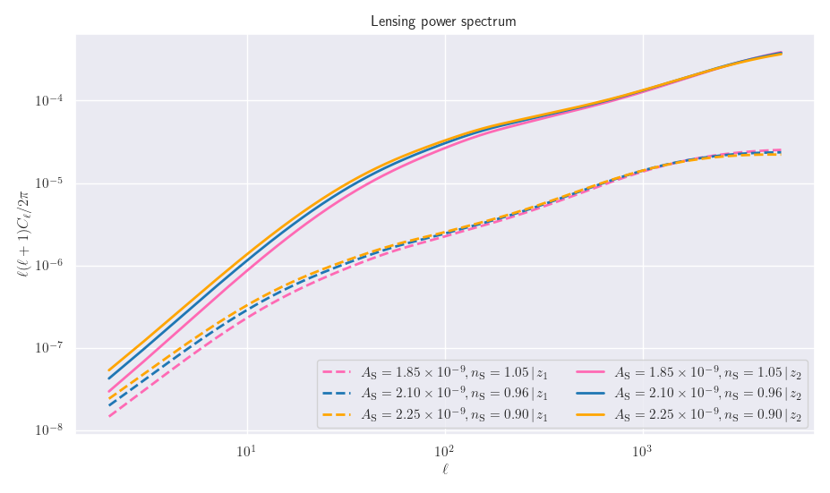

# Investigating the effects of masks

A mask is simply where we neglect observations taken over a region of the sky. This is often done because the observations
in this region are heavily contaminated with noise, and so the data is not coming from the underlying signal that we are
trying to detect. An example of this is when we mask over the Milky Way in most observations due to the increased stellar
density, which dramatically increases the noise in the signal.

## Masking CMB data

First, I will look at masks in relation to CMB data as there are many existing demonstrations of masks applied to WMAP and
*Planck* data online. Once the basics are understood, I can apply this to weak lensing data.

Here, we plot raw temperature anisotropy data obtained by WAMP seven-year data in the Q-band (41 GHz), with a normalised colour-map scale.

We see that the data is heavily contaminated by the Milky Way running through the centre of the image, and so if we want
to do any science with this map, we need to mask over this area. This will leave behind the actual temperature anisotropies
that are from the CMB, and not from any other sources. To do so, WMAP employed the following mask

In this figure, a value of one corresponds to allowing the data through the mask, and a value of zero corresponds to
the data being masked out. Here, we see the large section that is masked out in the centre is the Milky Way. However,
we also see many smaller regions have also been masked out throughout the entire map, which corresponds to bright stars and
other objects that produce a large amount of noise - and so need to be masked out accordingly.

With this mask in place, we can now plot the raw temperature anisotropy data of the residual signal, which looks like

Hence, we recover a much cleaner signal with values that match the theoretical prediction of the CMB signal alone.

## Masks for Euclid

Above, we were looking at masks for WMAP, which of course was a CMB experiment and so much less sensitive to bright sources
or nearby galaxies than optical galaxy surveys. We can now look at what a prototype Euclid mask may look like, which is

Here, we can see that there is a large band around the centre of the map, which corresponds to masking out the Milky Way,
as this plot is in galactic coordinates. We also see that there is a slightly smaller band that appears to oscillate in our
mask. This is the ecliptic plane of the Solar System, and looks this way because we are plotting the mask in galactic
coordinates. If we were plotting this mask in ecliptic coordinates, then we would find that the Solar System runs
through the centre of our mask, by definition.

From a mask, we can define the fraction of the surveyed sky *f* as

 

For the Euclid trial mask above, we find the fraction of sky observed is around 37%.

### Creating a semi-realistic Euclid mask

As discussed above, the two most important objects when making a mask for an optical galaxy survey are the Milky Way and the
Solar System. Hence, we can create a semi-realistic mask by just masking them out in their respective coordinate systems.  
This is shown below:

Here, we have taken the Milky Way to be a cylindrical band between θ = π/3 and θ = 2π/3 in galactic coordinates, and the
Solar System to be another cylindrical band but one slightly thinner going from θ = 2π/5 to θ = 3π/5 in ecliptic coordinates.

> Do note that these are just arbitrary angles for both objects that I have plucked out of thin air based on the rough size
> of the Euclid map above!

It is important to ask why we need to mask out both these regions. For the Milky Way, we have many bright star sources
which affects the quality of the signal, but importantly for both the Milky Way and the Solar System, there are large
quantities of cosmic dust in both of these regions which attenuates the observed signal. This means that we will observe
fewer galaxies in these regions, and so the data analysis becomes much harder to perform as we don't know what the "true"
signal should be in these situations.

Now that we have our two individual regions that we want to mask out, we need to combine these to form a single mask.
To do so, we need to set up a HealPy `Rotator` object to rotate our Solar System mask from ecliptic to galactic coordinates.
Now that we have both masks in a single coordinate system, we can combine them to form a new mask which only allows data
through if the region is unmasked in both maps. As these maps are simply NumPy arrays, we can use `np.logical_and` to
combine them in the correct way. This gives us our combined map, which in galactic coordinates, looks like

Here, we see our dummy mask looks very much like the prototype Euclid mask (which makes sense, and is good!) except for a
few extra regions which our very simple approximation of cylindrical regions does not include.  
We also note that our fraction of sky observed using the dummy mask is around 32%, which is broadly comparable to the
Euclid mask.

## Obtaining power spectra from masked maps

Now that we have a realistic mask for Euclid-like observations, we can now apply this to maps and see what their effects
are on the power spectrum coefficients recovered from the map.

First, let us apply the Euclid mask to some noisy convergence data provided from Flask.

Now that we have our masked map, we can compute what the *Cl* values are using the masked map

Here, we have plotted the *Cl*s recovered from the **full** map in blue, and those recovered from the masked map in green.
Nothing that the masked *Cl* values look like the original *Cl* values, just at a lower amplitude, we have applied a very
naive "correction" to the masked *Cl*s where we simply divide by the fraction of sky observed, which results in the orange
line. We see that this basic correction seems to work remarkably well across all *l* values, subject to a bit of noise,
which is very interesting to see.  

Now that we have some recovered *Cl* values from our mask (with our basic correction in place), we can look at how these
recovered values compare to the original, unmasked values. Here, we take the ratio of the masked values with the unmasked
values, to give the plot below.

Here we see that the recovered *Cl* values are quite noisy, with respect to the original values, especially at low *l*.
This somewhat dissipates at higher *l*, but still quite large differences.

## Power spectra for an ensemble of masked maps

Above, we have looked at the power spectrum for a single map that had a mask applied. To get more detailed information
about how applying a mask changes the distribution of the *Cl* values obtained from a masked map, we need to repeat this
process many times to build up an ensemble of masked maps, and then can compare summary statistics between the masked
and unmasked distributions.

### Mean, variance, skew, and kurtosis

First, we look at how the first four moments of our *Cl* distribution change when we apply a mask. This is for data
that has been collected for one thousand runs in each dataset.  
Note that throughout this section we renormalise the recovered *Cl* values from the masked map by dividing by the fraction
of sky let through.

Here we are plotting the deviation of the average of the recovered *Cl* values with respect to the input *Cl* values.
Interestingly, we see that for *l* below a hundred, the masked *Cl*'s on average predict a slightly lower power spectrum,
with this difference decreasing at larger *l*.

Here we are plotting the variance of the recovered set of *Cl* values divided by the squared-average. We see that the
masked values predict a systematically larger variance than the unmasked values, which follow the cosmic variance
prediction almost exactly.

Here, we see that the skew and kurtosis statistics are generally much noisier than the mean or variance, but we see
a general trend that the masked values predict a slightly larger value for both.

We can try to get a better visualisation of the increased variance by producing KDE plots at each *l* for the two
sets of values.

### Looking at the covariance values

Now that we have our set of masked *Cl* values, we can look at if using a mask introduces any correlation between the
*Cl* values at different *l*. Previously, we have found that for unmasked maps, there is very little correlation between
the *Cl* values, with a maximum correlation coefficient of |r| ~ 0.06. However, we can repeat the same analysis but now
for our masked values, which gives:

Here, we see that there is a very interesting peak that lies on the diagonal between *l* and *l* - 2. Here, we see a strong
positive correlation between these values that was not previously observed for the unmasked values.

**Note:** I have updated this plot with a new colour-bar which better reflects the nature of this data. Here, we still
see the extremely strong correlation between *l* and *l* ± 2 modes, and again very little correlation outside of these
modes.

## Looking at *Cl* bleed between *l*'s for masked maps

Above, we can see that for our masked maps, there seems to be a slight positive correlation between different *l* modes
for our masked maps. We can investigate this further by creating maps where we start our with just a single *Cl* value
non-zero, applying a mask and then recovering the *Cl* values from this.  
To do this, we start off with two maps where all *Cl* values are zero, expect for *l* of 50 and 250. The maps for these
to *Cl* values are shown below.

Now that we have these two maps, we can apply the Euclid mask and recover what the power spectrum is for the masked
maps, which is shown below.

## Power spectra for an ensemble for different masks

Here, we want to look at the statistical features in the power spectrum by applying different sized masks. To do so, we
need to average over vary many different realisations of individually masked maps to be able to view the affects of the
mask, and isolate statistical noise to the best that we can.

### Constructing nine masks

First, we needed to construct a variety of masks that have different sky fractions. To do so, we generalised the previous
method of constructing galactic and ecliptic cuts for the Milky Way and Solar System, respectively, but dynamically
changing the thickness of the two cuts. Implementing this over a range of different thicknesses gives us the following
nine masks

We can see that our process has generated masks that range from blocking nearly all of the pixels through to letting
most of the pixels through. By applying these different masks to many different convergence maps, we can try to find
any statistical trends in the *Cl*'s on the sky-fraction.

### Editing Flask

In order to implement the masking and recovery of the *Cl* values for our many different masks in the most efficient way
possible, the source code of Flask was edited to include the desired functionality.  
The result of this was that Flask would recover eleven sets of *Cl* values for each realisation of the convergence map
(the nine masks above, plus the Euclid mask, and of course the unmasked values), and save each to the disk. These were
then read in by the Python code to be added to existing DataFrames.  
With N_side of 1024 and l_max of 1000, both for performance reasons, the code took an average of 5.8 seconds per sample
to do this.

### Results

We now present the results of averaging over our ensemble of maps, where we have generated 6,000 maps.

#### Deviation from input power spectra

Here, we want to look at how the average power spectra recovered from the masked maps deviates from the input power
spectrum. Note that we have used a rolling average using three *l* modes at each point, which helped smooth out some
of the rapid oscillations present in the recovered data, leaving behind the underlying pattern.

Here, we see some very interesting behaviour: for low-*l* modes (less than around 200) we see that there is reduced power
for the masked maps compared to the original power spectrum. We see that the more heavily the map is masked (indicated by
a lower fsky), the more the power is suppressed on these large angular scales.
Then above this point, there seems to be slightly more power compared to the original power spectrum,
again with this increase growing as we decrease fsky.

#### Variance

We now want to look at how the variance of the recovered *Cl*'s change as we increase the masking of the maps. This
is shown in the following figure

Here, we have plotted the expectation from the Γ-distribution as a dashed cyan line. Here we see that as we decrease
fsky, the variance seems to increase with a constant factor across all *l*. We can quantify this increase, by
taking the ratio of the recovered lines with the expected values, to give

Here, we see that for all lines except for the most heavily masked maps, this ratio is basically constant across all *l*,
and is some function of fsky. A few functions were tried, e.g. 1/fsky and 1/sqrt(fsky),
but nothing tired *yet* seems to fit these values.

#### Skew

We now want to look at the third moment of the *Cl*'s, skew. Again, we have taken a rolling average of three *l* modes
to damp down some oscillations present in the original data.

Here, we see that as we decrease fsky, the skewness increases, showing that even at very large *l* the
skewness deviates significantly from the Gaussian case and from the expected values from the Γ-distribution (which
is shown in the dashed cyan line).

#### Kurtosis

We can now look at the third moment of the *Cl*'s, kurtosis. Again, we have taken a rolling average of three *l* modes
to clean up the data somewhat.

Again, we see that as we decrease fsky, the kurtosis of the data increases. However, once *l* increases past
around 100, all lines except the most heavily masked, reduce to basically zero kurtosis (except noise).

### Signal-to-noise of masked maps

A very simple signal-to-noise calculation was performed for the nine masks above, averaging over our ensemble of
six thousand realisations. Here, we have used the theoretical covariance matrix from the Γ-distribution, which assumes
that all *l*-modes are independent of each other. This is true for our unmasked map, but we note that modes start to
mix with each other as we introduce a mask. The results of this are

Here, we see that as we increase the fraction of sky surveyed, the S/N ratio increases, which is what we expected.

## Recovering cosmological parameters from masked maps

Now that we have established methods to mask convergence maps and naively recover the unmasked power spectrum, we can
apply these methods to recover the cosmological parameters that were used to generate the original map. This is a
formulation of a **very basic** likelihood code, which seeks to evaluate the posterior as a function of a singular
cosmological parameter to find the maximum-likelihood value.  

First, though, we need to define what the likelihood is in our case. Here, we have one set of "observed" *Cl*'s, denoted
with a hat, and want to find the most likely parameters of our model that go into generating our theory *Cl*'s. If we
assume that the *Cl*'s are normally distributed (we have shown this not to be true, but we will apply this approximation
anyway), then we find that for a single *Cl* value, the logarithm of the posterior probability is proportional to

 

Since the total likelihood is proportional to the multiplication of *f* over all *l*, the log-likelihood will simply
be the sum of the above quantity over all *l*:

 

Here, we have assumed a uniform prior on the theory *Cl*'s (and thus cosmological values), but this can be incorporated
into the above equation if so desired.

We can now implement the above equation into our code, and extract results from it.

### Recovering A_s

The first parameter that was attempted to be recovered from a map was the scalar amplitude A_s. Here, we computed the
likelihood for the unmasked map, the Euclid-like mask, and our first mask with fsky = 0.15%. This allows us
to see if applying a mask changes the recovered cosmological parameters, even for our very simple case.

The first test was on a pre-existing convergence map which was generated with A_s = 2.1E-9, so we want to see how
close we can get to this value using our maximum-likelihood technique.

Here, we can see that the maximum-likelihood values predicted by all three maps are very close to the original value
(which is shown by the dashed cyan line in the zoomed insert). We can see that the affect of masking gradually
decreases the recovered A_s parameter, with the results being

* Unmasked map: A_s = 2.102E-9
* Euclid mask: A_s = 2.099E-9
* Crazy mask: A_s = 2.094E-9

Hence, even our crazy mask predicts a value of A_s that is very close to the true value, which is encouraging!

We can now repeat the same analysis, but for a true A_s of 2.25E-9, just to see how robust the predictions are.

Here, we now see that the unmasked and Euclid masked maps predict A_s values that are very close to the true value,
with our crazy mask predicting somewhat of a lower value of A_s, but still in the right ballpark:

* Unmasked map: A_s = 2.252E-9
* Euclid mask: A_s = 2.251E-9
* Crazy mask: A_s = 2.215E-9

### Recovering the neutrino masses

Above, we were just trying to recover A_s, which simply scales the entire power spectrum and so is quite a simple value
to predict from a map. Here, we wish to extend the above analysis, but now try to recover the sum of the neutrino masses.
This causes scale-dependant suppression in the power spectrum, and so may be harder to predict than a simple scaling.

Again, we look at the unmasked map, the Euclid-like mask, and our crazy mask.

Here, we see some interesting results: all likelihoods dip around m_nu = 0.02eV, which causes the maximum-likelihood
value for the unmasked map to be much smaller than what it should be. The two masked maps also feature this dip,
but with is slightly weaker, and so the maximum-likelihood values here are much closer to the input value of 0.06eV.
The results for this are:

* Unmasked map:  sum m_nu = 0.00214 eV
* Euclid mask: sum m_nu = 0.0587 eV
* Crazy mask:  sum m_nu = 0.0620 eV

Hence, even with a much harder value to predict from a map, our maximum-likelihood technique still manages to recover
sensible, and quite close, values for the two masked maps.

## Investigating power suppression at high _l_ when using masks

In some plots of the power spectrum for masked maps, we can see that the _Cl_ values drop off at
_l_ values that are close to the maximum _l_ value used. For example, see the first figure under
the "Deviation from input power spectra" sub-section. Here, we would like to have a closer look
at this effect, and see if it's invariant under changing conditions related to the mask/map
generation.

First, a mask with a very large _f_sky was created. This had _f_sky = 99.5%,
which is far larger than any realistic mask and so any behaviour seen at this level will propagate
into our actual masks. We tested this for two different values of _l_max: 1,000 and 2,000,
both with Nside of 1024 and 2048 to see if there were any artefacts caused by the resolution
of the map. We ran each combination of _l_ and _N_ 5,000 times which should give us accurate averages.

Here, we can see that this mysterious drop-off in power at high _l_ seems to scale with _l_max
and is invariant upon the choice of _N_side.  
It is not yet clear where this drop-off comes from, however it can be assumed that it arises from some
way that HealPix applies a mask and then recovers the power spectra from this masked map.  
It is interesting to see that while the _Cl_ values themselves seem to get suppressed at this high _l_,
they seem to keep the same distribution (i.e. variance and other higher-order statistics don't seem to
exhibit this feature).

## Investigating masks with very small _f_sky

In some above plots, we looked at masks that had _f_sky as small as 0.15%. While this is
quite a small value, we wish to investigate the properties of masks that have an extremely small value
of _f_sky (which is the opposite of the directly above section), and see if any interesting
behaviour shows itself.  
First, a set of nine masks all with small _f_sky were generated. To do this, we allowed data
through in a small region that was centred on the origin of the map, and then decreased the radius of
this area. Doing so allowed us to generate maps that have around four orders of magnitude difference in
_f_sky, which is very useful for comparisons.

Note that the allowed regions in the last two maps are so small that the map plotting functions in
HealPy seem to break down for some region, but these maps still seem ot be fully functional.

Now that the masks have been generated, we can apply them in Flask to find what the recovered power spectra
and its properties are. To do this, we used an ensemble of 30,000 maps, and the results are as follows:

Here we see the expected results: the smaller _f_sky is the larger the deviation between the
input and recovered Cl values are. We also see the usual behaviour where the recovered values are smaller
than expected for _l_ values that are less than around 200, and larger above this threshold (with the usual
suppression at _l_ values that are close to _l_max).

Now, let us look at the raw variance of the _Cl_'s. Here, we see some interesting behaviour: starting
from the yellow line (which has the largest _f_sky), as we decrease the sky fraction we see that
the variance at a given _l_ increases, but at low _l_ values (less than 100, or so) we see that as we
further decrease _f_sky the variance actually decreases. However, at high _l_, we see that
the variance is monotonically increasing as _f_sky decreases.  
We can now look at the normalised variance, which is shown below.

If we now look at the variance of the _Cl_'s normalised by the average squared, we find that the
increased variance over the theoretical values (shown in the dashed cyan line) scales monotonically
as _f_sky decreases. We also see interesting behaviour in that there seems to be a
fixed, limited variance at low _l_ that all masks tend to in this regime. This fixed normalised 
variance seems to have a value of around two, and so could be interesting to see where this value
arises from.  
If we now look at the skewness of the data, we also see a form of limiting behaviour of the masks
at low _l_:

Here, the skewness seems to have a limiting value of around 2.75, or so, and is still remarkably
consistent across all the masks.  
This limiting behaviour was also present in the kurtosis, but for brevity the figure was dropped.

## Increased samples for clearer plots

Now that HPC access via Cuillin is now possible, the amount of Flask runs per model can now be
dramatically increased. One of the tasks that I wanted to do was to look at our "default" list
of masks that cover a normal range of sky fraction values to look at the recovered power spectra
in more detail. The plot below is the average of 30,000 individual realisations of the same input
power spectra with our nine masks applied.

Here, we can see the power of using such large statistics is to severely reduce the noise in the
averages. This allows us to clearly see that all nine masks seem to cross between under-estimating
and over-estimating the power spectrum at exactly the same point, which is very roughly at _l_ of 200.
It's still not clear _why_ this scale seems to be the turning point, and may be interesting to
investigate this further.

## Covariance matrix for masked maps

Above, we have shown that the covariance matrix for a masked map is very different from that of an unmasked
map; in particular for correlations between _l_ and _l_ ± 2 modes. Here, we would like to see how this difference
evolves with a mask's _f_sky property. To do so, we used a set of 10, 000 realisations and applied
nine individual masks to each. The covariance matrix was then evaluated for each mask up to a maximum _l_ value
of 125, with the results as

> Note that what is actually being displayed here is the *normalised* covariance matrix, which is simply the
> Pearson correlation coefficient value, **not** the raw covariance matrices, these are shown below.

Here, we can see that at the start of the animation (where _f_sky is very small) correlations between
many different _l_ modes that are integer multiples of _l_ ± 2. These correlations decrease in strength as 
_f_sky grows, but it is still possible to see the leading edge of the  _l_ and _l_ ± 2 modes as
these remain having a high correlation for all the masks.  
It is also interesting to see that all these strong correlations are positive, with only very small
negative correlations. This makes sense when looking at the power spectrum for a subset of masks used here, which
is shown below:

Here, we see that the mask only has power for even _l_, and is zero for odd _l_. Hence, when we convolve
our original signal at an _l_ value, we expect to pick up major contributions from this at multipoles of _l_ ± 2,
and other even multiples of two. This can be shown by starting out with power only at one _l_ mode, applying
a mask, and recovering the power spectrum, which gives

Here, we can see that power is significantly increased for even multiples of 2 from our original _l_ value.
This then makes sense why there are such strong correlations between these _l_ modes, as shown in the covariance
matrix.

### Evaluating the coupling matrix

In the above animation of the covariance matrix, we show how a certain _l_ mode is coupled
to integer multiples of ± 2 _l_. We can quantify these correlations by evalutating the symmetric
mode-coupling matrix _G_, which is given as Equation 11 of
[`astro-ph/0307515`](https://arxiv.org/pdf/astro-ph/0307515.pdf). To evaluate this, we used
CAMB's `pcl_coupling_matrix` function, which is a fast implementation of this equation. We then normalise
this by (2 _l_2 + 1) to turn the ordinary coupling matrix into the symmetric form,
which gives

Here, we can see that the coupling matrix is only non-zero for even values of _l_1 + _l_2,
with larger values being close to the diagonal and smaller values further out. The coupling only
being non-zero for even values of _l_1 + _l_2 makes sense when looking at the power
spectrum of the mask: this is only non-zero for even values of _l_, and so for the Wigner-3*j* matrix
to be non-zero _l_1 + _l_2 must be even (as the mask enforces _l_3 to be even).

## Power spectra of masks

Above, we plotted the power spectra for a few different masks that have different _f_sky values, but
are fundamentally the same shape (just with different sized galactic and ecliptic bands). There, we showed that
for odd _l_ modes, the Cl coefficients were zero, which is due to the symmetry of the map. Due to the large range
in the y-axis needed it was hard to see how the amplitude of the values changed with _l_ for our different maps.
Hence, here we plot the same data (with additional maps too), but now for even _l_ only.

Note that for the Euclid mask (the lime-green line) data is plotted for both even and odd l, as the values for
odd-l are non-zero.  
Here, we can see that in general the amplitude of the Cl values grow as _f_sky increases, with the
oscillations becoming noisier too. The values also closely follow a 1/l behaviour, which means that the raw
Cl values follow a 1/l3 pattern.

## Comparing analytic and numerical covariance matrices

A key part of the pseudo-Cl technique is to recover the covariance matrix between the different _l_ modes without
having to run an ensemble of realisations of the masked maps for each mask considered. The covariance matrix can
be estimated through the mode-coupling matrix _G_ through the use of Equation 16 of `astro-ph/0307515`. As shown
above, we can use CAMB to calculate the mixing matrix, and so we can get an estimate of the pseudo-Cl "analytic"
covariance matrix. Furthermore, we can run an ensemble of realisations to estimate what the numerical form of the
covariance matrix is, and so we can compare the two. Here, we used a set of 10,000 realisations for the numerical
simulations. 

Here, we can see that the covariance matrix has very strong support on and around the diagonal, with values being
very small outside this range. This band shrinks as _f_sky increases, which tells us that
larger masks (i.e. masks that allow data through a larger area) cause less mode-mixing between the Cl's than
smaller masks, which is what we expect.  
We can compare the two covariance matrices by taking their differences, which gives

Here, we can see that the main differences are in the upper-left and lower-right corners. There is also a sizeable
difference along the diagonal, but as this is the region with the largest amplitude of values, it is expected
that the absolute difference will also be largest here.  
For a comparison, here is the difference between numerical and theoretical covariance matrices for mask 9
(which has _f_sky of around 81%)

This shows no trends in the differences as the values here are just random noise. It should be noted that the
amplitude of the absolute differences have increased between masks 1 to 9, but the relative differences
have decreased to sub-1% level. The reason why we can't compute the fractional difference is becasue the odd-l
modes should have (close to) zero covariance, and so taking the ratio here will dominate the plots with noise.

## Masking shear with E/B decomposition

In all the above analysis of masks, we have been using the convergence (_κ_) maps because of their simplicity,
as they are simply scalar maps described by spin-0 spherical harmonics. However, what we actually observe is
the cosmic shear signal derived from the ellipticities, and so we want to see how masking affects the
shear signal. As the shear signal is described in terms of a spin-2 field, it is analogous to the polarisation
of the CMB. Hence, we can utilise the E/B decomposition to describe the shear field as two ordinary power
spectra. As the B-modes carry the opposite parity to the T and E modes, we expect any cross-correlations between
E and B to be zero, and the B-modes themselves to be zero. Therefore, if any of these signals are non-zero,
then this would be a sign that masking interrupts the B-mode signal, and so needs special care when using. 

To perform this decomposition, the `map2alm_pol` function in HealPix was used as this could properly deal with
the spin-2 nature of the shear maps to produce the _alm_ coefficients for the T, E, and B signals which could
then be combined to give the power spectra.

### Average power spectra

Here, we first look at the EE, EB, and BB power spectra averaged over 750 runs for three masks and an unmasked
map to see what affect masking has on the recovered signal.

Here, the BB signal is very interesting: for the unmasked sky we see that the power spectra is extremely small,
which suggests that there is no actual signal and this is just a numerical artefact from the processing
algorithm. However, as we decrease _f_sky even by just a little, we see that there is a large
jump in amplitude of the BB signal, which would suggest that there is an actual signal here, and not just
numerical noise. This BB signal then grows as we decrease _f_sky further, which suggests that the
effect of masking is to introduce a phantom BB signal that is not there on the full-sky. This behaviour is
mimicked in the EB signal.

Note that as the EB signal can be positive or negative, we use the root-mean-square of the signal at each _l_,
instead of the mean as that correctly deals with the sign flips, as we mostly care about the amplitude of the
signal not the sign.

The dashed cyan line in the EE plot is the expected EE signal from the convergence, and can be calculated
by comparing the convergence and EE power spectra to the lensing potential, and so we can relate them together.
This relation is a function of _l_, which tends to one at high _l_. Now that we have the theoretical prediction
for the EE signal, we can take the ratio of the derived versus the prediction, and so accurate the recovered
values are:

Here, we see that the variations for the full-sky realisations are small and consistent with the theoretical
prediction for the entire _l_ range. For the masked-sky realisations, we see that power is significantly
suppressed at low _l_, but also extends to high _l_ too. This is in contrast to the convergence power spectrum
where the masked sky actually overshoots the theory curve at high _l_. This suggests that power is being
moved from the EE mode into the EB & BB modes, and so we expect the EE signal to be lower across all _l_.

### Variances

Now that we have our set of _Cl_ values, we can also look at higher-order statistics than the mean, and so here
we look at the variances of the signal.

It is good to see that both the EE and BB signal produce the expected behaviour in that the variances
follow the cosmic variance prediction very well (including the deviations expected when masking).

## Improved parameter estimation from likelihoods

In above sections, a very basic likelihood code was written to try to extract the As value from a given map
and compare with the "true"/input values. There, the values reported were simply proportional to the
log-likelihood, with no normalisation made. Here, we would like to look at the curvature of the raw likelihood
around the maximum-likelihood point. To do so, we can normalise the values such that when we exponentiate the
likelihood, we find Min(L)=1. This was done for an unmasked map, and a map with the Euclid mask applied, for both
maps without noise and with shape noise added. The results of these four are:

Here, we have normalised the x-axis for each curve by taking centering the graph around the maximum likelihood
value for each curve. This allows us to easily compare how small changes in As correspond to change in the
likelihood across curves.  
Here, we can see that for a very small change in As, of the order a 0.05% change, the likelihood doubles.
This indicates that the actual likelihood is very sharply peaked around the optimal value of As, and so the
constraints on As will be very small in this case (which is what we expect as A_s should be a well constrained
parameter).  
We note that the likelihood becomes broader when we add noise, which would transfer to looser parameter
constraints on maps with noise over noiseless maps. We also note that the use of masking does not significantly
alter the shape of the likelihood curves, only inducing a slight bias to smaller As values.

### 2D likelihood of As-ns

In the above analysis we focused on just the 1D probability distribution of A_s values, with all other cosmological
parameters fixed. This is a gross simplification as, in general, there are many unknown parameters that values we do
not know, and so we need to marginalise over all of these at once. To go from a 1D distribution to all
cosmological parameters is quite a complex task, so let us extend to two parameters here, which can then be
further generalised later.

As the above liklelihood calculations focused on A_s, it was natural to extend them to include the scalar spectral
index n_s too. This then gives us a 2D likelihood contour, as we can simply evaluate it over a grid of (A_s, n_s)
values. This isn't the most efficient method, however is the simplest to code up. The results of this are

Here, we can see that the likelihood values generally form bands, where an increase in A_s leads to a decrease
in n_s, for the same likelihood value. We have also labelled the maximum-likelihood point (the pink cross) and
the true values for the map (the purple cross). We can see that these two values are quite close, which shows
that our 2D likelihood code is still capable of recovering cosmological parameters from a map, even in 2D.

#### Slices of the 2D likelihood

In the above contour plot, we can see that bands have formed in the likelihood along the inverse diagonal
in the plane of the plot. We would now like to look at these bands by taking slices of the contour
at fixed n_s, giving us a likelihood in just the A_s plane:

This nicely illustrates that we have found that for larger values of A_s, the likelihood prefers a smaller n_s,
and vice versa.  
Hence, looking at this leads us to think that there might be a slight degeneracy between A_s and n_S in the
lensing power spectrum. Therefore, we can plot what the lensing power spectrum looks like for the maximum
likelihood point for our three curves above, which gives

Here, we can see that for low _l_ (less than around one hundred) the three models predict quite different values
for the lensing power spectrum. However, above this point they all start to converge to the same curve which
is where the degeneracy in the likelihoods comes from.
