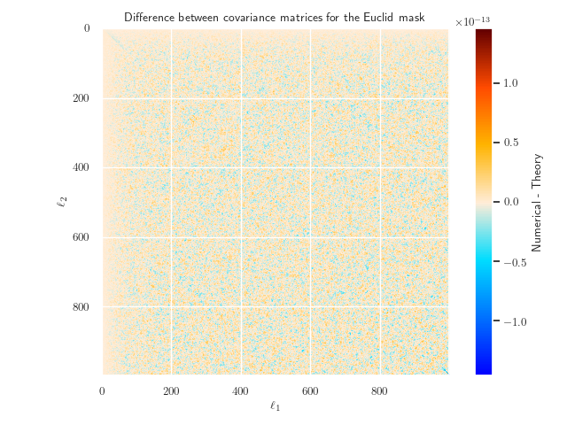

# Investigating the effects of masks

A mask is simply where we neglect observations taken over a region of the sky. This is often done because the observations
in this region are heavily contaminated with noise, and so the data is not coming from the underlying signal that we are
trying to detect. An example of this is when we mask over the Milky Way in most observations due to the increased stellar
density, which dramatically increases the noise in the signal.

## Masking CMB data

First, I will look at masks in relation to CMB data as there are many existing demonstrations of masks applied to WMAP and
*Planck* data online. Once the basics are understood, I can apply this to weak lensing data.

Here, we plot raw temperature anisotropy data obtained by WAMP seven-year data in the Q-band (41 GHz), with a normalised colour-map scale.


We see that the data is heavily contaminated by the Milky Way running through the centre of the image, and so if we want
to do any science with this map, we need to mask over this area. This will leave behind the actual temperature anisotropies
that are from the CMB, and not from any other sources. To do so, WMAP employed the following mask


In this figure, a value of one corresponds to allowing the data through the mask, and a value of zero corresponds to
the data being masked out. Here, we see the large section that is masked out in the centre is the Milky Way. However,
we also see many smaller regions have also been masked out throughout the entire map, which corresponds to bright stars and
other objects that produce a large amount of noise - and so need to be masked out accordingly.

With this mask in place, we can now plot the raw temperature anisotropy data of the residual signal, which looks like


Hence, we recover a much cleaner signal with values that match the theoretical prediction of the CMB signal alone.

## Masks for Euclid

Above, we were looking at masks for WMAP, which of course was a CMB experiment and so much less sensitive to bright sources
or nearby galaxies than optical galaxy surveys. We can now look at what a prototype Euclid mask may look like, which is


Here, we can see that there is a large band around the centre of the map, which corresponds to masking out the Milky Way,
as this plot is in galactic coordinates. We also see that there is a slightly smaller band that appears to oscillate in our
mask. This is the ecliptic plane of the Solar System, and looks this way because we are plotting the mask in galactic
coordinates. If we were plotting this mask in ecliptic coordinates, then we would find that the Solar System runs
through the centre of our mask, by definition.

From a mask, we can define the fraction of the surveyed sky *f* as

<center>
 
</center>

For the Euclid trial mask above, we find the fraction of sky observed is around 37%.

### Creating a semi-realistic Euclid mask

As discussed above, the two most important objects when making a mask for an optical galaxy survey are the Milky Way and the
Solar System. Hence, we can create a semi-realistic mask by just masking them out in their respective coordinate systems.  
This is shown below:


Here, we have taken the Milky Way to be a cylindrical band between θ = π/3 and θ = 2π/3 in galactic coordinates, and the
Solar System to be another cylindrical band but one slightly thinner going from θ = 2π/5 to θ = 3π/5 in ecliptic coordinates.

> Do note that these are just arbitrary angles for both objects that I have plucked out of thin air based on the rough size
> of the Euclid map above!

It is important to ask why we need to mask out both these regions. For the Milky Way, we have many bright star sources
which affects the quality of the signal, but importantly for both the Milky Way and the Solar System, there are large
quantities of cosmic dust in both of these regions which attenuates the observed signal. This means that we will observe
fewer galaxies in these regions, and so the data analysis becomes much harder to perform as we don't know what the "true"
signal should be in these situations.

Now that we have our two individual regions that we want to mask out, we need to combine these to form a single mask.
To do so, we need to set up a HealPy `Rotator` object to rotate our Solar System mask from ecliptic to galactic coordinates.
Now that we have both masks in a single coordinate system, we can combine them to form a new mask which only allows data
through if the region is unmasked in both maps. As these maps are simply NumPy arrays, we can use `np.logical_and` to
combine them in the correct way. This gives us our combined map, which in galactic coordinates, looks like


Here, we see our dummy mask looks very much like the prototype Euclid mask (which makes sense, and is good!) except for a
few extra regions which our very simple approximation of cylindrical regions does not include.  
We also note that our fraction of sky observed using the dummy mask is around 32%, which is broadly comparable to the
Euclid mask.

## Obtaining power spectra from masked maps

Now that we have a realistic mask for Euclid-like observations, we can now apply this to maps and see what their effects
are on the power spectrum coefficients recovered from the map.

First, let us apply the Euclid mask to some noisy convergence data provided from Flask.


Now that we have our masked map, we can compute what the *Cl* values are using the masked map


Here, we have plotted the *Cl*s recovered from the **full** map in blue, and those recovered from the masked map in green.
Nothing that the masked *Cl* values look like the original *Cl* values, just at a lower amplitude, we have applied a very
naive "correction" to the masked *Cl*s where we simply divide by the fraction of sky observed, which results in the orange
line. We see that this basic correction seems to work remarkably well across all *l* values, subject to a bit of noise,
which is very interesting to see.  

Now that we have some recovered *Cl* values from our mask (with our basic correction in place), we can look at how these
recovered values compare to the original, unmasked values. Here, we take the ratio of the masked values with the unmasked
values, to give the plot below.


Here we see that the recovered *Cl* values are quite noisy, with respect to the original values, especially at low *l*.
This somewhat dissipates at higher *l*, but still quite large differences.

## Power spectra for an ensemble of masked maps

Above, we have looked at the power spectrum for a single map that had a mask applied. To get more detailed information
about how applying a mask changes the distribution of the *Cl* values obtained from a masked map, we need to repeat this
process many times to build up an ensemble of masked maps, and then can compare summary statistics between the masked
and unmasked distributions.

### Mean, variance, skew, and kurtosis

First, we look at how the first four moments of our *Cl* distribution change when we apply a mask. This is for data
that has been collected for one thousand runs in each dataset.  
Note that throughout this section we renormalise the recovered *Cl* values from the masked map by dividing by the fraction
of sky let through.


Here we are plotting the deviation of the average of the recovered *Cl* values with respect to the input *Cl* values.
Interestingly, we see that for *l* below a hundred, the masked *Cl*'s on average predict a slightly lower power spectrum,
with this difference decreasing at larger *l*.


Here we are plotting the variance of the recovered set of *Cl* values divided by the squared-average. We see that the
masked values predict a systematically larger variance than the unmasked values, which follow the cosmic variance
prediction almost exactly.


Here, we see that the skew and kurtosis statistics are generally much noisier than the mean or variance, but we see
a general trend that the masked values predict a slightly larger value for both.

We can try to get a better visualisation of the increased variance by producing KDE plots at each *l* for the two
sets of values.


### Looking at the covariance values

Now that we have our set of masked *Cl* values, we can look at if using a mask introduces any correlation between the
*Cl* values at different *l*. Previously, we have found that for unmasked maps, there is very little correlation between
the *Cl* values, with a maximum correlation coefficient of |r| ~ 0.06. However, we can repeat the same analysis but now
for our masked values, which gives:


Here, we see that there is a very interesting peak that lies on the diagonal between *l* and *l* - 2. Here, we see a strong
positive correlation between these values that was not previously observed for the unmasked values.

**Note:** I have updated this plot with a new colour-bar which better reflects the nature of this data. Here, we still
see the extremely strong correlation between *l* and *l* ± 2 modes, and again very little correlation outside of these
modes.

## Looking at *Cl* bleed between *l*'s for masked maps

Above, we can see that for our masked maps, there seems to be a slight positive correlation between different *l* modes
for our masked maps. We can investigate this further by creating maps where we start our with just a single *Cl* value
non-zero, applying a mask and then recovering the *Cl* values from this.  
To do this, we start off with two maps where all *Cl* values are zero, expect for *l* of 50 and 250. The maps for these
to *Cl* values are shown below.


Now that we have these two maps, we can apply the Euclid mask and recover what the power spectrum is for the masked
maps, which is shown below.


## Power spectra for an ensemble for different masks

Here, we want to look at the statistical features in the power spectrum by applying different sized masks. To do so, we
need to average over vary many different realisations of individually masked maps to be able to view the affects of the
mask, and isolate statistical noise to the best that we can.

### Constructing nine masks

First, we needed to construct a variety of masks that have different sky fractions. To do so, we generalised the previous
method of constructing galactic and ecliptic cuts for the Milky Way and Solar System, respectively, but dynamically
changing the thickness of the two cuts. Implementing this over a range of different thicknesses gives us the following
nine masks


We can see that our process has generated masks that range from blocking nearly all of the pixels through to letting
most of the pixels through. By applying these different masks to many different convergence maps, we can try to find
any statistical trends in the *Cl*'s on the sky-fraction.

### Editing Flask

In order to implement the masking and recovery of the *Cl* values for our many different masks in the most efficient way
possible, the source code of Flask was edited to include the desired functionality.  
The result of this was that Flask would recover eleven sets of *Cl* values for each realisation of the convergence map
(the nine masks above, plus the Euclid mask, and of course the unmasked values), and save each to the disk. These were
then read in by the Python code to be added to existing DataFrames.  
With N_side of 1024 and l_max of 1000, both for performance reasons, the code took an average of 5.8 seconds per sample
to do this.

### Results

We now present the results of averaging over our ensemble of maps, where we have generated 6,000 maps.

#### Deviation from input power spectra

Here, we want to look at how the average power spectra recovered from the masked maps deviates from the input power
spectrum. Note that we have used a rolling average using three *l* modes at each point, which helped smooth out some
of the rapid oscillations present in the recovered data, leaving behind the underlying pattern.


Here, we see some very interesting behaviour: for low-*l* modes (less than around 200) we see that there is reduced power
for the masked maps compared to the original power spectrum. We see that the more heavily the map is masked (indicated by
a lower f<sub>sky</sub>), the more the power is suppressed on these large angular scales.
Then above this point, there seems to be slightly more power compared to the original power spectrum,
again with this increase growing as we decrease f<sub>sky</sub>.

#### Variance

We now want to look at how the variance of the recovered *Cl*'s change as we increase the masking of the maps. This
is shown in the following figure


Here, we have plotted the expectation from the Γ-distribution as a dashed cyan line. Here we see that as we decrease
f<sub>sky</sub>, the variance seems to increase with a constant factor across all *l*. We can quantify this increase, by
taking the ratio of the recovered lines with the expected values, to give


Here, we see that for all lines except for the most heavily masked maps, this ratio is basically constant across all *l*,
and is some function of f<sub>sky</sub>. A few functions were tried, e.g. 1/f<sub>sky</sub> and 1/sqrt(f<sub>sky</sub>),
but nothing tired *yet* seems to fit these values.

#### Skew

We now want to look at the third moment of the *Cl*'s, skew. Again, we have taken a rolling average of three *l* modes
to damp down some oscillations present in the original data.


Here, we see that as we decrease f<sub>sky</sub>, the skewness increases, showing that even at very large *l* the
skewness deviates significantly from the Gaussian case and from the expected values from the Γ-distribution (which
is shown in the dashed cyan line).

#### Kurtosis

We can now look at the third moment of the *Cl*'s, kurtosis. Again, we have taken a rolling average of three *l* modes
to clean up the data somewhat.


Again, we see that as we decrease f<sub>sky</sub>, the kurtosis of the data increases. However, once *l* increases past
around 100, all lines except the most heavily masked, reduce to basically zero kurtosis (except noise).

### Signal-to-noise of masked maps

A very simple signal-to-noise calculation was performed for the nine masks above, averaging over our ensemble of
six thousand realisations. Here, we have used the theoretical covariance matrix from the Γ-distribution, which assumes
that all *l*-modes are independent of each other. This is true for our unmasked map, but we note that modes start to
mix with each other as we introduce a mask. The results of this are


Here, we see that as we increase the fraction of sky surveyed, the S/N ratio increases, which is what we expected.

## Investigating power suppression at high _l_ when using masks

In some plots of the power spectrum for masked maps, we can see that the _Cl_ values drop off at
_l_ values that are close to the maximum _l_ value used. For example, see the first figure under
the "Deviation from input power spectra" sub-section. Here, we would like to have a closer look
at this effect, and see if it's invariant under changing conditions related to the mask/map
generation.

First, a mask with a very large _f_<sub>sky</sub> was created. This had _f_<sub>sky</sub> = 99.5%,
which is far larger than any realistic mask and so any behaviour seen at this level will propagate
into our actual masks. We tested this for two different values of _l_<sub>max</sub>: 1,000 and 2,000,
both with N<sub>side</sub> of 1024 and 2048 to see if there were any artefacts caused by the resolution
of the map. We ran each combination of _l_ and _N_ 5,000 times which should give us accurate averages.


Here, we can see that this mysterious drop-off in power at high _l_ seems to scale with _l_<sub>max</sub>
and is invariant upon the choice of _N_<sub>side</sub>.  
It is not yet clear where this drop-off comes from, however it can be assumed that it arises from some
way that HealPix applies a mask and then recovers the power spectra from this masked map.  
It is interesting to see that while the _Cl_ values themselves seem to get suppressed at this high _l_,
they seem to keep the same distribution (i.e. variance and other higher-order statistics don't seem to
exhibit this feature).

## Investigating masks with very small _f_<sub>sky</sub>

In some above plots, we looked at masks that had _f_<sub>sky</sub> as small as 0.15%. While this is
quite a small value, we wish to investigate the properties of masks that have an extremely small value
of _f_<sub>sky</sub> (which is the opposite of the directly above section), and see if any interesting
behaviour shows itself.  
First, a set of nine masks all with small _f_<sub>sky</sub> were generated. To do this, we allowed data
through in a small region that was centred on the origin of the map, and then decreased the radius of
this area. Doing so allowed us to generate maps that have around four orders of magnitude difference in
_f_<sub>sky</sub>, which is very useful for comparisons.


Note that the allowed regions in the last two maps are so small that the map plotting functions in
HealPy seem to break down for some region, but these maps still seem ot be fully functional.

Now that the masks have been generated, we can apply them in Flask to find what the recovered power spectra
and its properties are. To do this, we used an ensemble of 30,000 maps, and the results are as follows:


Here we see the expected results: the smaller _f_<sub>sky</sub> is the larger the deviation between the
input and recovered Cl values are. We also see the usual behaviour where the recovered values are smaller
than expected for _l_ values that are less than around 200, and larger above this threshold (with the usual
suppression at _l_ values that are close to _l_<sub>max</sub>).


Now, let us look at the raw variance of the _Cl_'s. Here, we see some interesting behaviour: starting
from the yellow line (which has the largest _f_<sub>sky</sub>), as we decrease the sky fraction we see that
the variance at a given _l_ increases, but at low _l_ values (less than 100, or so) we see that as we
further decrease _f_<sub>sky</sub> the variance actually decreases. However, at high _l_, we see that
the variance is monotonically increasing as _f_<sub>sky</sub> decreases.  
We can now look at the normalised variance, which is shown below.


If we now look at the variance of the _Cl_'s normalised by the average squared, we find that the
increased variance over the theoretical values (shown in the dashed cyan line) scales monotonically
as _f_<sub>sky</sub> decreases. We also see interesting behaviour in that there seems to be a
fixed, limited variance at low _l_ that all masks tend to in this regime. This fixed normalised 
variance seems to have a value of around two, and so could be interesting to see where this value
arises from.  
If we now look at the skewness of the data, we also see a form of limiting behaviour of the masks
at low _l_:


Here, the skewness seems to have a limiting value of around 2.75, or so, and is still remarkably
consistent across all the masks.  
This limiting behaviour was also present in the kurtosis, but for brevity the figure was dropped.

## Increased samples for clearer plots

Now that HPC access via Cuillin is now possible, the amount of Flask runs per model can now be
dramatically increased. One of the tasks that I wanted to do was to look at our "default" list
of masks that cover a normal range of sky fraction values to look at the recovered power spectra
in more detail. The plot below is the average of 30,000 individual realisations of the same input
power spectra with our nine masks applied.


Here, we can see the power of using such large statistics is to severely reduce the noise in the
averages. This allows us to clearly see that all nine masks seem to cross between under-estimating
and over-estimating the power spectrum at exactly the same point, which is very roughly at _l_ of 200.
It's still not clear _why_ this scale seems to be the turning point, and may be interesting to
investigate this further.

## Covariance matrix for masked maps

Above, we have shown that the covariance matrix for a masked map is very different from that of an unmasked
map; in particular for correlations between _l_ and _l_ ± 2 modes. Here, we would like to see how this difference
evolves with a mask's _f_<sub>sky</sub> property. To do so, we used a set of 10, 000 realisations and applied
nine individual masks to each. The covariance matrix was then evaluated for each mask up to a maximum _l_ value
of 125, with the results as

> Note that what is actually being displayed here is the *normalised* covariance matrix, which is simply the
> Pearson correlation coefficient value, **not** the raw covariance matrices, these are shown below.


Here, we can see that at the start of the animation (where _f_<sub>sky</sub> is very small) correlations between
many different _l_ modes that are integer multiples of _l_ ± 2. These correlations decrease in strength as 
_f_<sub>sky</sub> grows, but it is still possible to see the leading edge of the  _l_ and _l_ ± 2 modes as
these remain having a high correlation for all the masks.  
It is also interesting to see that all these strong correlations are positive, with only very small
negative correlations. This makes sense when looking at the power spectrum for a subset of masks used here, which
is shown below:


Here, we see that the mask only has power for even _l_, and is zero for odd _l_. Hence, when we convolve
our original signal at an _l_ value, we expect to pick up major contributions from this at multipoles of _l_ ± 2,
and other even multiples of two. This can be shown by starting out with power only at one _l_ mode, applying
a mask, and recovering the power spectrum. We do this for the Euclid-mask, and our simple mask (made out of 
our two cuts and so exhibits the perfect odd-mode symmetry, and has a similar _f_<sub>sky</sub> value to 
the Euclid mask), which gives


Here, we can see that the perfect symmetry of the basic mask causes the odd-mode power to be vastly
suppressed compared to the Euclid mask. Both masks feature strong increases for even multiples of 2 from 
our original _l_ value, which again makes sense because both masks have strong(er) support at even _l_
over odd _l_ values. For _l_ values close to our input value, we see that the even modes predicted for the
two masks are very similar, which shows that (at least for the even values) the primary features of the Euclid
mask are simply the two large galactic and ecliptic cuts.

### Evaluating the coupling matrix

In the above animation of the covariance matrix, we show how a certain _l_ mode is coupled
to integer multiples of ± 2 _l_. We can quantify these correlations by evaluating the symmetric
mode-coupling matrix _G_, which is given as Equation 11 of
[`astro-ph/0307515`](https://arxiv.org/pdf/astro-ph/0307515.pdf). To evaluate this, we used
CAMB's `pcl_coupling_matrix` function, which is a fast implementation of this equation. We then normalise
this by (2 _l_<sub>2</sub> + 1) to turn the ordinary coupling matrix into the symmetric form,
which gives


Here, we can see that the coupling matrix is only non-zero for even values of _l_<sub>1</sub> + _l_<sub>2</sub>,
with larger values being close to the diagonal and smaller values further out. The coupling only
being non-zero for even values of _l_<sub>1</sub> + _l_<sub>2</sub> makes sense when looking at the power
spectrum of the mask: this is only non-zero for even values of _l_, and so for the Wigner-3*j* matrix
to be non-zero _l_<sub>1</sub> + _l_<sub>2</sub> must be even (as the mask enforces _l_<sub>3</sub> to be even).

## Power spectra of masks

Above, we plotted the power spectra for a few different masks that have different _f_<sub>sky</sub> values, but
are fundamentally the same shape (just with different sized galactic and ecliptic bands). There, we showed that
for odd _l_ modes, the Cl coefficients were zero, which is due to the symmetry of the map. Due to the large range
in the y-axis needed it was hard to see how the amplitude of the values changed with _l_ for our different maps.
Hence, here we plot the same data (with additional maps too), but now for even _l_ only.


Note that for the Euclid mask (the lime-green line) data is plotted for both even and odd l, as the values for
odd-l are non-zero.  
Here, we can see that in general the amplitude of the Cl values grow as _f_<sub>sky</sub> increases, with the
oscillations becoming noisier too. The values also closely follow a 1/l behaviour, which means that the raw
Cl values follow a 1/l<sup>3</sup> pattern.

### Comparing the Euclid mask to our theoretical simple theta mask

Previously, we have analytically calculated the Cl values for a mask that is simply a band around the center
of the map (which means it only varies with theta, and is constant in phi). The derived Cl's were a function
of the regular Legendre polynomials that depended on where the mask started and stopped in the theta plane.
These analytic values were found to agree very well with numerical results for a numerical implementation
of this simple mask, however we now want to see how close the Euclid mask is to our simple analytic mask by
comparing the Cl values. We expect, given that the Euclid mask has an additional cut corresponding to the
ecliptic plane and other irregularities, that the broad features will be the same between the two, but there
may be differences (especially at high _l_).  


Note that in this plot the theory values are plotted for even-_l_ only (as the odd-_l_ values are zero), whereas
the Euclid values are plotted for all _l_.  
Here we see that both masks seem to follow the same general trend: they both exhibit the same 1/l pattern as
seen before. 

## Comparing analytic and numerical covariance matrices

A key part of the pseudo-Cl technique is to recover the covariance matrix between the different _l_ modes without
having to run an ensemble of realisations of the masked maps for each mask considered. The covariance matrix can
be estimated through the mode-coupling matrix _G_ through the use of Equation 16 of `astro-ph/0307515`. As shown
above, we can use CAMB to calculate the mixing matrix, and so we can get an estimate of the pseudo-Cl "analytic"
covariance matrix. Furthermore, we can run an ensemble of realisations to estimate what the numerical form of the
covariance matrix is, and so we can compare the two. Here, we used a set of 10,000 realisations for the numerical
simulations. 


Here, we can see that the covariance matrix has very strong support on and around the diagonal, with values being
very small outside this range. This band shrinks as _f_<sub>sky</sub> increases, which tells us that
larger masks (i.e. masks that allow data through a larger area) cause less mode-mixing between the Cl's than
smaller masks, which is what we expect.  
We can compare the two covariance matrices by taking their differences, which gives


Here, we can see that the main differences are in the upper-left and lower-right corners. There is also a sizeable
difference along the diagonal, but as this is the region with the largest amplitude of values, it is expected
that the absolute difference will also be largest here.  
For a comparison, here is the difference between numerical and theoretical covariance matrices for mask 9
(which has _f_<sub>sky</sub> of around 81%)


This shows no trends in the differences as the values here are just random noise. It should be noted that the
amplitude of the absolute differences have increased between masks 1 to 9, but the relative differences
have decreased to sub-1% level. The reason why we can't compute the fractional difference is because the odd-l
modes should have (close to) zero covariance, and so taking the ratio here will dominate the plots with noise.

### Differences for the Euclid mask

Above, we looked at the numerical and theoretical covariance matrices where the theoretical values were
calculated using the narrow kernel approximation, which is where we assume that we only have a narrow mask
(and so a large _f_<sub>sky</sub>). We now want to see how accurate this approximation is for the Euclid mask,
as we can compute the covariance matrix both ways and take their difference, just as above. This gives




Here, we can see that both methods yield pretty much the same covariance matrix. The absolute differences are
about an order of magnitude, _at most_, smaller than the raw values themselves. This shows us that the
narrow-kernel approximation is fine for the Euclid mask for our range of _l_ values.  
However, to double check the exact ratios of how off the theory matrix is to the numerical one, we can take
the ratio. To do so, we need to be careful as many of the entries in the covariance matrices are close to
zero, and so we only want to take the ratios of values that we know to be non-zero. Here, we take the ratio
of the diagonal elements, and elements that are on the ±1 and ±2 from the diagonal. This gives us the following
plot


This shows that for the diagonal elements, the numerical and theoretical values give very good agreement, 
with only slight differences at low and high _l_ values. This relative difference increases to a factor of 
around ± two when considering the off-diagonal by one terms. This makes sense as the absolute values here
will be very small, and so the effects of small numerical noise become increased here. We then note that for
the off-diagonal by two terms seem to peak strongly for small-_l_ values, but seem to be scattered around
zero elsewhere. This indicates that the theoretical covariance matrix deviates from the numerical one when
at least one of the _l_ values become small.  
We also note that the off-diagonal by one and two plots aren't perfect symmetries of each other (the off-diagonal
by one is close, but the off-diagonal by two is far from close) which is surprising given that the covariance
matrices should be perfectly symmetric. Indeed, the numerical covariance matrix is perfectly symmetric due to
its construction, and so any anti-symmetry displayed in the ratio is arising from the theory matrix. We can
quantify the anti-symmetry of the theory matrix by taking the difference between the original matrix and its
transpose. This should give us an empty matrix of zeros, but instead gives us


Here, we can see that the values are slightly larger on the upper right-hand side of the matrix than
the bottom left-hand side. This slight asymmetry then causes our ratios above to be non-symmetric, which is
what we have observed.

### Theory covariance asymmetry update

Previously, it was found that the theory covariance matrix was slightly asymmetric when it should be perfectly
symmetric. It was thought that this asymmetry could arise from a slight error on the computation of the
Wigner 3-j matrix, as this was the most obvious place where something could go wrong. However, it was found that
the mixing matrix returned from CAMB was _perfectly_ symmetric, and so the step going from the mixing matrix and
turning this into the covariance matrix must have some error in it. To do this conversion, we need to perform 
element-by-element multiplication of the covariance matrix with the matrix of Cl values. Previously, this was
performed using the following line of code

```python
cov_th = 2 * self.c_ells['W4xW4'][2:lmax+1] * np.transpose(self.c_ells['W4xW4'][2:lmax+1]) * mask_matrix
```

However, upon further inspection it seems that this was doing _matrix_ multiplication between the Cl's and
the mixing matrix. To peform the desired element-by-element multiplication, this line needed to be replaced with

```python
cov_th = 2 * self.c_ells['W4xW4'][np.newaxis, 2:lmax+1] * self.c_ells['W4xW4'][2:lmax+1, np.newaxis] * mask_matrix
```

Where we now manually insert new axes into the 1D arrays to turn them into the correct form that allows NumPy
to perform the correct multiplication.

### Computing the covariance matrix using the MASTER algorithm

The MASTER algorithm is another way to compute the pseudo-Cl estimator, and so has methods to compute the 
covariance matrix for a given mask. This allows us to compare our numerical covariance matrix and theory
covariance matrix from CAMB to an additional method to make cross-comparisons.  
Evaluating the covariance matrix using MASTER gave the following result


Here, we can see that this result is slightly different from both our numerical estimates and the estimated
theoretical matrix from CAMB. The maximum amplitude of the matrix is around half that of our previous results,
and we see that there are additional negative correlations not seen before.  
To try and see how different this covariance matrix is over our previous result, we can take the ratio of
the MASTER matrix to our numerical result. To account for the large range of values in the covariance matrix,
we need to take the log of the ratio, as that allows us to extract useful information from it


Here, we can see that along the diagonal (where most of the data lies) the ratios lie from around 10% to
upwards of 100 times greater than the numerical version. This suggests that something in the MASTER calculation
isn't being done correctly, and so further work will need to be done to investigate this discrepancy.
