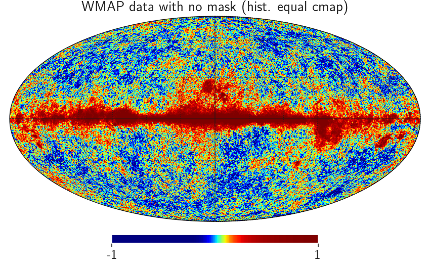

# Investigating the effects of masks

A mask is simply where we neglect observations taken over a region of the sky. This is often done because the observations
in this region are heavily contaminated with noise, and so the data is not coming from the underlying signal that we are
trying to detect. An example of this is when we mask over the Milky Way in most observations due to the increased stellar
density, which dramatically increases the noise in the signal.

## Masking CMB data

First, I will look at masks in relation to CMB data as there are many existing demonstrations of masks applied to WMAP and
*Planck* data online. Once the basics are understood, I can apply this to weak lensing data.

Here, we plot raw temperature anisotropy data obtained by WAMP seven-year data in the Q-band (41 GHz), with a normalised colour-map scale.

We see that the data is heavily contaminated by the Milky Way running through the centre of the image, and so if we want
to do any science with this map, we need to mask over this area. This will leave behind the actual temperature anisotropies
that are from the CMB, and not from any other sources. To do so, WMAP employed the following mask

In this figure, a value of one corresponds to allowing the data through the mask and a value of zero corresponds to
the data being masked out. Here, we see the large section that is masked out in the centre is the Milky Way. However,
we also see many smaller regions have also been masked out throughout the entire map, which corresponds to bright stars and
other objects that produce a large amount of noise - and so need to be masked out accordingly.

With this mask in place, we can now plot the raw temperature anisotropy data of the residual signal, which looks like

Hence, we recover a much cleaner signal with values that match the theoretical prediction of the CMB signal alone.

## Obtaining power spectra from masked maps

