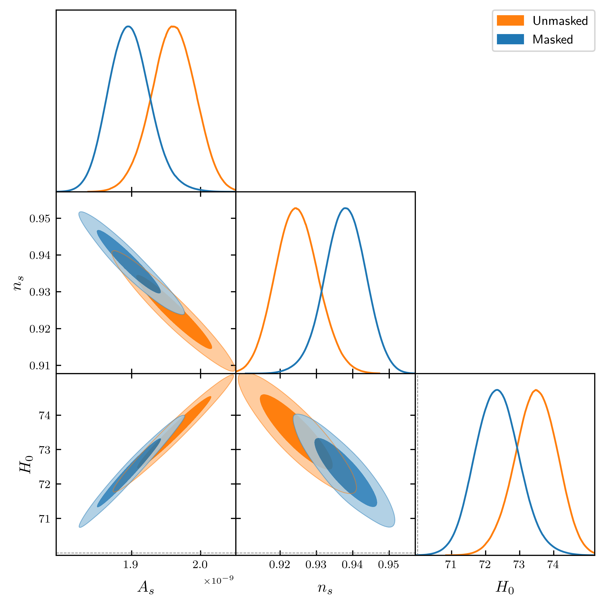
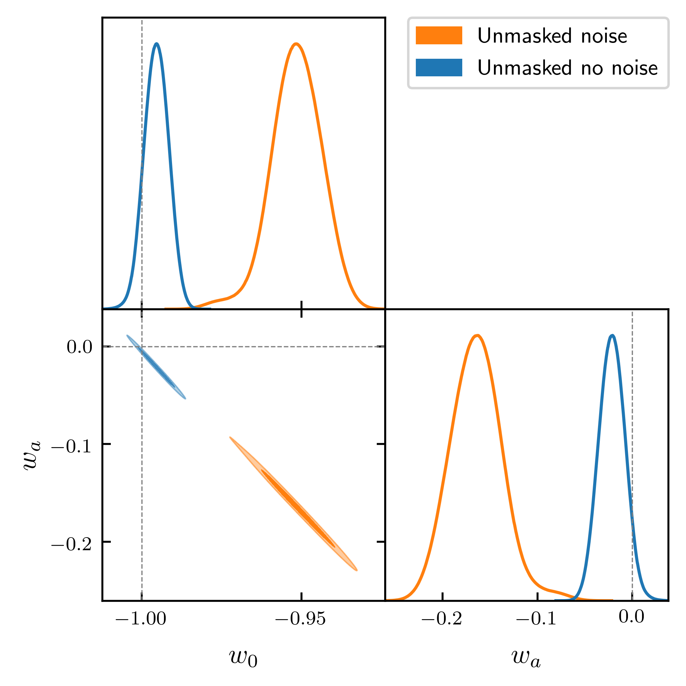

## Recovering cosmological parameters from masked maps

Now that we have established methods to mask convergence maps and naively recover the unmasked power spectrum, we can
apply these methods to recover the cosmological parameters that were used to generate the original map. This is a
formulation of a **very basic** likelihood code, which seeks to evaluate the posterior as a function of a singular
cosmological parameter to find the maximum-likelihood value.  

First, though, we need to define what the likelihood is in our case. Here, we have one set of "observed" *Cl*'s, denoted
with a hat, and want to find the most likely parameters of our model that go into generating our theory *Cl*'s. If we
assume that the *Cl*'s are normally distributed (we have shown this not to be true, but we will apply this approximation
anyway), then we find that for a single *Cl* value, the logarithm of the posterior probability is proportional to

<center>
 
</center>

Since the total likelihood is proportional to the multiplication of *f* over all *l*, the log-likelihood will simply
be the sum of the above quantity over all *l*:

<center>
 
</center>

Here, we have assumed a uniform prior on the theory *Cl*'s (and thus cosmological values), but this can be incorporated
into the above equation if so desired.

We can now implement the above equation into our code, and extract results from it.

### Recovering A_s

The first parameter that was attempted to be recovered from a map was the scalar amplitude A_s. Here, we computed the
likelihood for the unmasked map, the Euclid-like mask, and our first mask with f<sub>sky</sub> = 0.15%. This allows us
to see if applying a mask changes the recovered cosmological parameters, even for our very simple case.

The first test was on a pre-existing convergence map which was generated with A_s = 2.1E-9, so we want to see how
close we can get to this value using our maximum-likelihood technique.


Here, we can see that the maximum-likelihood values predicted by all three maps are very close to the original value
(which is shown by the dashed cyan line in the zoomed insert). We can see that the affect of masking gradually
decreases the recovered A_s parameter, with the results being

* Unmasked map: A_s = 2.102E-9
* Euclid mask: A_s = 2.099E-9
* Crazy mask: A_s = 2.094E-9

Hence, even our crazy mask predicts a value of A_s that is very close to the true value, which is encouraging!

We can now repeat the same analysis, but for a true A_s of 2.25E-9, just to see how robust the predictions are.


Here, we now see that the unmasked and Euclid masked maps predict A_s values that are very close to the true value,
with our crazy mask predicting somewhat of a lower value of A_s, but still in the right ballpark:

* Unmasked map: A_s = 2.252E-9
* Euclid mask: A_s = 2.251E-9
* Crazy mask: A_s = 2.215E-9

### Recovering the neutrino masses

Above, we were just trying to recover A_s, which simply scales the entire power spectrum and so is quite a simple value
to predict from a map. Here, we wish to extend the above analysis, but now try to recover the sum of the neutrino masses.
This causes scale-dependant suppression in the power spectrum, and so may be harder to predict than a simple scaling.

Again, we look at the unmasked map, the Euclid-like mask, and our crazy mask.


Here, we see some interesting results: all likelihoods dip around m_nu = 0.02eV, which causes the maximum-likelihood
value for the unmasked map to be much smaller than what it should be. The two masked maps also feature this dip,
but with is slightly weaker, and so the maximum-likelihood values here are much closer to the input value of 0.06eV.
The results for this are:

* Unmasked map:  sum m_nu = 0.00214 eV
* Euclid mask: sum m_nu = 0.0587 eV
* Crazy mask:  sum m_nu = 0.0620 eV

Hence, even with a much harder value to predict from a map, our maximum-likelihood technique still manages to recover
sensible, and quite close, values for the two masked maps.


## Improved parameter estimation from likelihoods

In above sections, a very basic likelihood code was written to try to extract the As value from a given map
and compare with the "true"/input values. There, the values reported were simply proportional to the
log-likelihood, with no normalisation made. Here, we would like to look at the curvature of the raw likelihood
around the maximum-likelihood point. To do so, we can normalise the values such that when we exponentiate the
likelihood, we find Min(L)=1. This was done for an unmasked map, and a map with the Euclid mask applied, for both
maps without noise and with shape noise added. The results of these four are:


Here, we have normalised the x-axis for each curve by taking centering the graph around the maximum likelihood
value for each curve. This allows us to easily compare how small changes in As correspond to change in the
likelihood across curves.  
Here, we can see that for a very small change in As, of the order a 0.05% change, the likelihood doubles.
This indicates that the actual likelihood is very sharply peaked around the optimal value of As, and so the
constraints on As will be very small in this case (which is what we expect as A_s should be a well constrained
parameter).  
We note that the likelihood becomes broader when we add noise, which would transfer to looser parameter
constraints on maps with noise over noiseless maps. We also note that the use of masking does not significantly
alter the shape of the likelihood curves, only inducing a slight bias to smaller As values.

### 2D likelihood of As-ns

In the above analysis we focused on just the 1D probability distribution of A_s values, with all other cosmological
parameters fixed. This is a gross simplification as, in general, there are many unknown parameters that values we do
not know, and so we need to marginalise over all of these at once. To go from a 1D distribution to all
cosmological parameters is quite a complex task, so let us extend to two parameters here, which can then be
further generalised later.

As the above likelihood calculations focused on A_s, it was natural to extend them to include the scalar spectral
index n_s too. This then gives us a 2D likelihood contour, as we can simply evaluate it over a grid of (A_s, n_s)
values. This isn't the most efficient method, however is the simplest to code up. The results of this are


Here, we can see that the likelihood values generally form bands, where an increase in A_s leads to a decrease
in n_s, for the same likelihood value. We have also labelled the maximum-likelihood point (the pink cross) and
the true values for the map (the purple cross). We can see that these two values are quite close, which shows
that our 2D likelihood code is still capable of recovering cosmological parameters from a map, even in 2D.  
We have also added two contours that represent the 68 and 95-th percentiles of the likelihood data. These values
were obtained by plotting the likelihood values on a 1D histogram, and then extracting the confidence intervals
from that:


Looking back at the 2D contour map, we can see that the two dashed contours are very loose constraints on the
joint A_s-n_s values, primarily due to the apparent degeneracy between the lensing power spectrum as A_s increases
and n_s decreases.

#### Slices of the 2D likelihood

In the above contour plot, we can see that bands have formed in the likelihood along the inverse diagonal
in the plane of the plot. We would now like to look at these bands by taking slices of the contour
at fixed n_s, giving us a likelihood in just the A_s plane:


This nicely illustrates that we have found that for larger values of A_s, the likelihood prefers a smaller n_s,
and vice versa.  
Hence, looking at this leads us to think that there might be a slight degeneracy between A_s and n_S in the
lensing power spectrum. Therefore, we can plot what the lensing power spectrum looks like for the maximum
likelihood point for our three curves above, which gives


Here, we can see that for low _l_ (less than around one hundred) the three models predict quite different values
for the lensing power spectrum. However, above this point they all start to converge to the same curve which
is where the degeneracy in the likelihoods' comes from.

#### A_s - n_s contours with masking

The contours for the likelihood values in the A_s - n_s plane were for convergence maps with no masking, and so
we can ask if masking the map before recovering the Cl values (with the Euclid mask) changes the values
significantly. Doing so resulted in finding that neither the A_s or n_s values were changed to three
significant figures, and so we can be confident that masking does not change the final results much (at least
in our basic scenario). However, we can look at _how_ the likelihood changes when masking, which is through
taking the difference between the two sets of values. This gives us the plot of


This shows that the likelihood changes most for small values of A_s and n_s, when the amplitude of the
lensing power spectrum is at its smallest.


### An MCMC analysis of the A_s - n_s plane

In our above analysis, we used our likelihood code to simply evaluate the likelihood on a grid of (A_s, n_s)
values to then extract the maximum-likelihood point, and to see how the contours where shaped. However, we can
go further than this by embedding this likelihood in an external Monte Carlo Markov Chain (MCMC) analysis
pipeline to find the optimal constraints on the parameters, given our likelihood, and proper analysis
of the posterior distributions. To do so, the likelihood code was converted into a small standalone Cosmosis
module, which then allowed us to use the standard Cosmosis samplers to probe the parameter space in the
most efficient way possible. Here, we used the basic Metropolis-Hastings algorithm as while it may not be
the most efficient MCMC sampler, it is one of the easiest to use.

The sampler was then run using 25,000 sample points to obtain good distributions of the posterior, which was
then passed into the GetDist analysis software to produce a triangle plot of


Here, we can see the strong inverse degeneracy between A_s and n_s values, as seen in the raw likelihood
contours. We also note the nice nearly Gaussian 1D marginal distributions for A_s and n_s. From GetDist, the
1D marginal constraints on A_s were (2.088 ± 0.012) x10<sup>-9</sup> and n_s were (0.9670 ± 0.0050). Clearly
these are very tightly constrained parameters, which makes sense given what we know about the likelihood.

#### Extending the MCMC to three parameters

Now that we have a working MCMC pipeline to estimate two parameters, we can try to extend this to more parameters,
in this case by sampling over the Hubble constant H0. This then gives us three parameters, of which the triangle
plot for the run gave



This now gives some very interesting results when we compare our three parameter run to our two parameter run.
We note that the A_s and n_s values seem to be biased to lower values than their true value, and that the
H0 value is larger than the true value. We also note that none of the 95% contours overlap with the true values
for any of the parameter combinations. The best-fit parameters here are: A_s of (1.96 ± 0.06) x10<sup>-9</sup>,
n_s of (0.925 ± 0.012), and H0 of (73.5 ± 1.2) km/s/Mpc.  
These results show that a smarter likelihood and sampler code is needed when we want to eventually extend this to 
the number of parameters eventually required (approximately ten).

### <span style="color:orange">⚠️ Follow-up note:</span>

In the above triangle plot it was noted that all parameter values seemed to be significantly shifted from their
"true" values, with A_s and n_s being considerably shifted from the previous two-parameter only case.
Hence, we wanted to see if this result was true, or simply a result of a bug in the code that would need to be
looked into.  
To debug this, we first plotted the power spectrum of the map with the maximum-likelihood values found above.
We found that these two differed significantly, and so there is no way that the above parameters were the 
best-fit to the original map. Therefore, there must have been a slight issue in the computation of the 
theory power spectrum, or the likelihood calculation itself.  
The bug was found to be when we updated the H0 value in CAMB, and then computed the Cl's from that.
Originally, we set the cosmological parameters for the `params` class through the line
```python
params.set_cosmology(H0=70, ombh2=0.0226, omch2=0.112, mnu=0.06)
```
This sets all parameters to accurate default values, which then allows us to update them as we wish. This
was done though the following lines
```python
for H0_idx, H0 in enumerate(H0_vals):
    params.set_cosmology(H0=H0)
```
Here, we assumed that the previously set values would not be overwritten, however they were by the default
arguments of `ombh2=0.022` and `omch2=0.12`. This slight difference in the matter densities caused the 
likelihood to adjust the samples parameters to account for this difference.

With the fixed likelihood code, the triangle plot for our three-parameter case is


Here, we see that all parameter contours are much closer to their true values which shows that the bug
in the likelihood code has been correctly fixed. We also note that the size of all contours has been 
significantly reduced by about an order of magnitude, which shows that when we use the correctly likelihood
the constraining power is very large.

### Improving MCMC parameter estimation using multiple redshift bins

In our above MCMC analysis of recovering two and three parameters, the likelihood was only evaluated at a single
redshift (z=2). While this is good enough to get reasonable constraints on A_s and n_s, when extended to the 
dark energy parameters (w_0 and w_a), this simplistic approach starts to break down. This is because the dark
energy parameters mostly affect how the lensing power spectrum evolves with redshifts, not just at a single
slice. Hence, dark energy parameters can be optimized for a single redshift bin which do not match at all another
one due to the very different evolution. Therefore, we can instead use multiple redshift bins to constrain this
evolution of the power spectrum, which gives us much more optimal constraints on the dark energy parameters.

For example, the 2D constraints on w_0 and w_a from using a single redshift bin are


Whereas, for two redshift bins (z=0.5 and z=2), we find the constraints tighten significantly to


Here, we can see that the constraints on both w_0 and w_a become about three times smaller when using the
additional redshift bin over just using one. This shows the power of using the evolution of the lensing power
spectrum, instead of just using a single realisation. This is summarised in the following table

| Parameter      | One redshift bin  | One redshift bin - masked | Two redshift bins | Two redshift bins - Masked |
| ----------- | ----------- | ---------- | ---------- | ---------- |
| w_0 | -0.962  ± 0.030 | -0.960  ± 0.025 | -0.9955  ± 0.0073   | -0.9933  ± 0.0076 |
| w_a| -0.136  ± 0.11 | -0.146  ± 0.090 | -0.021  ± 0.026 | -0.028  ± 0.027  |

#### Using two redshift bins for A_s and n_s estimation

Now that we have adapted the code to use two redshift bins instead of one, we can apply this to our basic
example of estimating A_s and n_s. Again, doing this for masked and unmasked maps, we find the 2D contour as


### <span style="color:CornflowerBlue">Follow-up notes:</span>

#### Testing the grid precision

In our above MCMC analysis of the A_s-n_s plane, we used a grid of 10 A_s and n_s values (giving us a total
of 100 points) that we then interpolated over, which allowed us to easily evaluate what the Cl values are
at any arbitrary A_s n_s value. Here, we would like to check the sensitivity of the recovered contours to 
the number of points in our grid to see if increasing this produces tighter contours, or more accurate results.
To do so, we evaluated the grid with 5, 10, 20, and 40 number of points in each dimension and then ran the
MCMC analysis for 25,000 sample points. The results of this were


Here, we can see that all four contours are practically lying on top of each other, only the orange curve
representing 20 samples seems to be slightly displaced from the other three. This shows that our results seem
to be independent of the gird resolution, which is good to know.

#### Testing the sensitivity to l_max

In all of our previous results, we have evaluated the theory and recovered Cl's up to an l_max of 2000. 
While this is quite a high value, we wish to see what happens to the recovered contours when we increase this
to 4000. This should provide us with double the number of modes, and so in theory much better constrain 
the parameters. Additionally, as the likelihood is weighted by a factor of (2l + 1), the likelihood is far
more sensitive to changes at high _l_ than low _l_. 


Here, we see the main effect of increasing l_max is to significantly tighten the contours, providing more
precise maximum-likelihood values. This shows that we should be using the largest l_max as we can.  
The downside to increasing l_max, though, is the increased run-time for each sample point as CAMB needs to do
(at least) double the work per sample.

### Investigating parameter bias when masking and adding noise

In the real world, our maps that we want to estimate cosmological parameters from will be masked and include
noise. Hence, when we try to simulate recovering parameters from maps, we should do so from maps that have
been masked and have noise added that would reflect the real masking and noise. We can then compare the
parameter estimations from our maps with and without noise, and with and without masking. This allows
us to see in detail how each effect affects the recovered parameters in a controlled manor.  
Furthermore, we have been dealing entirely with convergence maps so far, which is not the case for the real
world applications where we will be using the EE mode of the shear signal. Hence, we want to compare how
using shear could lead to different parameters over using convergence, especially when masking and noise
are involved.

The same 1D likelihood code was re-used here to compute the likelihoods for our four cases for the
simulated convergence signal, which gives


The same was done to simulate the EE-mode shear signal, which gave the following likelihoods


These two plots look very much the same, which suggests that as the EE shear signal tends to the convergence
signal at large-_l_, this causes negligible parameter biasing as the likelihood calculation is weighted towards
larger-_l_ values. We have also seen that masking the shear signal  

| Map      | Recovered A_s value |
| ----------- | ----------- |
| Unmasked no noise convergence | 2.16162e-09 |
| Unmasked no noise shear | 2.16163e-09 |
| Unmasked with noise convergence | 2.16069e-09 |
| Unmasked with noise shear | 2.16070e-09 |
| Masked no noise convergence |  2.16192e-09 |
| Masked no noise shear | 2.16193e-09 |
| Masked with noise convergence |  2.15930e-09 |
| Masked with noise shear | 2.15931e-09 |

Note that the "true" value for the map is 2.1E-9, and so the masked with noise maps technically predict the 
"best" A_s value, however it is true to say that these are also the most biased parameters in regards to
the unmasked with no noise maps.

### MCMC analysis including noise

Above, we have looked at our 1D likelihood case where we have added noise and used a mask to see if there are
any biases when we include these effects. We noted that including noise slightly biased the to have lower A_s
values, and so here we want to repeat our MCMC analysis of the A_s-n_s plane but now including noise. Here,
we are still generating random shape noise inside each pixel and adding this to our convergence maps. Again,
we are using two redshift bins to improve the accuracy of the results.

#### Unmasked sky

First, we looked at adding noise to the unmasked sky, which gave the following triangle plot


Here, we can see that including noise in the maps causes biases in both of the recovered parameters, where we
have a lower A_s value, and a higher n_s value. This indicates that the likelihood code wants a steeper power
spectrum with a smaller overall scale factor. The addition of noise also increases the width of the 1D marginal
histograms, and so we expect the errors on the parameters from the maps with noise to be larger than those
without noise.

#### Masked sky

We then applied adding the random noise to our masked maps, which gave the following triangle plot


Here, we can see that adding noise to our masked maps does not significantly bias the recovered parameters,
just that their 1D marginal histograms (and thus 2D joint contour) becomes larger with noise.

#### Summary table

We can summarise our four runs through the following table of parameter values and their errors

| Parameter      | Unmasked no noise  | Unmasked with noise | Masked no noise | Masked with noise |
| ----------- | ----------- | ---------- | ---------- | ---------- |
| A_s x 10<sup>9</sup> | 2.0950 ± 0.0075 | 2.090 ± 0.012 | 2.0844 ± +0.0078 | 2.085  ± 0.012 |
| n_s | 0.9629 ± 0.0028 | 0.9649 ± 0.0050 | 0.9671 ± 0.0030 | 0.9673 ± 0.0050  |

This shows that the main effect of including noise in the maps is increased error bars on both parameters,
which shows that we are less certain on the values on the recovered parameters than we would otherwise be without
noise.

## MCMC analysis of dark energy with shape noise

Previously, we looked at performing an MCMC analysis of the dark energy equation-of-state parameters for 
unmasked and masked maps. However, these maps did not include any shape noise, which real world maps will.
As one of the main goals for Euclid is to constrain the dark energy parameters, we want to see what the affect
of including shape noise in our maps is. To do so, we can add random Gaussian noise to each pixel, with a mean
of zero, and a standard deviation given by the intrinsic galaxy ellipticity value (set as 0.21) divided by the 
square-root of the number of galaxies in each pixel. This then allows us to set a value for the noise Cl values,
and so by including this in our likelihood code we can accurately keep track of noise in the maps.  
Here, we include noise in our unmasked maps first, and then extend this to masked maps

### Unmasked maps



Here, we can see that the contour for the map with noise is significantly displaced from the no noise contour.
This shows that the maps with noise favour a cosmology with a slightly reduced w_0 (making dark energy behave
more like matter today) by with a significantly negative w_a component. This suggests that at early times,
the maps favour a map that has increased dark energy density in the past than what we would expect given
its current density.  
It is interesting to see that though the noise contour is significantly displaced from the original contour,
they both have the same shape, and both appear to lie on the same diagonal in the w_0-w_a plane.  
To increase the accuracy of the noise contour, more redshift bins could be used, which would further constrain
the evolution of dark energy and tighten constraints on these parameters.

### Masked maps


Again we see the noise contour is significantly displaced from the no noise contour, with the same general shape
and lying on the same diagonal. The specific shape of the 1D marginal contours appears to be slightly more
non-Gaussian for the masked maps over the unmasked maps, however both seem to peak in around the same place
suggesting that the effects of noise is dominating over the effects of masking.

#### Investigating the degeneracy between w<sub>0</sub> and w<sub>a</sub>

From the above triangle plots for the dark energy parameters, it is clear that there is a strong degeneracy
between a more positive w<sub>0</sub> and more negative w<sub>a</sub> as all contours seem to lie almost exactly
on some sort of relation. We can look at this degeneracy by plotting the lensing power spectrum for
our original ΛCDM model, along with our displaced version


Here, we can see that both models predict almost exactly the same power spectrum for both redshifts. The agreement
is excellent for the second redshift bin (z=2), whereas the ΛCDM curve seems to be _slightly_ larger than our
wCDM result for the first redshift bin (z=0.5). Hence, it makes sense that our MCMC results would indicate a 
degeneracy between these two parameters, given our current redshift bins. Given that these dark energy
parameters mostly seem to affect the evolution of the lensing power spectrum, using more redshift bins 
could be a way to slightly break the degeneracy between the two parameters.

## Full eight-parameter MCMC analysis of a convergence map

Above, we have looked at much simpler two- and three-parameter models where we wanted to find the 
maximum-likelihood values for these individual parameters alone. However, in a real analysis there will be many
more cosmological parameters, and perhaps even a few nuisance parameters, that will need to analysed to extract
meaningful results. Here, we attempt to do this by performing an eight-parameter analysis by exploring the
parameter space of (A<sub>s</sub>, n<sub>s</sub>, H<sub>0</sub>, Omega<sub>b</sub> _h_<sup>2</sup>,
Omega<sub>c</sub> _h_<sup>2</sup>, m<sub>ν</sub>, w<sub>0</sub>, and w<sub>a</sub>). To do so, we require
a much more sophisticated MCMC algorithm over the previously used Metropolis-Hastings. While MH is good for
basic tasks, when the number of parameters is increased MH can take an extremely long time to fully explore
the parameter space over other tools. Here, we use the Multinest algorithm as this has been found to work
extremely well with the number of parameters that we have, as it can provide fast and accurate MCMC results.  
The results of the masked and unmasked map are


Here, we can see the main affect of masking the map is to significantly increase the parameter contours,
which shows that we are less certain about the maximum-likelihood parameters for the maps with masking
over those that are unmasked. For some contours, for example the A<sub>s</sub>-n<sub>s</sub> contour,
the masked contour looks significantly displaced from the unmasked contour, which suggests that by masking 
introduces light biases in the parameter values. The A<sub>s</sub>-n<sub>s</sub> contour is also interesting for
another reason: when we looked at just A<sub>s</sub>-n<sub>s</sub> alone, we saw a strong negative correlation
between these two parameters. However, in our full analysis the contours indicate a positive correlation
between these two parameters, which shows that there must be new effects coming from the other parameters that
would cause this flip.  
For our two parameter sets, the best-fit parameters with errors are as follows

| Map      | A<sub>s</sub> x10<sup>-9</sup>  | n<sub>s</sub> | H<sub>0</sub> | Omega<sub>b</sub> _h_<sup>2</sup> | Omega<sub>c</sub> _h_<sup>2</sup> | m<sub>ν</sub> | w<sub>0</sub> | w<sub>a</sub> |
| ----------- | ----------- | ---------- | ---------- | ---------- |  ---------- |  ---------- |  ---------- |  ---------- |
| No mask | 2.09 ± 0.21 |0.966 ± 0.020 | 69.0 ± 5.1 | 0.0208  ± 0.0065 | 0.110  ± 0.013 | 0.049 ± 0.045 | -1.006 ± 0.0042 | 0.003 ± 0.055
| Mask | 1.96 ± 0.21 |0.964 ± 0.025 | 70 ± 8 | 0.020  ± 0.011 | 0.113  ± 0.021 | 0.072 ± 0.067 | -1.024 ± 0.0078 | 0.00 ± 0.14

Hence, this shows that the largest effect of masking is to increase the error bars when looking at our 
eight-parameter simulations. However, several parameters (notably A<sub>s</sub> and m<sub>ν</sub>) look to be slightly
biased away from their unmasked values. 

## Eight-parameter MCMC analysis using Metropolis-Hastings

Above, we looked at running MCMC runs using eight parameters, which is much more realistic than simple two- or
three-parameter runs previously used. There, we used the Multinest sampler, as this is quick and provides accurate
results in these higher-dimensional problems. However, we just wanted to see what would happen if we used the basic
Metropolis-Hastings sampler, instead of much more complex ones. Here, we use the same priors, ranges, and original
map, which gives the following contours


This run was completed over around four days, completing a total of 66,000 samples (of which only around a thousand
were accepted) before being killed. This shows that if we want to continue using the MH sampler, then we would
have to increase the runtime significantly to sampler over many more points to obtain accurate contours.
More realistically, however, should be the use of these complex samplers, such as Multinest or Emcee, going
forward.

## Parameter constraints from another convergence map

As each convergence map is randomly generated from the true power spectrum, there exists small fluctuations
in each individual map. This could then lead to the estimated parameters being slightly different for each map,
which is what we want to look at here.  
Another convergence map was generated using the same input power spectrum, and then run through our MCMC analysis
chain to estimate A_s and n_s, with the results as

### Unmasked, no noise

First, the unmasked map with no noise was analysed, giving


Here, we see that while the 2D contour largely lies in the same place, the 1D marginal histograms are slightly 
displaced from their original values. We see that our new map predicts a slightly smaller A_s, and larger n_s,
which are both displaced from their true values.

### Masked maps with noise

If we now move to add shape noise to each pixel, and then mask our maps we find the following results


Here, we now see that our new map predicts almost exactly the true A_s and n_s values, when we apply noise and
a mask. It should also be noted that the noise realisations were different between both runs, and so the shifts
will come from both the realisation of the signal map, and the noise maps.  
This shows that we need to be careful when simply using one, or a small number of maps, to estimate parameters
from as we could be biasing our parameter estimates without knowing.

## Parameter constraints from an ensemble of maps

Above, we have shown how simply generating a new random realisation of a convergence map leads to a slight
shift in the recovered parameters. This is because each new realisation will have a slightly different power
spectrum, and so will impact the likelihood calculation in a random way. To overcome this randomness, we can
use an ensemble of randomly generated convergence maps to see what the distribution of the maximum-likelihood
values are. This allows us to compare this with the "true" input values, and so allows for a proper comparison
between input and recovered values.

For each redshift bin, we generated sixteen convergence maps and performed a likelihood analysis on each 
of these maps independently. We can plot the individual likelihood contours as well as the combined contour
for both redshift bins, which gives:

### Redshift of 0.5


### Redshift of 2.0


Here, we plot the individual maps in grey, with the joint probabilities in yellow. While the individual maps
show a large range of scatter, the combined likelihood provides a very accurate estimation of the true A_s
and n_s values. This shows that we cannot trust the results of an individual likelihood run, and instead
need to average over many different realisations to provide the most accurate constraints possible.

#### Investigating the distribution of the maximum likelihood values

Above, we have seen how the complete 2D joint and 1D marginal contours change for each random realisation
of the convergence map. We now want to look at simply how the maximum-likelihood values are distributed with
regards to the total combined likelihood. Here, we simply plot each individual maximum-likelihood point as
a cross on top of the combined likelihood contour, for the _z_=0.5 redshift bin:


This shows that all maximum-likelihood values of the individual maps lie within the 1-sigma contour,
which is what we expected to see.

### Combined results at each redshift

Now that we have an ensemble of individual likelihoods at each redshift, we can combine them to a single
likelihood contour for each redshift, which gives


Here, we can see that all three contours give maximum-likelihood values that are very close to the true values,
which shows that each individual redshift bin can accurately predict the value of A_s and n_s, without needing
to use multiple bins.

## Repeating the ensemble of maps for masking and/or noise

Now that we have a method in place to produce individual results from an ensemble of randomly generated maps,
we can extend it to including more realistic effects, such as masking the maps and adding noise. 

### Masked map, no noise added

First, let us simply mask each map without adding any shape noise. This gave


Here, we can see approximately the same dispersion when compared to the unmasked case, however a few realisations
lie on the outskirts of the total contour.

### Unmasked map, with noise added

Now let us return to our unmasked maps, and add some random shape noise to each map


Here, we can see that some samples feature significant deviations to lower A_s & higher n_s values compared
to the majority of the samples. Hence, we may need to produce many more than our current sixteen realisations
to get a full understanding of the ensemble properties of the maps that have noise added to.

### Masked map, with noise added

Now let us apply both a mask and add noise to our maps, which is the most realistic scenario


Here, we see that there is a significant outlier to our data, as it has a small A_s value compared to the 
other maps. Hence, we may have to use more realisations when using masking and noise.

### Summary

We can compare the four different models through the following plot


Here, we can see the two main effects:

- Masking the map seems to increase the size of the contours, which leads to increased error bars on parameters.
    The secondary effect here is to slightly bias the parameters, but this bias changes between using noise or not.

- Adding noise seems to significantly shift the contours, introducing a significant bias. We also see that
    the maps with noise have significantly larger contours, which again leads to much larger error bars on 
    parameters.
