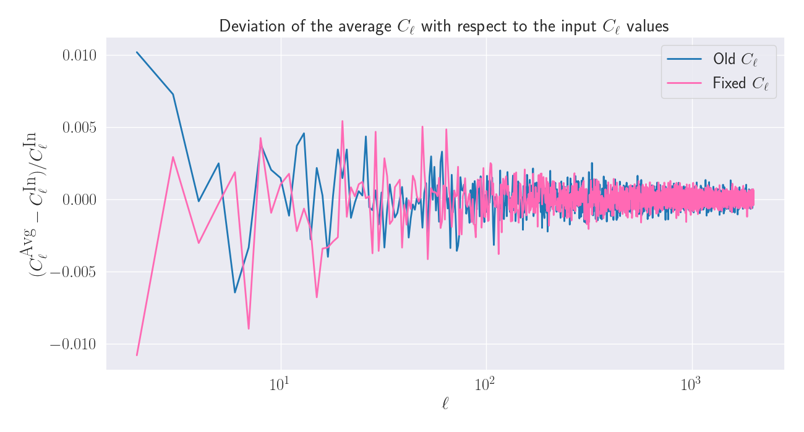
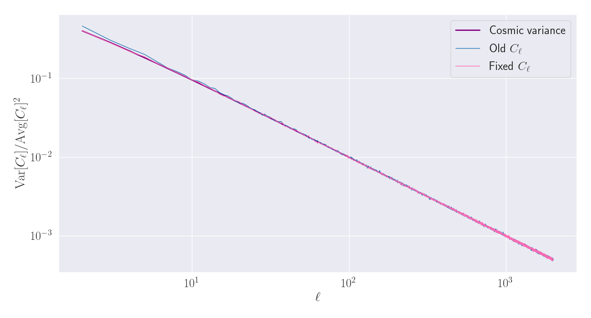
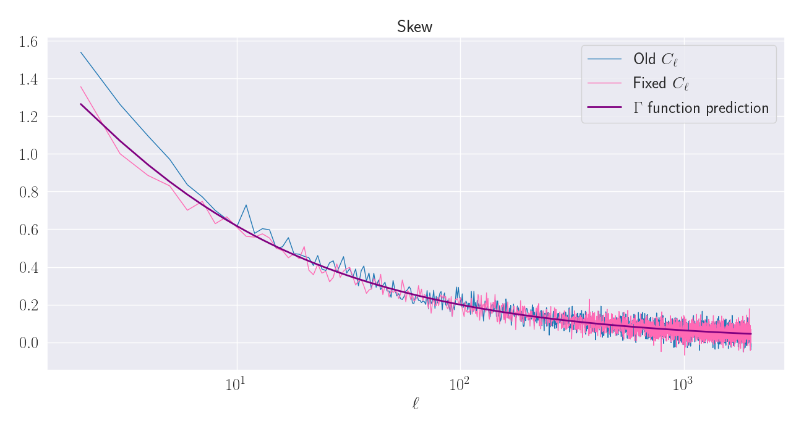
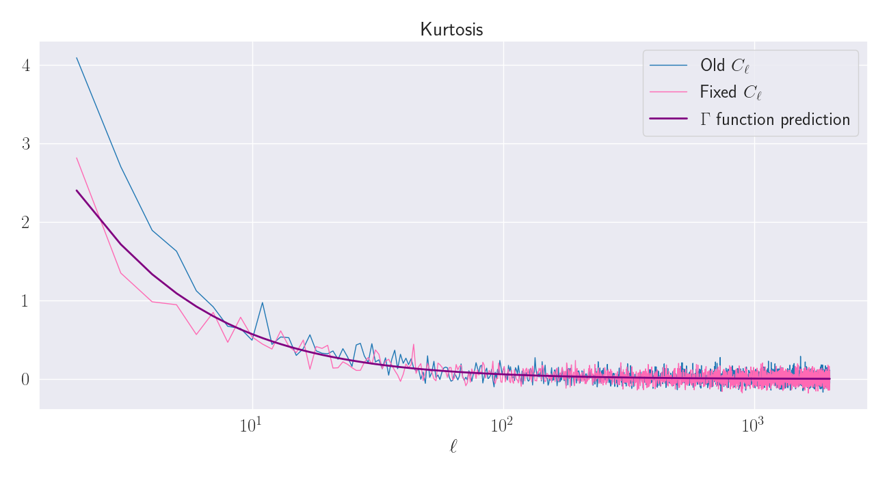
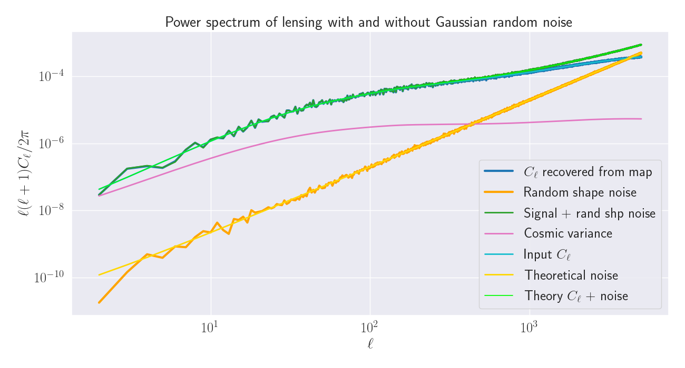

# Map making

## Generating lensing power spectrum in CAMB

The first task was to generate mock weak lensing power spectrum using the CAMB code for different redshift bins
and ensure that I could repeat previous figures. Such a plot is shown below, which shows the lensing power spectrum
for two different redshift bins, including the non-linear (solid) and linear (dashed) models. Here, we see the same
general structure between the two different redshift bins, however the z=2 line has a much larger amplitude over the
z=0.5 line. This makes sense as the light coming from z=2 galaxies has travelled a longer distance through spacetime,
and so had more opportunities to be gravitationally lensed - and thus we detect a stronger signal.


## Feeding this into Flask

Now that we have an accurate way of simulating mock weak lensing power spectra, we can use these as inputs to the
Flask code, which allows for accurate real-world simulations of various random astrophysical fields given input
spectra. For our case, we wish to compute the lensing convergence and shear fields. An example of such output
is below, which shows the input power spectrum from CAMB in blue, and the real-world random realisation from
Flask in purple.


Here, we see that the random realisation generally follows the input spectra, however due to the random nature of
the realisations, there is some scatter around the input curve. This is especially noticeable at low _l_, which
is due to the nature of the cosmic variance, which we will revisit later.

### Generating maps from power spectrum

While generating plots of power spectra are useful, what we actually observe are maps that correspond to the
convergence and shear signal at each point in the sky. Hence, we wish to convert our mock _Cl_ values into a mock
map. This can be done through the HealPy library, which is a Python wrapper for the popular HealPix spherical
harmonic transform library. Shown below is an example map generated from the above convergence power spectrum as
produced by Flask.


## Checking HealPy's alm -> Cl conversion

Put plot here.

## Checking HealPy's map -> alm conversion

In the above plots we are relying on the accuracy of HealPy and Flask conversion between a map, which contains
the field values at each position on the sky, to a list of _alm_ and thus _Cl_ values. To convert a map to a
set of _alm_ values, we can use the following spherical harmonic decomposition

<center>
 
</center>

where this integral is over the whole sky, _Ylm_ are the spherical harmonics, and _f_ is the data vector that we wish
to transform. Now, as our input data isn't a continuous function of theta and phi, but instead a list of values 
evaluated at fixed coordinates, we wish to discretize this integral into a sum. This can be done through

<center>
 
</center>

where the sum is over all data points. Here, we now have a pre-factor of (4 pi / _N_), where _N_ is the number of pixels
in the map, as this combination simply weights each term in the sum by the area of each pixel.

Numerically, this sum can be implemented as

```C++
auto alm = std::complex<double>(0);

// Go through each datapoint and compute the value of Y_lm(theta, phi) * f(theta, phi) and add to alm
for(std::size_t i = 0; i < thetas.size(); ++i)
{
    alm += std::conj(boost::math::spherical_harmonic(ell, m, thetas[i], phis[i])) * data[i];
}

// Normalise the alm value through the area of each pixel
alm *= (4 * M_PI) / n_pix;
```

Using this code allows us to evaluate the map -> _alm_ conversion ourselves, and thus verify the existing codes.
An example of this check is shown below, which is where the dark blue line is the _Cl_'s computed from the _alm_'s using
the above method, and the light blue line is the result from using HealPy from Flask's output.


Here, we see that the two curves are exactly on top of each other up to the cut-off in computation of the _alm_'s using
our method, which was _l_ = 250, which shows that HealPy is doing what is expected.  

## Multiple simulations for the same input

Since Flask generates a new random realisation of the fields given the input power spectra, it should be expected that
running the same simulation multiple times given the same input will inevitably result in slightly different results for
the _Cl_'s. Shown below is the result of 250 different runs of Flask using the same input power spectra.


Here, we see that the spread of _Cl_ values is larger at small _l_ , which is what's called _cosmic variance_:

<center>
 
</center>

Plotted below is the variance of the _Cl_'s divided by the average _Cl_ squared, and the prediction from cosmic variance,
which we see follows the data exactly.


## Investigating the distribution of the _Cl_ values

In the above plot, we found that the expected variance of the _Cl_ values almost exactly follows from the predictions
from the cosmic variance. We now wish to go beyond the variance and look at more detailed properties of the _Cl_ values,
how they change with _l_ and vary with each other.

The first plot made is a square plot of the _Cl_ values for  selected _l_. Here, we see that the 1D distribution looks
quite non-Gaussian for low _l_, as the distribution looks more like a Poisson distribution as it peaks early at low values
but has a long tail to high values. We see that as _l_ increases, the 1D distributions gradually approach a Gaussian.  
These 1D distribution properties are reflected in the two-dimensional contour and scatter plots on the off-diagonal corners.
For low _l_, the contours are concentrated at low values, with an asymmetric tail to higher values. For large _l_, we see
that the contours are quite circular, which indicates that each _Cl_ value is independent of each other.


Note that we needed to multiply all _Cl_ values by 1E7 to get the KDE contours to generate correctly.

Since we are dealing with vary many different sets of _Cl_ values it is useful to introduce new terminology.
For a given set of _alm_ values we can construct an *estimator* for the _true_ _Cl_ value, as  

<center>
 
</center>

If we average this estimator over vary many independent maps, then we should recover the true _Cl_ value

<center>
 
</center>

So while the individual _alm_ values are statistically independent and are random numbers drawn from a Gaussian
distribution, the estimated _Cl_ values are **not** intrinsically Gaussian variables. Instead, they are drawn
from a Γ distribution with mean _Cl_ and variance 2(2*l* + 1) \* Cl^2. For a reminder, the probability density function
for the Γ distribution (*f*) is 

<center>
 
</center>

where Γ is the gamma function, _a_ is called the shape parameter and _b_ is the scale parameter. This distribution has
a mean _ab_ and a variance _a b_<sup>2</sup>.

In the limit of large _l_, this distribution approaches a Gaussian due to the central limit theorem, but it is not intrinsically a Gaussian. This effect is very noticeable at small _l_, as seen in the plots above and below.  
As we wish to investigate the non-Gaussian behaviour of the estimated _Cl_ values at low _l_, we can plot the
estimated _Cl_ distribution normalised to the mean from _l_ = 2 to _l_ = 25.


Also plotted in light blue here is the expected curve of the Γ distribution for each _l_. We see very good agreement
across all _l_ values, which shows that we have recovered the expected result that the estimated _Cl_ values follow
the Γ distribution.

### Skew

We can quantify the skewness of the _Cl_ distribution by computing the skewness of the distribution, which is defined
as the third moment of the data
<center>
 
</center>

where _μ_ is the mean and _σ_ is the standard deviation of the data.

Plotting this as a function of _l_ for our data gives


Here, we see that the skew is large and positive for low _l_ values, with it decreasing with _l_ - but staying above zero
for most of the _l_ values. Plotted in purple is the expected values for the Γ  distribution, which has an exact value
for the skew as (2 / sqrt(*a*)), which very accurately matches the data for the range _l_ ≳ 20 but underestimates the
skew of the data at very small _l_.

### Kurtosis

Kurtosis is defined as the fourth moment of a data set, which is given as
<center>
 
</center>

Here, we use the *excess kurtosis* which is defined as the kurtosis minus three, and so the kurtosis for a Gaussian
as zero in the plot below.

We can perform the same analysis as above but now for the kurtosis of the data and expected values from the Γ distribution.

Here, we also find that the expected values from the Γ distribution closely follow the data for the range _l_ ≳ 20,
however we find a larger discrepancy between them for small _l_ than for the skew.

## Investigating correlation of Cl values between different *l* values

In theory, as each _alm_ value should be independent of other values, the Cl values should also be independent of each
other. We can test this by computing the Pearson correlation coefficient between each set of Cl values at different _l_.
The Pearson correlation coefficient between data vectors _x_ and _y_ is defined as

<center>


</center>

This was evaluated for our Cl data up to _l_ of 125 using the `scipy` function `stats.pearsonr`, which is shown in the plot below


Here, we see that the correlation coefficient has a maximum amplitude of around 0.06. This is a very small result for the
correlation coefficient, which shows that none of the Cl values are strongly correlated for different _l_ values.
The _p_-value for the correlation was also computed and was found to be very small, which also suggests that different
Cl sets are not correlated in any way.

The `scipy.stats.pearsonr` function uses the empirically-derived means to find the correlation coefficient, which may
introduce a small level of bias in the results. Instead, we can repeat this calculation where we are using the
**theoretical** _Cl_ means and variances from the input array. This gives us the raw covariance matrix, which when evaluated
on the same data as above gives us


## Fixing Flask's *Cl* calculation

In the above figures, it is noted that the variance, skew, and kurtosis of the ensemble of *Cl* values is slightly larger
than the prediction from the Γ distribution. This is especially noticeable at low _l_, in the region where _l_ < 15, or so.
This was found to come from the strange way that Flask computes _Cl_ values given a set of _alm_ values. Instead of doing
the normal sum of

<center>
 
</center>

where we sum over all _m_ values starting at _m_=-_l_ to _m_=+_l_, Flask performs the alternative sum of 

<center>
 
</center>

where we only sum over non-negative _m_ values. This has the affect of effectively double-counting the _m_=0 mode,
and so the obtained statistics of the _Cl_ values obtained this way is expected to be different from the normal ones.

We can see the effect that this has on our ensemble _Cl_ values by computing a new ensemble of _Cl_ values with the correct
_Cl_ calculation in place in the Flask source code. The `flask_aux.cpp` file was edited
[around these lines here](https://github.com/hsxavier/flask/blob/5245d15707b44bbe774d864429159e3d11ec7783/src/flask_aux.cpp#L334).  
Using the updated code, we find plots of the variance, skew, and kurtosis as






Here, we see that the ensemble statistics for the updated _Cl_ values match the prediction from the Γ distribution far
better than the previous values. This was done for 6,000 sets of _Cl_ values in each data set.  
When looking at the plot of the deviation of the average _Cl_ values, it is interesting to see that both lines are
randomly distributed around zero, which shows that despite Flask's native _Cl_ computation leading to a slightly wrong
variance, it is an unbiased statistic with regards to the mean.

## Including noise

Now that we have fast and accurate methods for obtaining the lensing power spectrum, we wish to include some of the real-world
effects that may affect the data that we collect. The first effect to be included is modelling the intrinsic ellipticities
of actual galaxies. To do so, we simply generate Gaussian random noise with a mean of zero and a standard deviation given
by

<center>
 
</center>

where σ_e is the average intrinsic ellipticity of galaxies, taken to be 0.21 following Euclid here, and *N* is the number of
galaxies in each pixel. We assume a flat distribution of galaxies on the sky, where we have 30 galaxies
per arcmin<sup>2</sup>.

We now wish to analytically derive what the *Cl* values for a pure Gaussian noise map is. To do so, we can use the fact
that if we have a pure noise map, then the estimator for the convergence in a given pixel will be

<center>
 
</center>

From this, we find the contribution to the total *Cl* values from the noise is given by

<center>
 
</center>

where *n* is the observed galaxy density in units of galaxies per radian<sup>2</sup>. We note that this is independent
of *l*, and so when we plot *l*(*l* + 1)*Cl*, like below, we expect to see a straight line on a log-log plot.  

Using this, we can generate a random noise map following this distribution and can simply add this map to our recovered
convergence map from Flask, and generate *Cl* values for the map with noise, to give



Here we see the characteristic power spectrum for Gaussian random noise, it is simply an increasing straight line.
Hence, when we add this to our existing power spectrum, we find that it has negligible effects at low *l*, but after *l*
values of around 900, it starts to have a non-negligible effect on the *Cl* values, and after *l* of around 2000 the power
spectrum is completely dominated by noise. We also see the large effect of the cosmic variance on low *l* scales, which
shows that the region of data where we have large a signal-to-noise ratio is only for a small range of *l* values.

We also see that the random realisation that was chosen for this simulation is very accurately described by the theory lines
for both the noise and the convergence signal.
