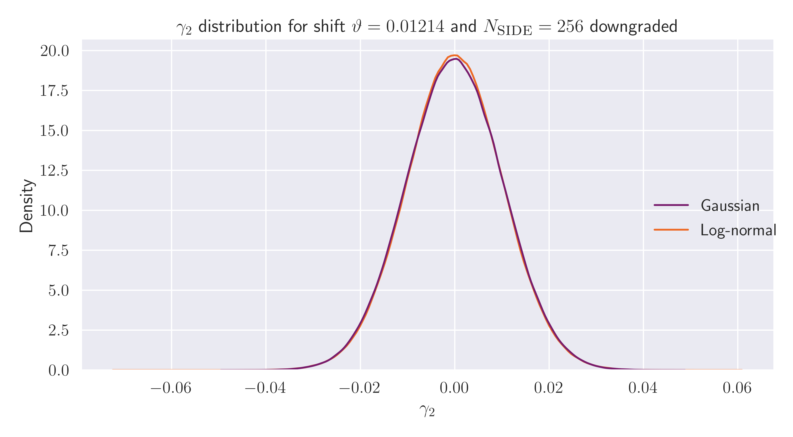

# Non-Gaussian maps

Thus far, I have been simply estimating the power spectrum errors using the Fisher matrix applied to Gaussian
realisations of the shear field. However, as we know that the shear field is not exactly Gaussian, we wanted to see
how the affect of non-Gaussianities in the shear maps changes the distribution of recovered Cl values for the QML and
PCl estimators. The Flask code was used to generate an ensemble of log-normal maps, which we will use as our
non-Gaussian prediction for the shear field. To check that there were differences in the distribution in the pixels
of the maps, we can plot the histogram of the pixel values for the Gaussian and log-normal cases, to find

Here, we see that there is a _slight_ difference in the distribution in the map's pixel values which shows that the
log-normal generation is doing something!

We can now move on to apply our estimators to these Gaussian and log-normal maps and see how their performance is
affected. Taking the ratio of the errors for the PCl with respect to the QML estimator for our two distributions,
we find

