# Quadratic Maximum Likelihood estimators

## Estimators with spatially-varying noise levels

When we have added noise to our shear maps we have always assumed that the variance of the noise is constant
with position. However, this assumption may not necessarily be correct, as the noise levels can change over the sky,
and so we want to include this in our analysis. To model this at a beginners level, we simply induce a multiplicative
bias correction into the noise standard deviation when we generate the noise: we multiply it by 0.8 for the northern
hemisphere, and by 1.2 for the southern hemisphere. One realisation of this noise map looks as follows

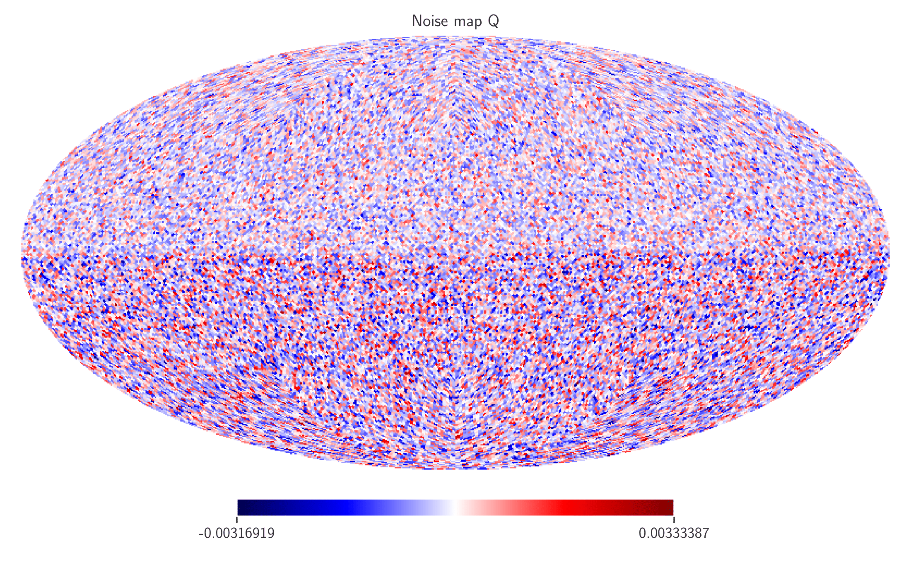

Here, we can see that the amplitude of the shape noise is generally larger in the southern hemisphere over the northern
one.

With our new noise maps in place, we can look at how this affects the recovered power spectra between the Pseudo-Cl
and QML methods. We can average over 256 maps to find the means and variances as

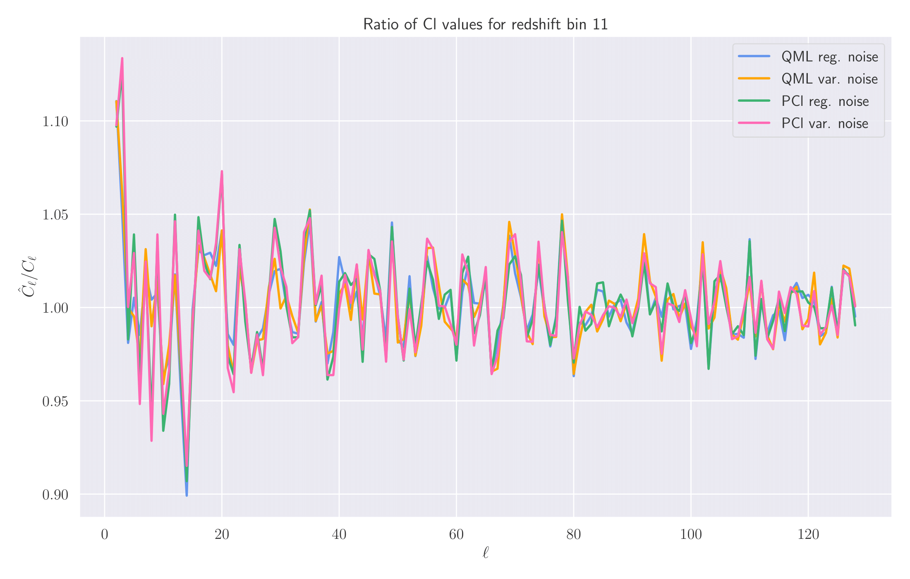

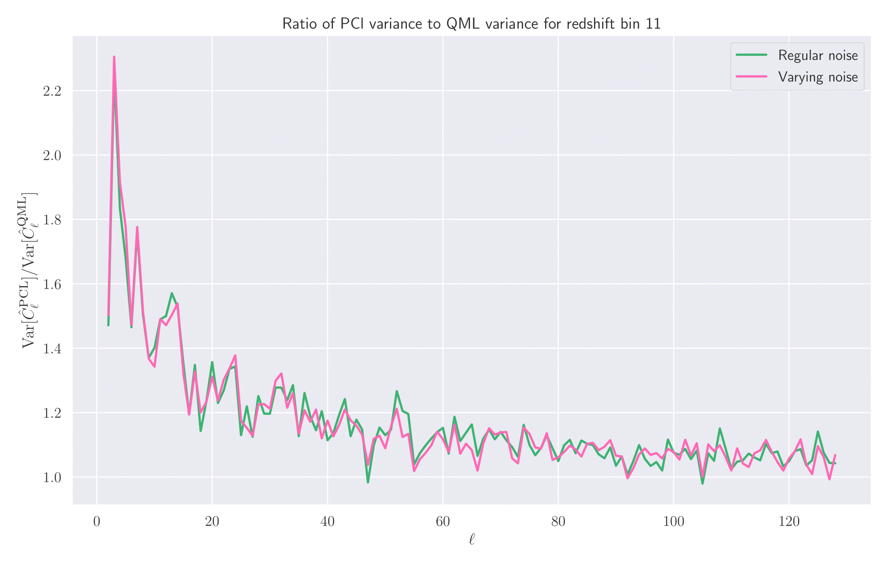

Here, we are also comparing the averages and variances between the spatially-varying noise levels and a constant noise
level. This shows that both estimators are capable of recovering the input power spectrum, on average, despite having
varying noise levels. We also see that for our chosen bias scales, there is little difference in the variances
between the regular noise and varying noise cases. It was noted, however, that when the bias terms became much larger,
then the QML estimator significantly out-performed Pseudo-Cl, and so that could be something to look into.  
Looking at the averages and variances, it is unlikely that the spatially-varying noise levels (at least with our bias
values), will have any meaningful impact on recovered cosmological parameters.

## Parameter constraints in the As-ns plane

With our power spectrum estimation techniques working well, we can now apply them to an ensemble of maps to generate
parameter constraint contours. Here, a Gaussian likelihood has been used where we have neglected any correlations
between different _l_ values. Results are presented for maps with an N_side of 64, so an l_max of 128, for two redshift
bins.

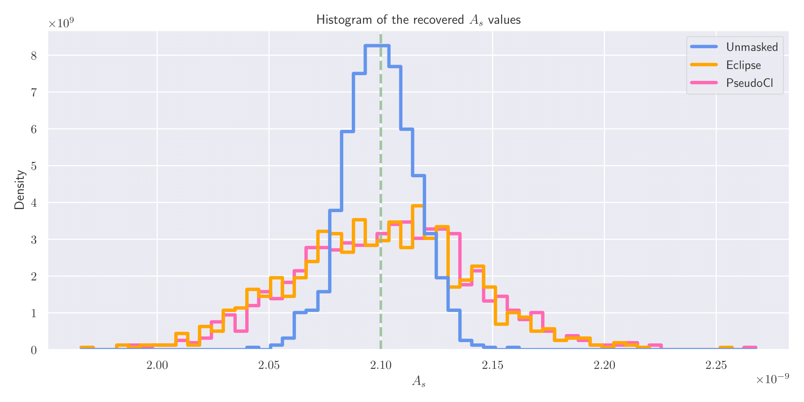

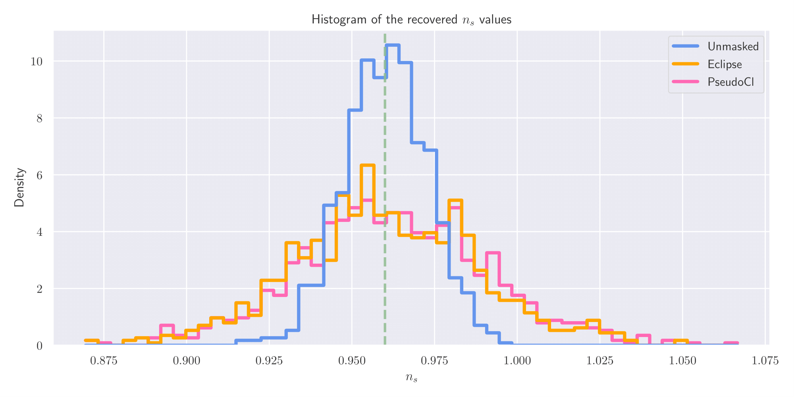

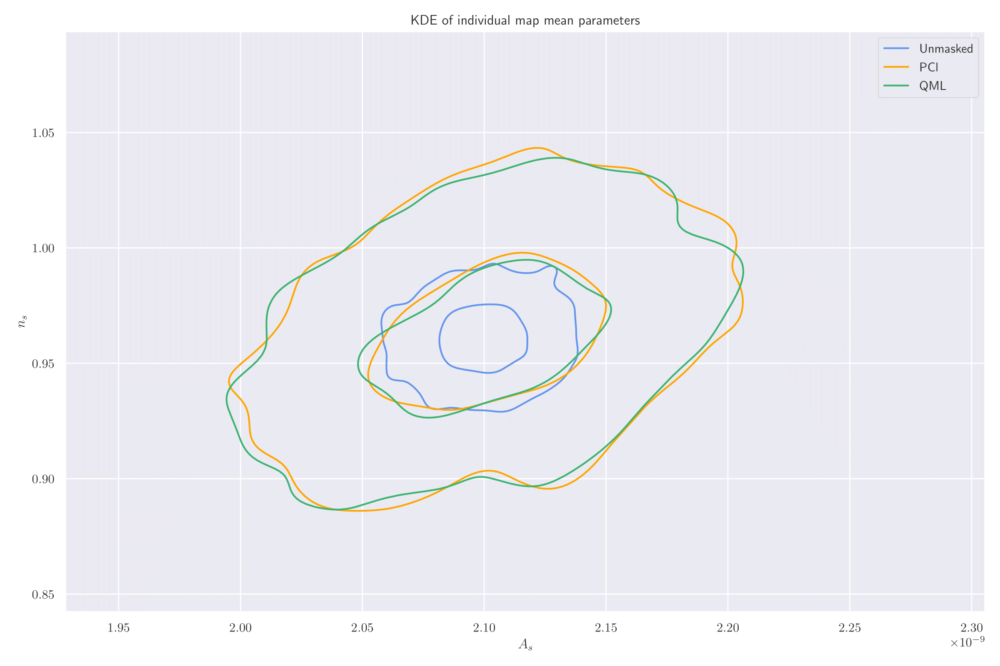

Here, we see very little difference between QMl and PCl method in either the 1D histograms or the 2D combined
distribution of the mean parameter values. It would be worth, however, applying our estimates to higher-dimensional
problems where we have many more parameters to estimate and marginalise over at the same time.

## Testing the LSST's Core Cosmological Library

So far, I have been using CAMB to compute the theory spectra for the shear maps at specific redshifts and as a function
of cosmological parameters in the MCMC analyses. However, this is quite a slow process taking multiple seconds to
evaluate the Cl values per run, and so for a general MCMC analysis this needs to be sped up. One way to do this is to
use a cosmological emulator, which are many orders of magnitude faster than calling CAMB every single time. One such
emulator is the LSST's Core Cosmological Library (CCL) code. This can evaluate the shear power spectra much faster than
CAMB, ~9 seconds for CAMB compared to ~75 ms for CCL, and should provide just as accurate values. We can compare the
two codes by taking the ratio of the Cl values for what should be the same cosmology and redshift bin combinations:

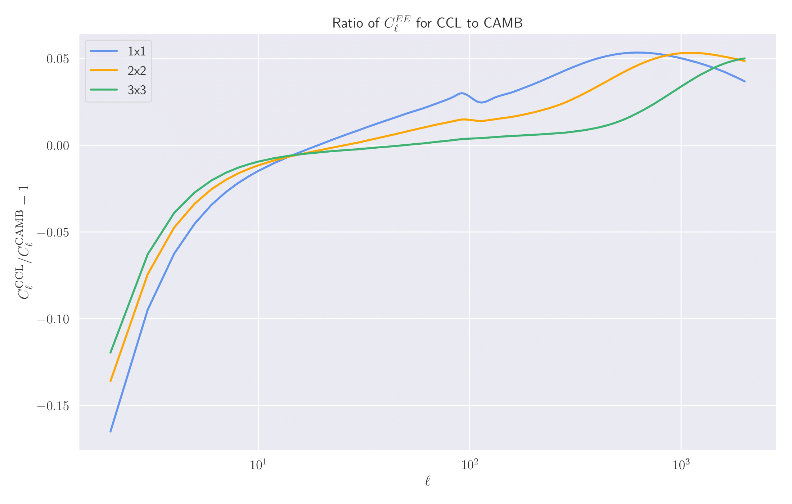

Here, we see that there are quite large differences at the lowest _l_ values, and also quite a difference with the 
high-_l_ values too.

## How to downgrade maps effectively

We know that the QML method only works for low resolution maps (N_side of 64 is about its maximum), and so some form
of combined estimator of QML and PCl could be used. Hence, we need a way to downgrade our shear maps from the normal
high resolution to ones that can be used in our QML analysis. So far, we have been using HealPix's `ud_grade` function
which simply averages over the smaller pixels to form the larger pixel's value. This is not ideal as it suppresses power
on small scales, which we would like to keep in our maps:

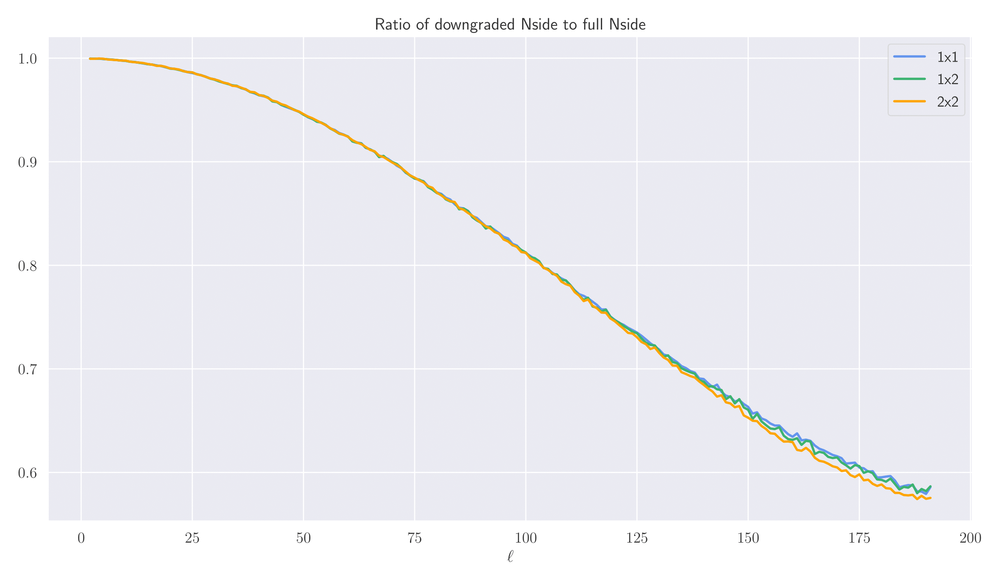

## More spatially varying noise levels

The major source for spatially varying noise levels comes from the fact that we will have varying number of galaxies
per square arc-minute over the sky. Here, we wish to model this in a more accurate way, instead of a simple 
hemispherical noise model. To do so, we use the Dark Energy Survey's Year-3 footprint and estimate that it has a total
galaxy density of 6 per square arc-min, split between three redshift bins. We then add a Hyper Suprime Cam-like 
experiment in the northern hemisphere, where they can observe around 20 galaxies per square arc-min, again equally split
between three redshift bins. When we divide up the sky in this way, we end up with a mask that looks something like

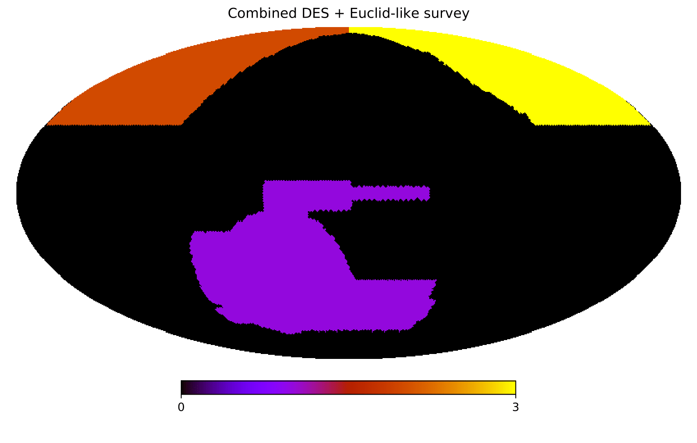

Here, we are including a slight asymmetry in the northern hemisphere too, for additional effects.  
With this sky map in place, we can generate a random noise realisation to this specification, which gives us

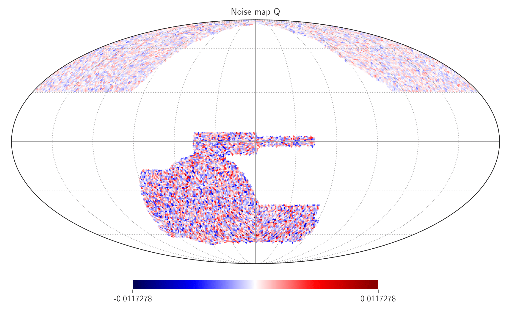

Here, we see the much larger amplitude of the noise for the DES-like area and smaller values for the HSC-like area.

With these noise maps in place, we can now generate an ensemble of maps and recover their power spectra when we add 
noise:

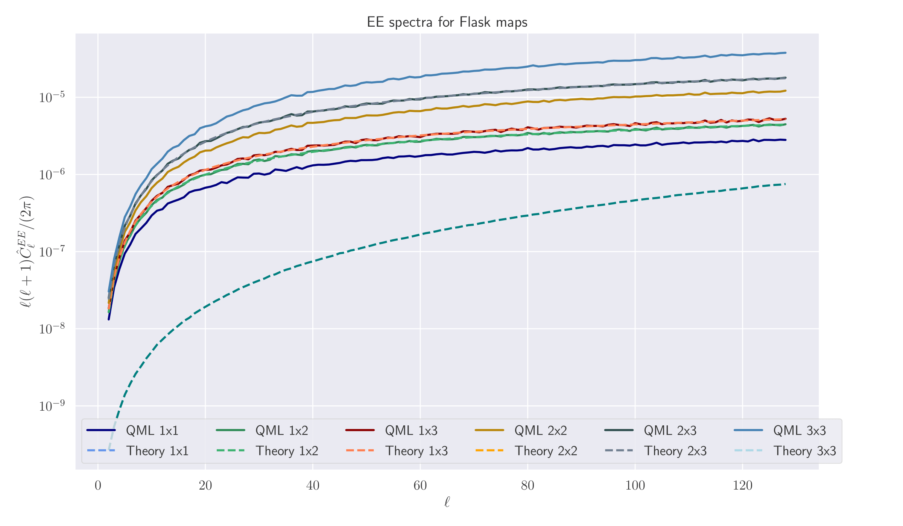

As we see, our QML methods manage to successfully recover the average power spectrum, even with this asymmetric noise.

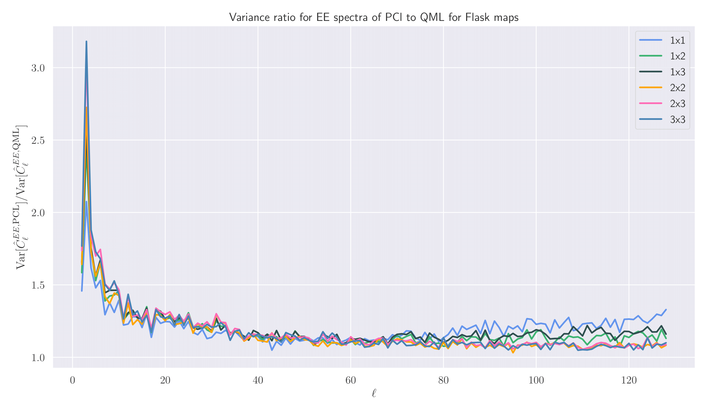

Interestingly, we see that the variance ratio of PCl to QML increases again as we go to higher-l values which was not
seen before. This could come from the fact that the noise power spectra starts to become as large as the signal, and so
the asymmetry causes problems in the PCl method.

### Propagating this to parameter constraints

Now that we have seen that the PCl variance is larger for some redshift bins at high-l values, this indicates that 
the recovered parameter constraints could also be impacted from this larger variance. 

#### As-ns

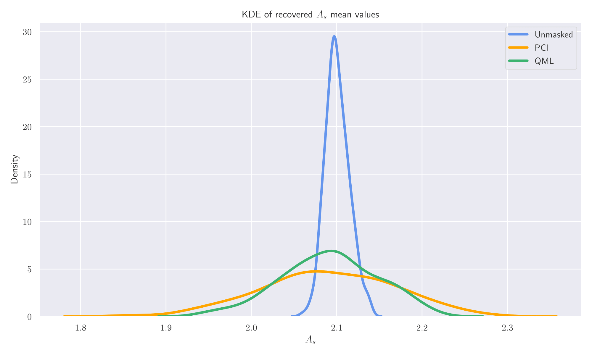

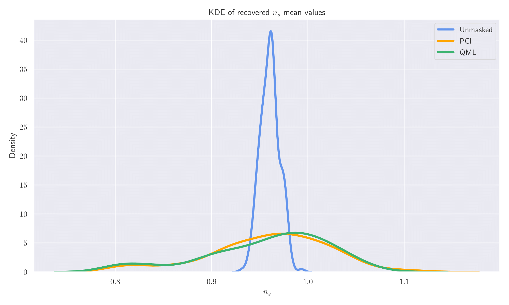

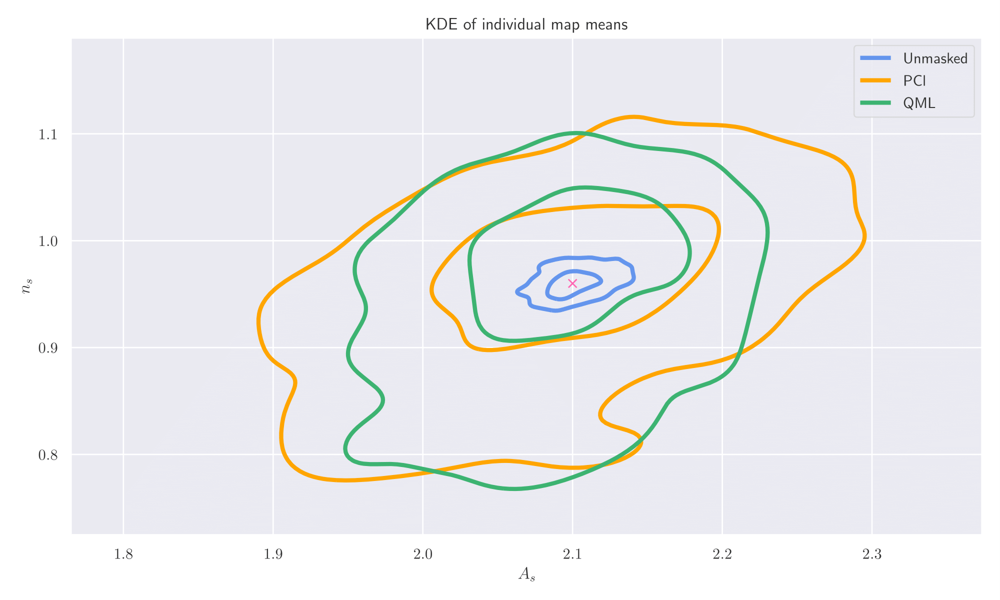

#### w0-wa

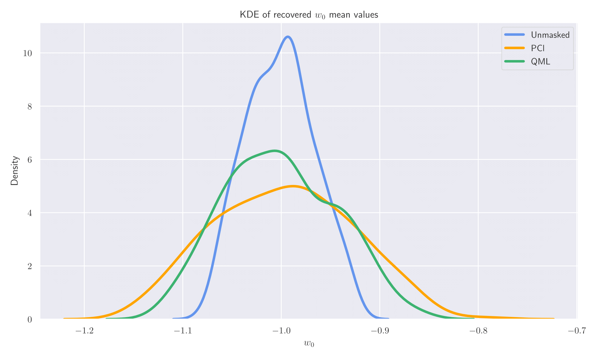
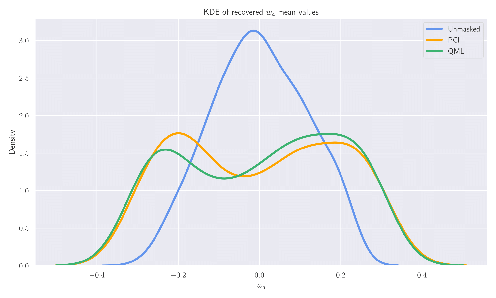
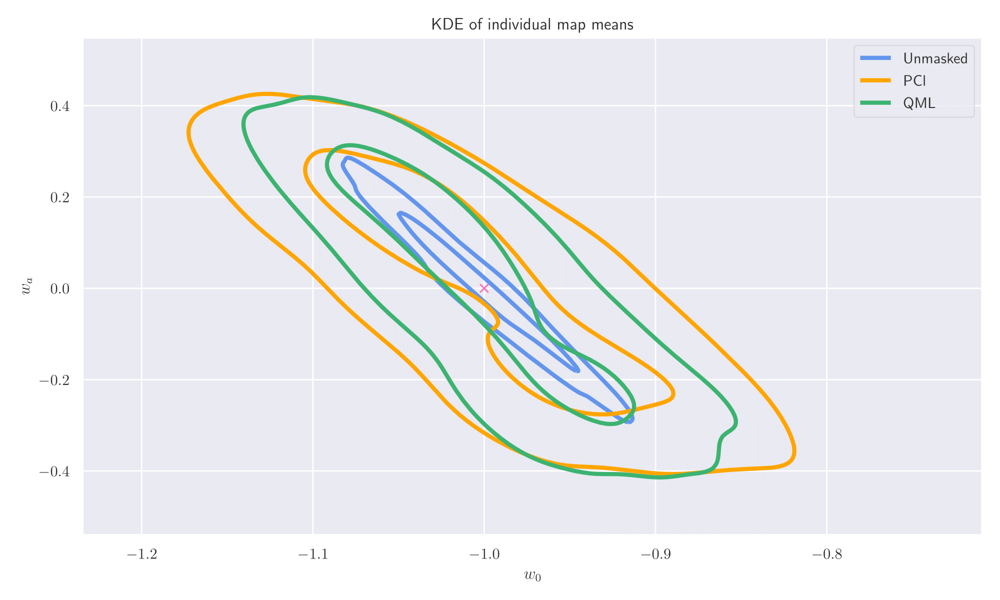

## Extending QML to galaxy counts - TEB spectra

So far in my look into QML methods, I have studied convergence only (T) and cosmic shear only (EB) maps individually.
However, as data will also be taken for the galaxy number count statistics, which is a scalar spin-0 field, we need to
extend my current spin-2 only analysis to cope with the full cross-spectra TEB analysis. As the prescription for how to
do this is already detailed in the Eclipse method paper, it is just a case of extending my code to deal with another map.
Here, we expect signal in only three of the six unique spectra for a single redshift bin: TT, TE, and EE. There should
be no signal in the BB, TB, or EB spectra as parity should be conserved in cosmic shear. However, once we extend this
to two redshift bins then things get significantly more complicated as now we have cross-spectra between different
redshift bins that depends on their specific combinations (e.g. the signal of T1 with E2 is not the same as the signal
of T2 with E1). 

If we look at the ten theory spectra arising from two redshift bins, along with some of the recovered spectra from two
maps, we find

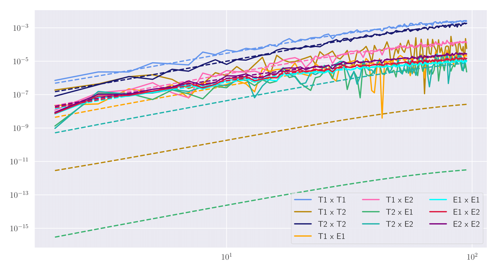

Here, we see a wide range in the magnitudes of the signal, and where some of the recovered spectra follow the theory
line closely whereas others do not (or only in the high-ell range, such as the T1xT2 signal).

Recovering the average spectra for many maps with Nside of 32 using my TEB pipeline, gives

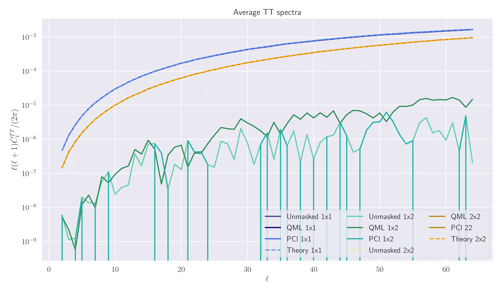

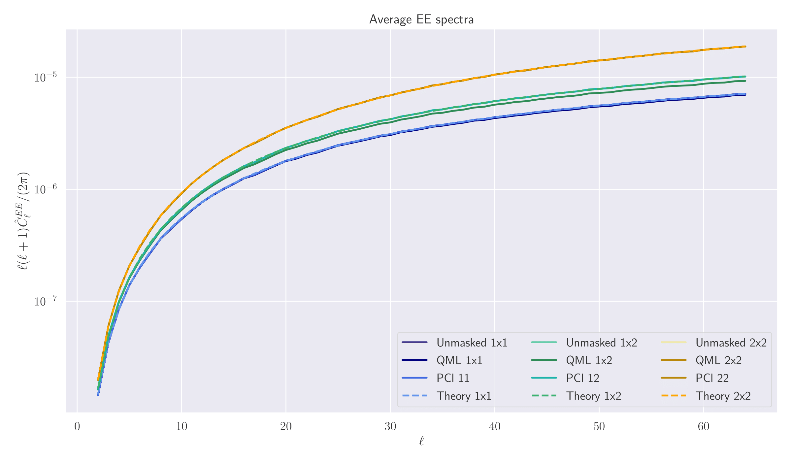

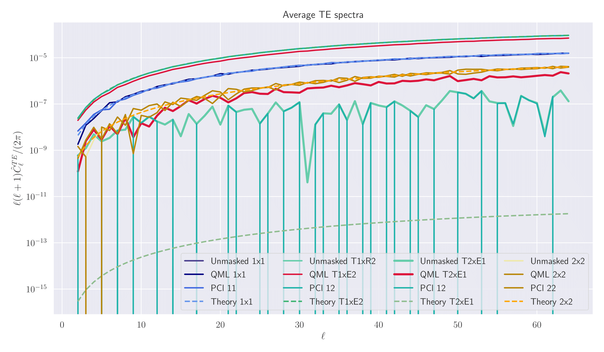
