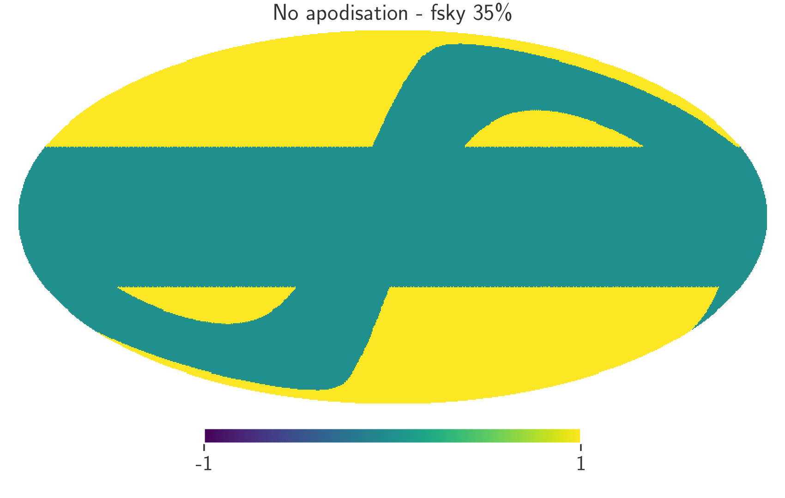
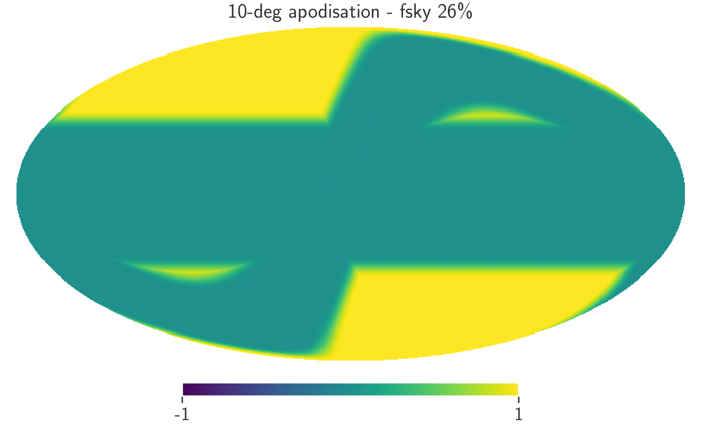
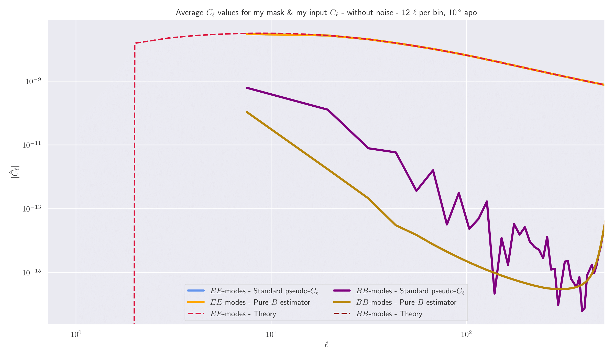
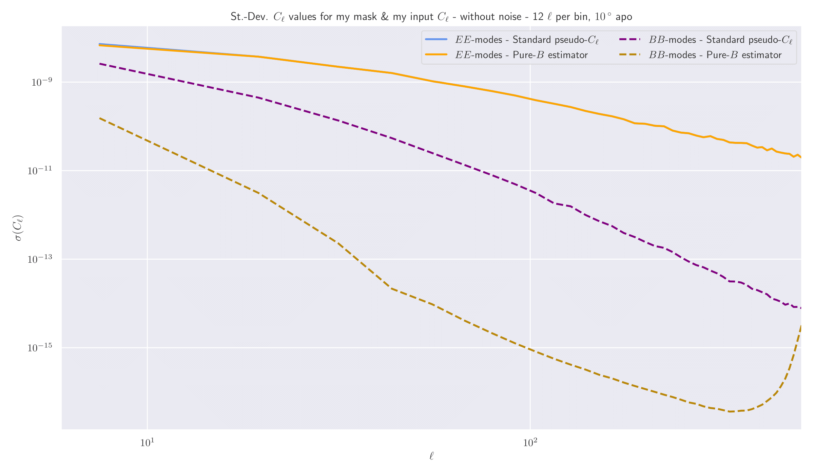
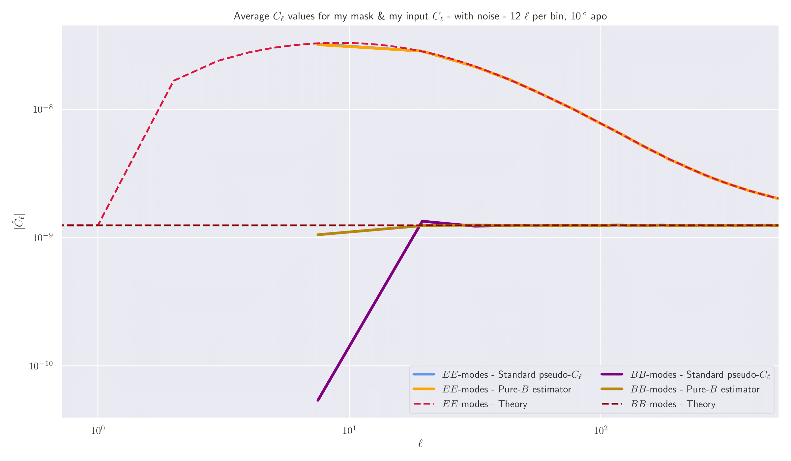
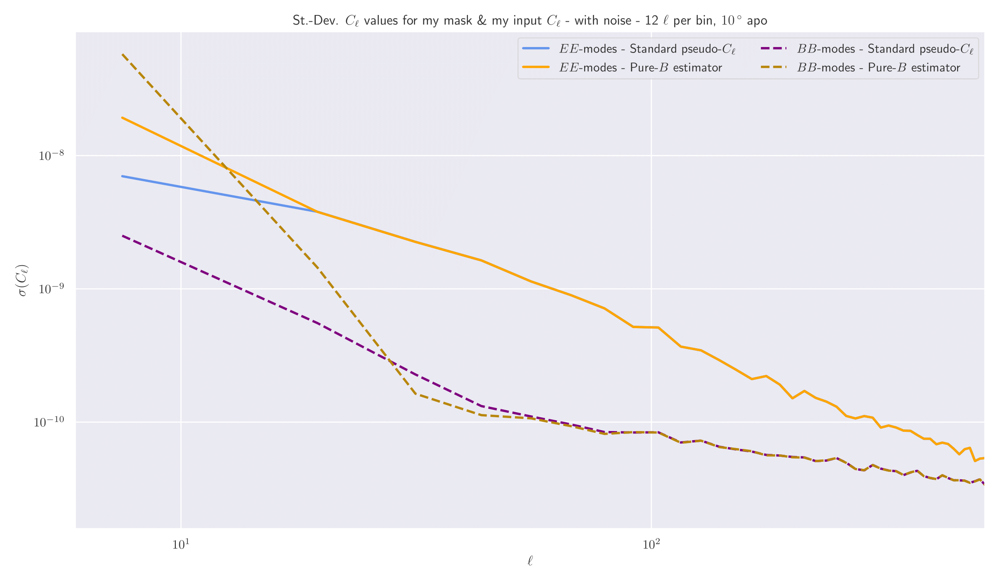

# Figures & Results

## Sensitivity of numerical results to ensemble size

It's certainly well-known that numerical results (e.g. averages and variances) are highly sensitive to the number of
simulations in the ensemble. This can cause the interpretation of numerical results to vary wildly when changing
the number of simulations in the ensemble. Here, we look at comparing the Pseudo-Cl covariance matrix that's been
estimated analytically using the Narrow Kernel Approximation and to one that's been estimated numerically where we've
used 1,000 and 100,000 samples in our ensemble.

### Diagonal elements

First, we are plotting the diagonal elements of the ratio of the numerical to analytic covariance matrix for our two
number of simulations:

Here, we see two main results: the numerical estimates become significantly cleaner which results in much less noise
in the plots, which makes sense when increasing the number of simulations by two orders of magnitude. Secondly, we note
that (at least for the off-diagonal elements) the ratio of numeric to analytic becomes much closer to unity for the
increased number of samples. This makes sense as it is these off-diagonal elements which are much harder for the
numerical covariance matrix to capture accurately.

### Comparing parameter constraints

With our two Cl covariance matrices, we can feed them into a Fisher estimate for the parameter constraints and see how
they vary between the to different number of samples in our averages.

Here, we see that for our 1,000 simulation run the numerical covariances vastly under-estimate the parameter contours
when compared to the analytical result - whereas for the 100,000 samples run the two contours are very close.

### Modifying the numerical covariance matrix

When a covariance matrix is estimated numerically, one should rescale the inverse covariance matrix through the 
factor

 

where Nsamples is the number of samples in the ensemble average, and Ndata is the number of data
points in the covariance matrix.

We can now apply this correction to see how the numerical Pseudo-Cl covariance matrix compares with the analytical
estimate for cases with fewer number of samples.

#### No correction

#### With correction

Here, we see that the parameter contours for the numerical case are slightly increased for the case where we now
include this small correction, and so see the numerical contours tend to the analytic ones. Hence, we should include
this factor in all future analyses of numerical covariance matrix estimates.

## Problems with B-mode purification

One of the goals of this project is to compare how the BB Cl values differ between our QML method and the standard
Pseudo-Cl one. As part of the PCl suit, we can enable the process of B-mode purification, which is meant to reduce
the errors on the recovered B-modes as a result of masking. Hence, if we are to compare QML to PCl, then we need to
test the effects of B-mode purification in our analysis. Since B-mode purification requires a mask that is
differentiable along its edges, we need to apodize our mask. To do so, we need to specify an apodization scale. The
choice of this scale has a massive impact on the results, as too small apodization will result in a mask that is not
differentiable, whereas too large apodization will result in unnecessary loss in sky area (and thus increase Cl 
variances regardless of purification). 

### Apodisation

Here, we are looking at the effects of apodising our main galactic & ecliptic plane mask with an apodisation scale of
10 degrees.

Here we see what apodising the mask is doing - blurring out the sharp edges of the original mask making it 
differentiable along these edges. We also note that by apodising over this scale, f_sky decreased by about 10%.

### Testing the basic case

Here, I wanted to test the effects of B-mode purification on just our basic mask (shown above) with no noise added
to our maps. These results were generated using an apodisation scale of 10 degrees, and a binning strategy of using
12 _l_ modes per bin with uniform weights.

These plots clearly show that B-mode purification is doing exactly what it was intended to do: decrease the errors on
the B-mode Cl values resulting in average values that are much closer to zero (the truth) than without using it. 

### Adding noise

The above plots were for the shape noiseless case, where there are zero underlying B-modes. However, when we add shape
noise to our maps, then we expect to recover some non-zero B-mode (when we don't subtract noise from the recovered Cl
values). Through adding noise to our maps, something clearly breaks and I'm not sure why, as can be seen from the 
plots below:

Here, we see that B-mode purification is doing the exact opposite of what it was intending to do, _increasing_ the 
errors on the B-modes!

### Testing with non-zero B-mode theory power

In the above case, the "true" B-mode power was zero (except for noise), so we can now try a case where we have some
fiducial B-mode power and then add shape noise to this. This is something that I should investigate ASAP.
