# Figures & Results

## Sensitivity of numerical results to ensemble size

It's certainly well-known that numerical results (e.g. averages and variances) are highly sensitive to the number of
simulations in the ensemble. This can cause the interpretation of numerical results to vary wildly when changing
the number of simulations in the ensemble. Here, we look at comparing the Pseudo-Cl covariance matrix that's been
estimated analytically using the Narrow Kernel Approximation and to one that's been estimated numerically where we've
used 1,000 and 100,000 samples in our ensemble.

### Diagonal elements

First, we are plotting the diagonal elements of the ratio of the numerical to analytic covariance matrix for our two
number of simulations:

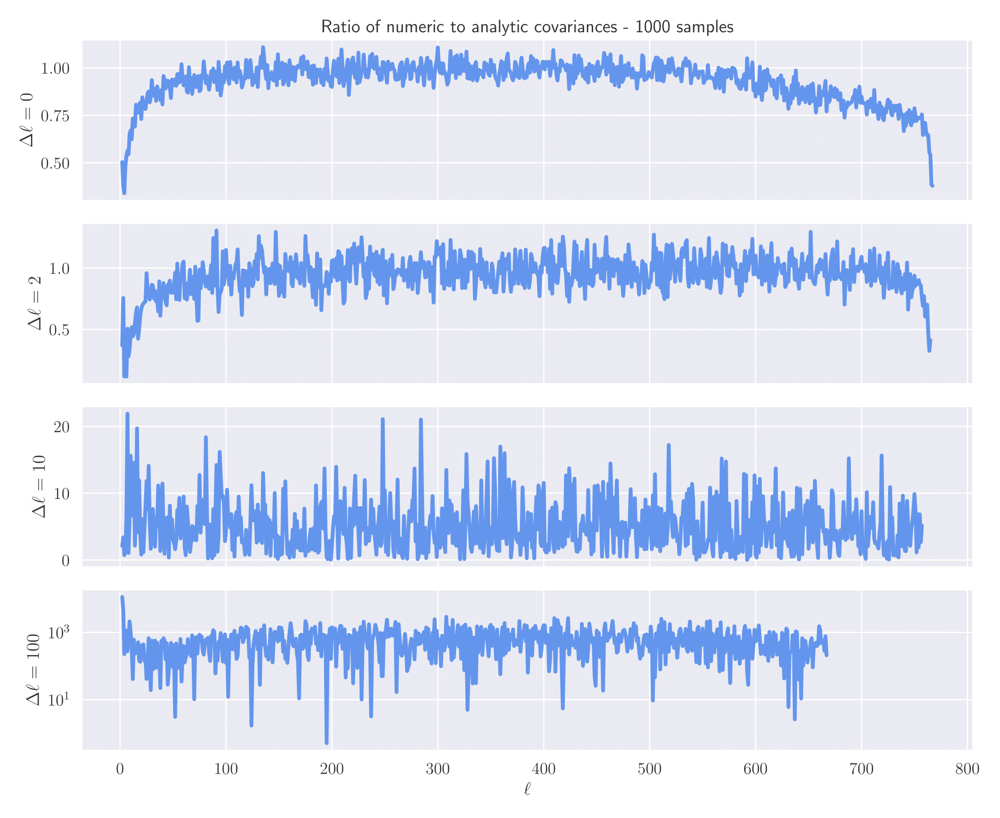

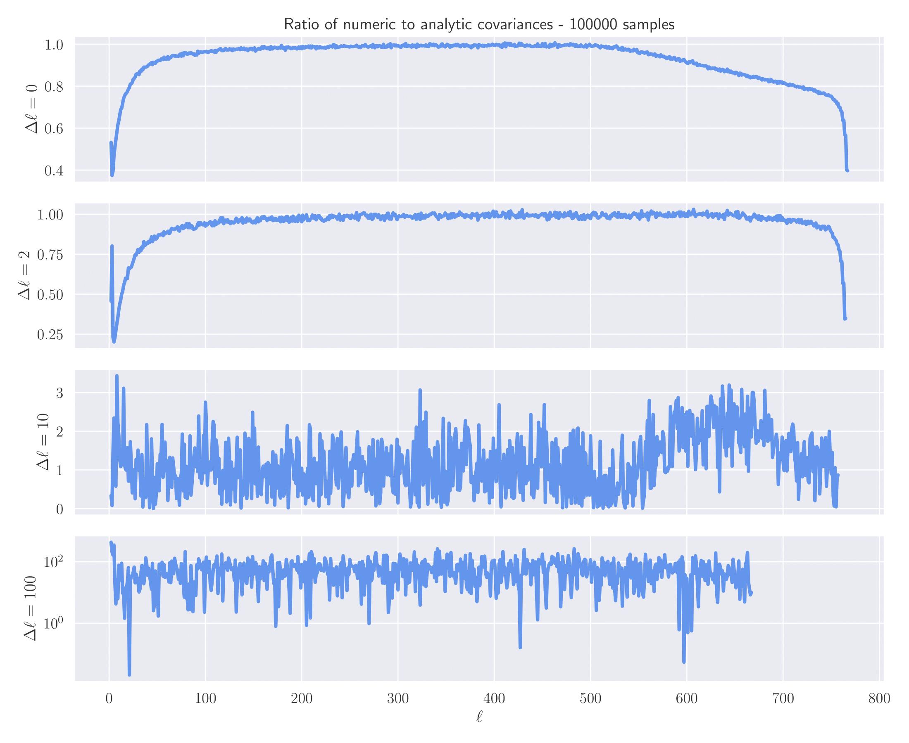

Here, we see two main results: the numerical estimates become significantly cleaner which results in much less noise
in the plots, which makes sense when increasing the number of simulations by two orders of magnitude. Secondly, we note
that (at least for the off-diagonal elements) the ratio of numeric to analytic becomes much closer to unity for the
increased number of samples. This makes sense as it is these off-diagonal elements which are much harder for the
numerical covariance matrix to capture accurately.

### Comparing parameter constraints

With our two Cl covariance matrices, we can feed them into a Fisher estimate for the parameter constraints and see how
they vary between the to different number of samples in our averages.

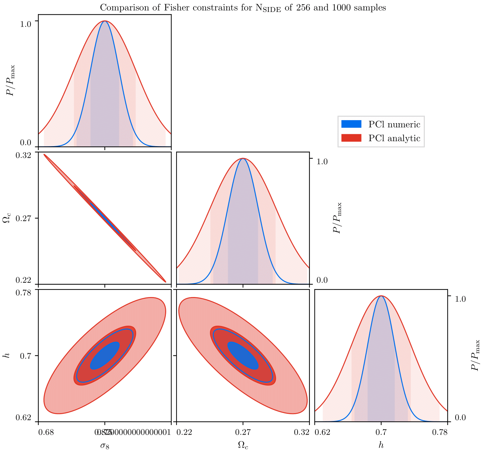

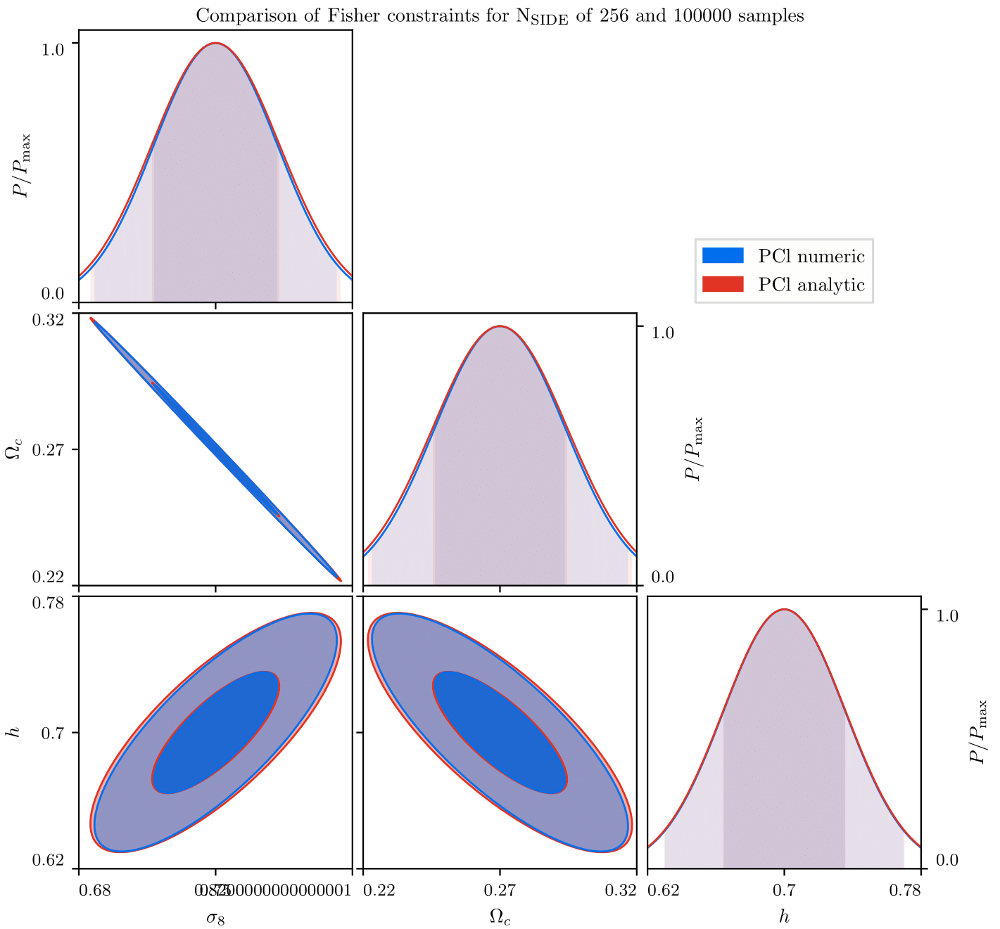

Here, we see that for our 1,000 simulation run the numerical covariances vastly under-estimate the parameter contours
when compared to the analytical result - whereas for the 100,000 samples run the two contours are very close.

### Modifying the numerical covariance matrix

When a covariance matrix is estimated numerically, one should rescale the inverse covariance matrix through the 
factor

 

where Nsamples is the number of samples in the ensemble average, and Ndata is the number of data
points in the covariance matrix.

We can now apply this correction to see how the numerical Pseudo-Cl covariance matrix compares with the analytical
estimate for cases with fewer number of samples.

#### No correction

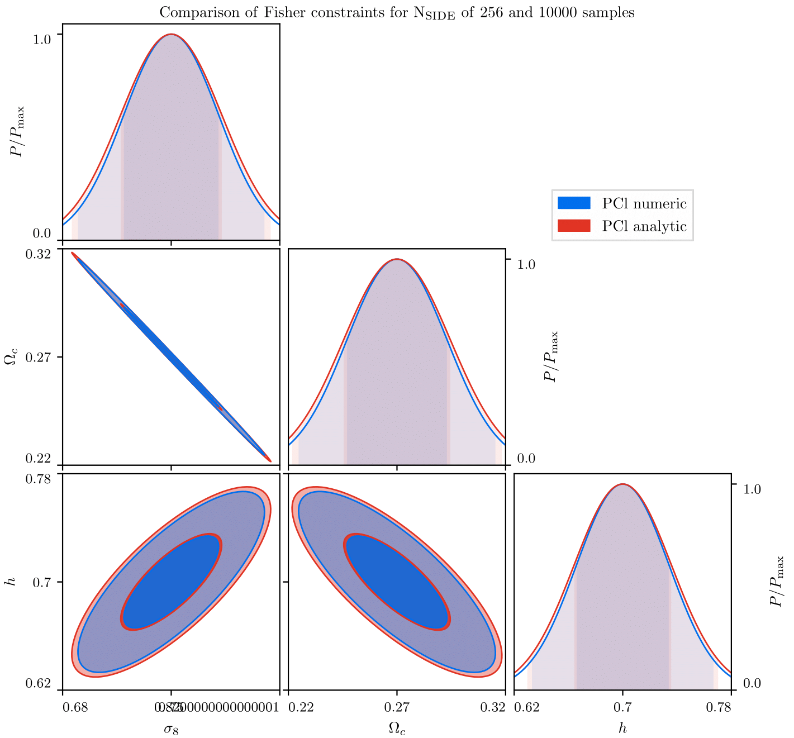

#### With correction

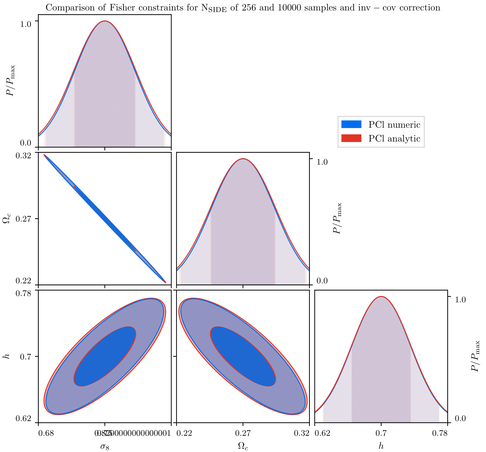

Here, we see that the parameter contours for the numerical case are slightly increased for the case where we now
include this small correction, and so see the numerical contours tend to the analytic ones. Hence, we should include
this factor in all future analyses of numerical covariance matrix estimates.

## Properly including star masks

For a while now, I've been dealing with problems induced when stars are included in the mask. See [this issue on the
NaMaster GitHub page](https://github.com/LSSTDESC/NaMaster/issues/152) for detailed plots and discussion of the issue.

One way to fix this problem is to apodize the main mask, and then apply the binary star mask on top of this. This yields
good results, as shown below:

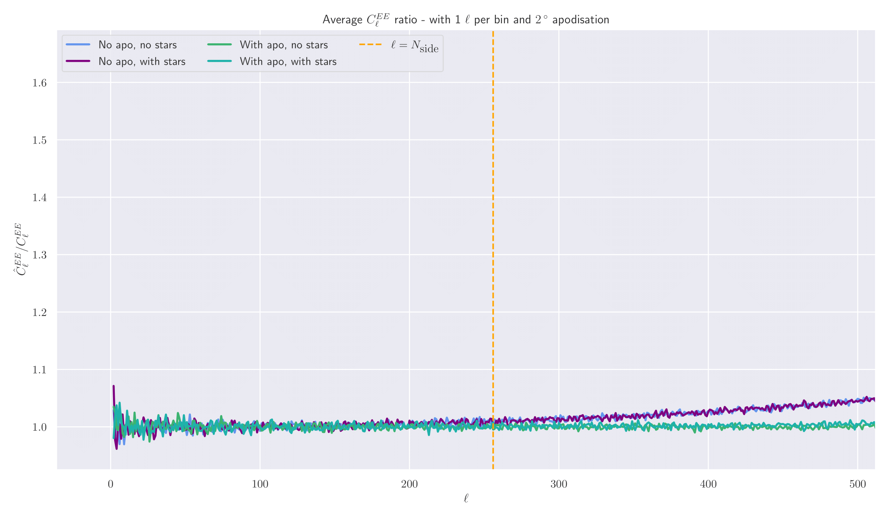

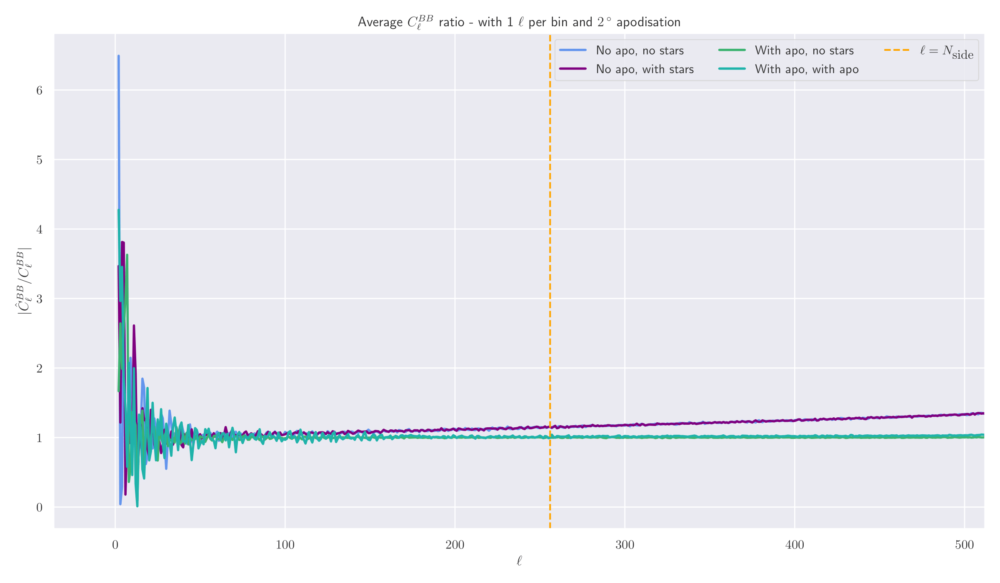

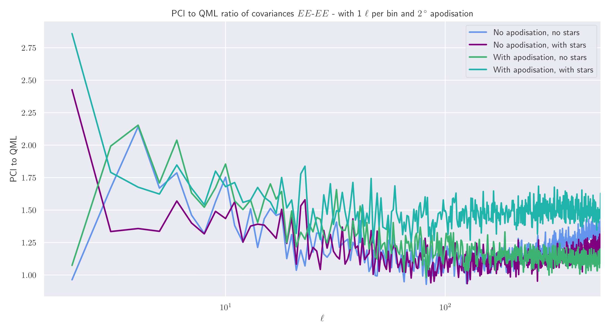

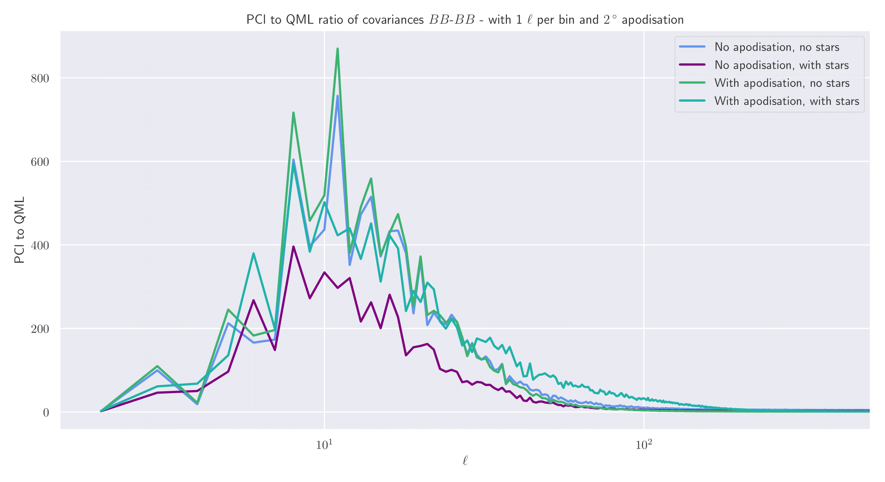

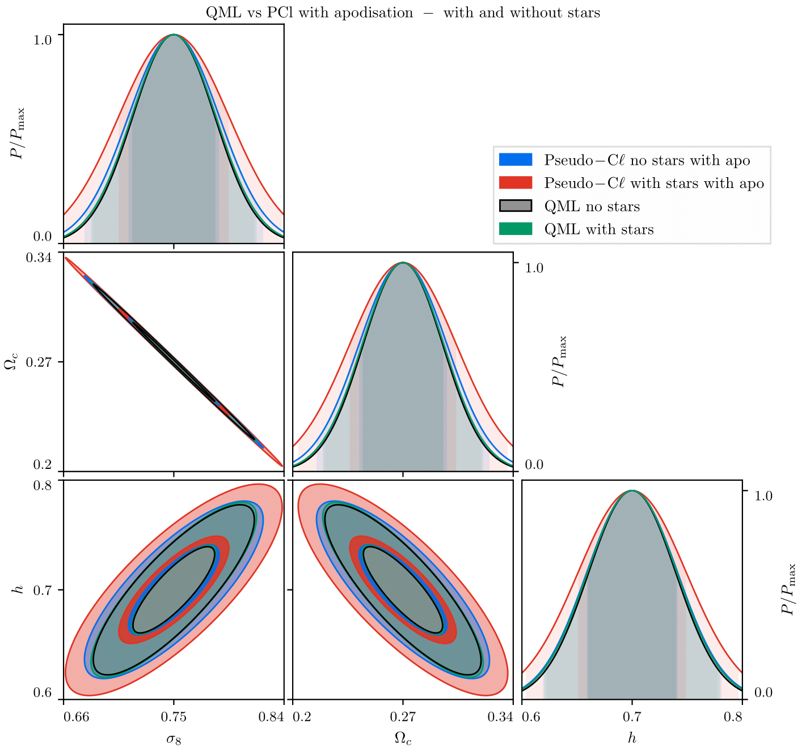

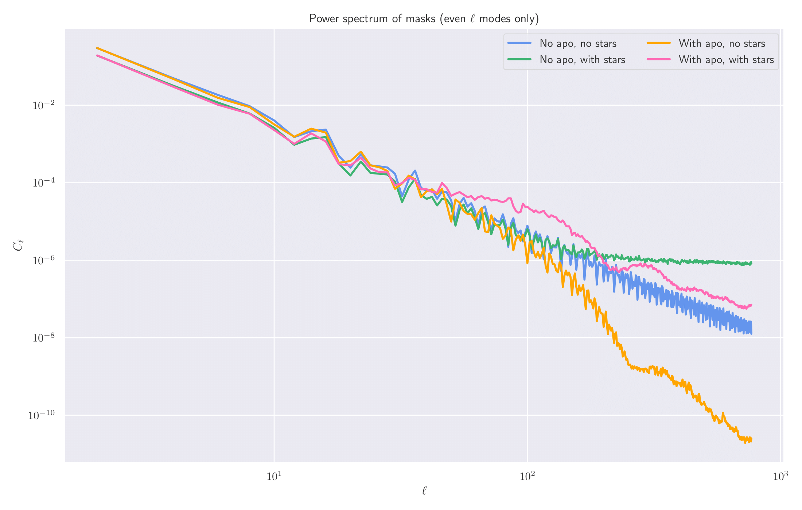

