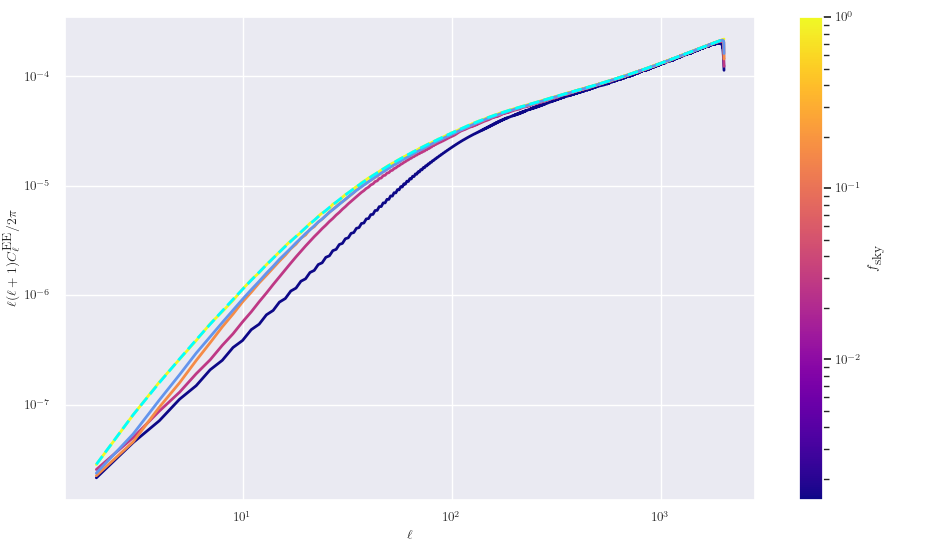
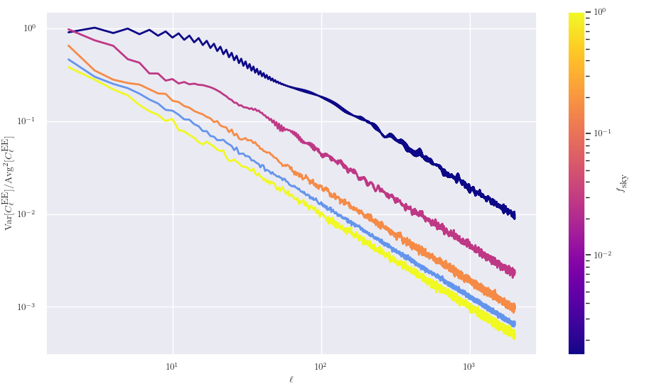
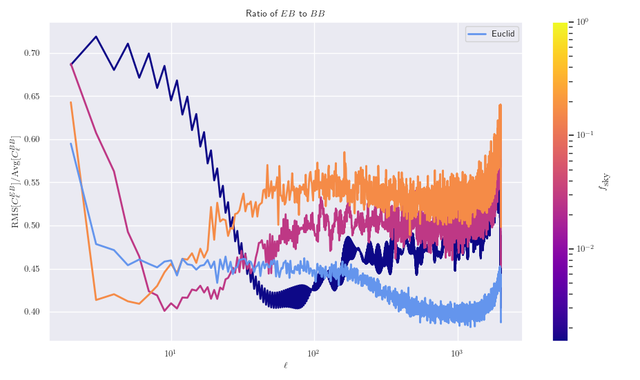

# Investigating the shear signal with maskking

## Masking shear with E/B decomposition

In all the above analysis of masks, we have been using the convergence (_κ_) maps because of their simplicity,
as they are simply scalar maps described by spin-0 spherical harmonics. However, what we actually observe is
the cosmic shear signal derived from the ellipticities, and so we want to see how masking affects the
shear signal. As the shear signal is described in terms of a spin-2 field, it is analogous to the polarisation
of the CMB. Hence, we can utilise the E/B decomposition to describe the shear field as two ordinary power
spectra. As the B-modes carry the opposite parity to the T and E modes, we expect any cross-correlations between
E and B to be zero, and the B-modes themselves to be zero. Therefore, if any of these signals are non-zero,
then this would be a sign that masking interrupts the B-mode signal, and so needs special care when using. 

To perform this decomposition, the `map2alm_pol` function in HealPix was used as this could properly deal with
the spin-2 nature of the shear maps to produce the _alm_ coefficients for the T, E, and B signals which could
then be combined to give the power spectra.

### Average power spectra

Here, we first look at the EE, EB, and BB power spectra averaged over 750 runs for three masks, and an unmasked
map to see what affect masking has on the recovered signal. We also plot the Euclid mask, which is shown in the
light blue line throughout these plots.

In the following two plots, the dashed cyan line corresponds to 1% of the EE signal, which allows us to see
how important the recovered EB and BB signal is to the pure EE signal.

Here, the BB signal is very interesting: for the unmasked sky we see that the power spectra is extremely small,
which suggests that there is no actual signal and this is just a numerical artefact from the processing
algorithm. However, as we decrease _f_sky even by just a little, we see that there is a large
jump in amplitude of the BB signal, which would suggest that there is an actual signal here, and not just
numerical noise. This BB signal then grows as we decrease _f_sky further, which suggests that the
effect of masking is to introduce a phantom BB signal that is not there on the full-sky. This behaviour is
mimicked in the EB signal.  
We also see that for the EB signal for the Euclid mask, the recovered power is larger than our 1% cut for
_l_ values less than about one hundred. This indicates that the EB mode is non-negligible below this _l_ value,
and becomes less important above this. We see the same pattern in the BB mode, however now the point
where the two signals cross is around a factor of two larger, at around 250. We can separately plot the
EE, EB, and BB signal for just the Euclid mask (along with the 1% cut) to see in detail how important this
power-mixing is:

This clearly shows that at low _l_ the recovered EB and BB signals are non-negligible and need to be taken
into account when performing analysis.

Note that as the EB signal can be positive or negative, we use the root-mean-square of the signal at each _l_,
instead of the mean as that correctly deals with the sign flips, as we mostly care about the amplitude of the
signal not the sign.

The dashed cyan line in the EE plot is the expected EE signal from the convergence, and can be calculated
by comparing the convergence and EE power spectra to the lensing potential, and so we can relate them together.
This relation is a function of _l_, which tends to one at high _l_. Now that we have the theoretical prediction
for the EE signal, we can take the ratio of the derived versus the prediction, and so accurate the recovered
values are:

Here, we see that the variations for the full-sky realisations are small and consistent with the theoretical
prediction for the entire _l_ range. For the masked-sky realisations, we see that power is significantly
suppressed at low _l_, but also extends to high _l_ too. This is in contrast to the convergence power spectrum
where the masked sky actually overshoots the theory curve at high _l_. This suggests that power is being
moved from the EE mode into the EB & BB modes, and so we expect the EE signal to be lower across all _l_.

### Variances

Now that we have our set of _Cl_ values, we can also look at higher-order statistics than the mean, and so here
we look at the variances of the signal.

It is good to see that both the EE and BB signal produce the expected behaviour in that the variances
follow the cosmic variance prediction very well (including the deviations expected when masking).

### ⚠️ Follow-up note:

When we plotted the EB and BB spectrum above, we plotted all lines, which included the unmasked sky. This is
so that way we can see how large the numerical noise is on the unmasked sky, where the actual signal should
be zero. However, this caused the masked sky signal's to be compressed at the top of the figure, which made
comparisons between masks difficult. Here, we now plot only the signals from actual masks, which gives us
the following plots

Here, we can easily see the differences in the recovered signals for the different masks. In the EB plot, 
all four masks predict roughly the same shape, just with a different amplitude. Again, we see that it's not
until _l_ values of around one hundred to when the EB signal is less than 1% of the EE signal.  
The BB plot is not quite as straightforward, we see that at low _l_ it looks like all curves tend to the same 
values, irrespective of their f_sky value. These curves then diverge as _l_ increases, but still following
the same general trend. It is interesting to note that the light-blue line, corresponding to the Euclid mask,
starts out with a smaller amplitude compared to the orange line (which has a roughly similar f_sky value),
but then increases to a larger amplitude at high _l_. This shows that the extra anisotropies in the Euclid
mask cause additional BB power on the smaller scales (where these anisotropies become important).

### Ratios of EB and BB signals to the EE signal

To see how the individual masks affect the amplitude of the recovered EB and BB signal, we can take the ratio
of the recovered EB and BB signals with respect to the EE signal, which tells us how important these are
as a function of angular scale.  
First, let us look at the EB ratio:

Here, we see a figure that looks very similar to the variance plots: for large f_sky the curves are simply 
a power law for all _l_, whereas for small f_sky, and at low _l_, the curves tend to a single value
(which is approximately 0.5). Again, for the Euclid mask we see that we have to go to _l_ values of around 
one hundred to have EB less than one percent of the EE signal, and then further to _l_ values of around 
one thousand to have EB less than 0.1% of EE.  
We can now look at the ratio of the BB signal:

Here, we see the same kind of curves to that for the EB signal (which is expected). However now, at low _l_ the
curved tend to the fixed value of 1 instead of 0.5. Additionally, the Euclid curve here seems to be less like
a single power-law, as the gradient of the line seems to change with _l_. This is probably due to the
anisotropies in the mask contributing to the BB signal differently at different scales.  
Finally, we can see how large the BB signal is compared to the EB signal by taking their ratios:

Now while this plot is dominated by noise, the overall trend of each line is clear: all ratios are roughly
constant between _l_ values of 100 and 1000, with a clear dependence on f_sky. All ratios are less than one,
which shows that the BB signal is always larger than the EB signal for all our masked maps.
