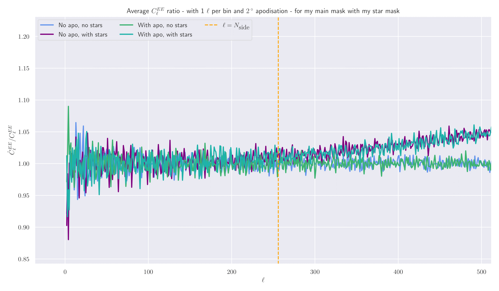
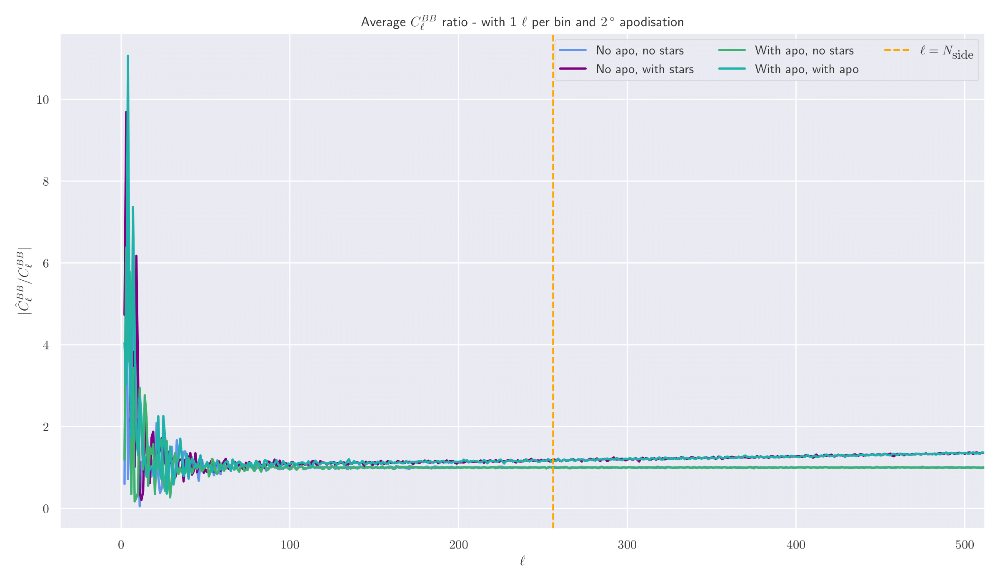
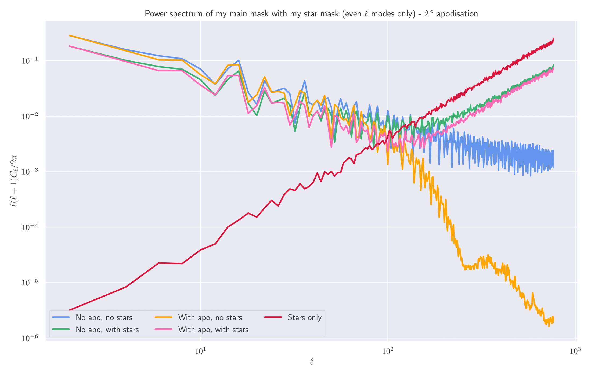
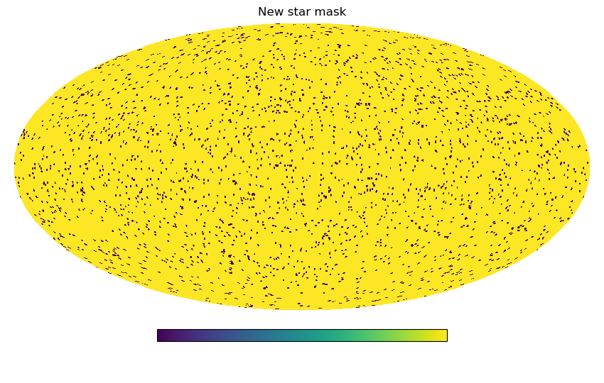
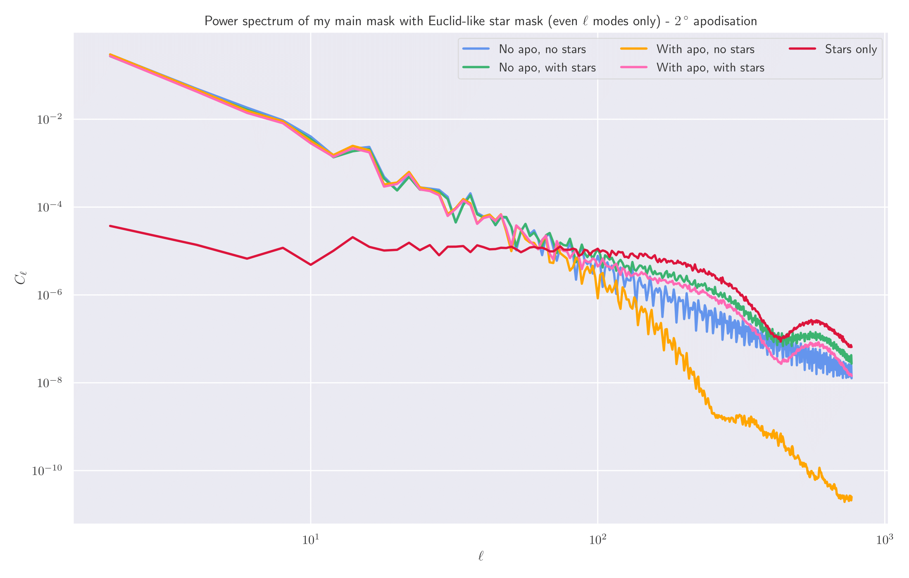
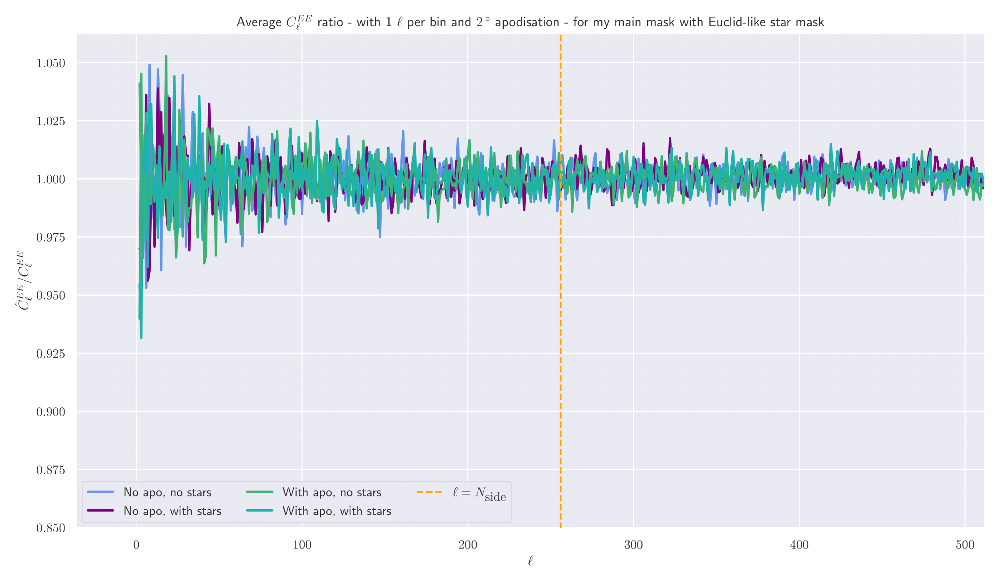
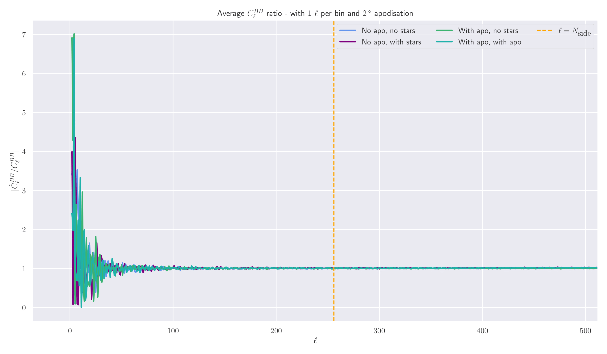

# Trouble with star masks

I've been having a few issues with regards to implementing star masks and using them in the Pseudo-Cl method. This is
because when I apply a star mask to my existing galactic and ecliptic cuts, the recovered EE and BB Cl values are biased
high at large ell values (approximately turning upwards from unity at ell ~ Nside). Obviously this is 
undesirable as it would indicate that the Pseudo-Cl method is not capable of recovering the Cl values to the resolution
that it should be able to in the presence of a star mask (which all weak lensing surveys have to have).  
We can see this bias through the average of the recovered EE and BB Cl values:

Here, the divergence in the BB spectrum is abundantly clear, and shows that something is breaking down in the Pseudo-Cl 
method. To diagnose this, we can look at the power spectrum of the masks, which gives us

Here we have plotted both the raw Cl values and the contribution per log-ell bin for a more representative view of the
power spectrum. This shows that the star mask acts to add random Poisson noise to our masks, and such gives a constant
power spectrum over the scales that we are looking at. Hence, when we convolve our original mask with the star mask,
our Cl values also tend to a fixed value rather than decaying with ell. This may cause the computation of the mixing
matrix to be ill-defined, and so the power spectrum being biased high.

Since this appears to be a problem with our specific star mask, we can look at it in more details. For this, I generated
the mask modelling stars as disks using a logarithmic distribution in radii from 0.29 arcmins to 8.79 arcmins, following
[ArXiV:2010.07376](https://arxiv.org/pdf/2010.07376.pdf). However, as we are only generating maps up to an 
Nside of 256, both of these scales are below the pixel size and so the stars will simply be point-sources.
This is probably what is causing issues when we apply the star mask. To get around this, we can generate a star mask
with larger stellar objects, where we are now following the prescription of Figure 46 of 
[ArXiV:2108.01201](https://arxiv.org/pdf/2108.01201.pdf). Now, we model stars as uniform disks which have radii of 30 
arcmins, and have ~800 such objects in our observed sky area.  
Generating a mask with such parameters gives us

And so we see that our "stars" are now much larger objects. Running the same analysis yields

Here, we see a suppression in power at large ell values for the new star mask, which filters through to the combined
masks. This propagates into correct Cl values:

This shows that our new star mask can be correctly dealt with in the PCl framework, and so this should be used in all
future analysis.