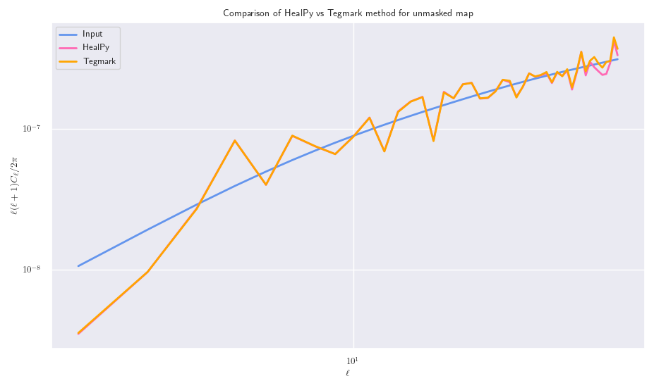
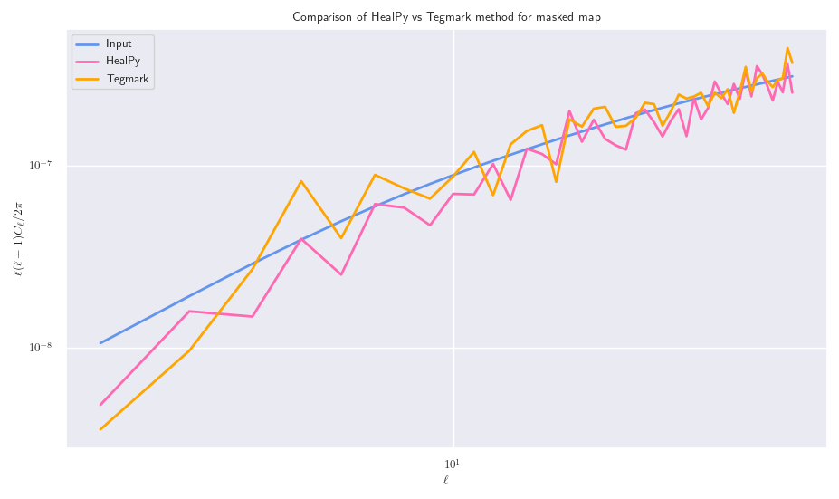
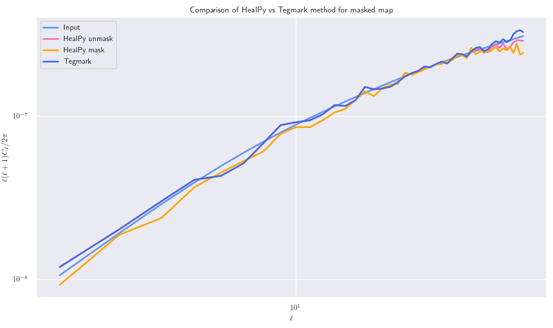
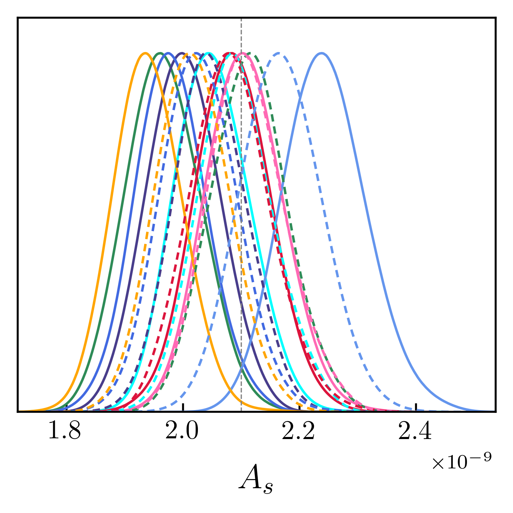
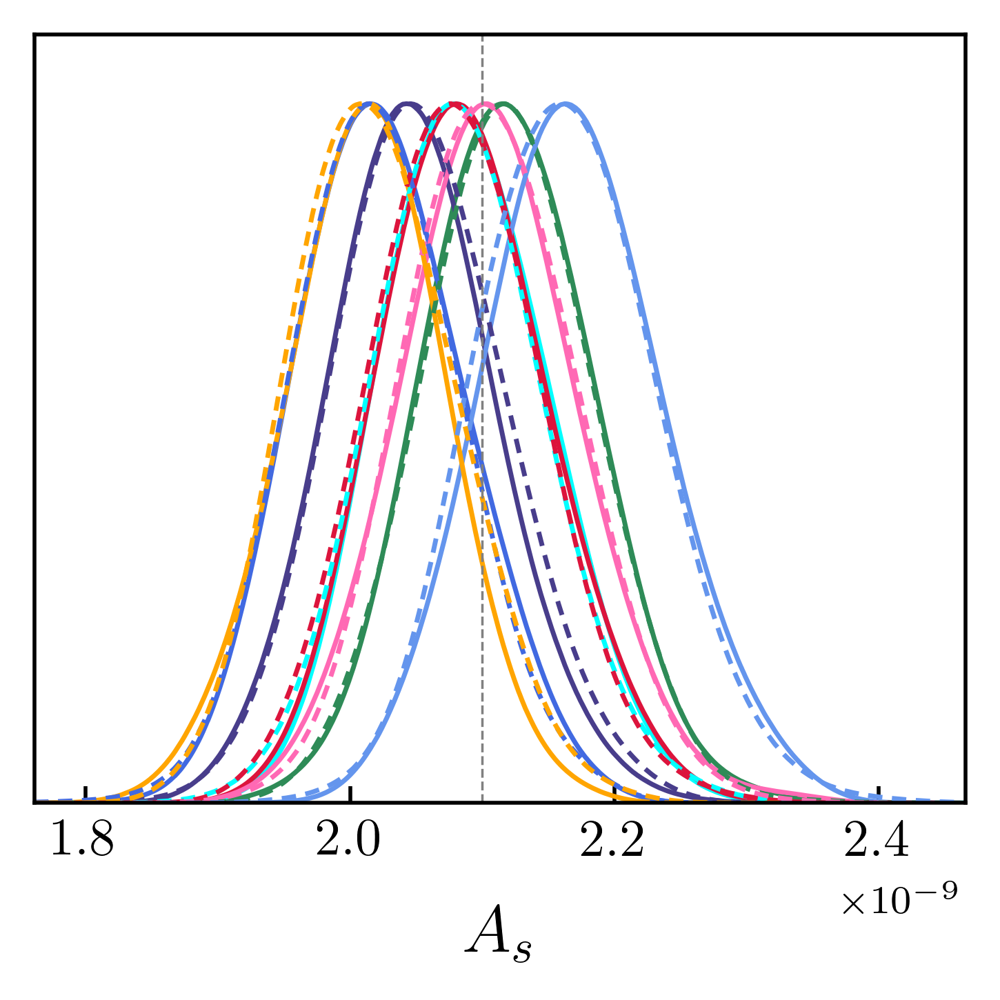
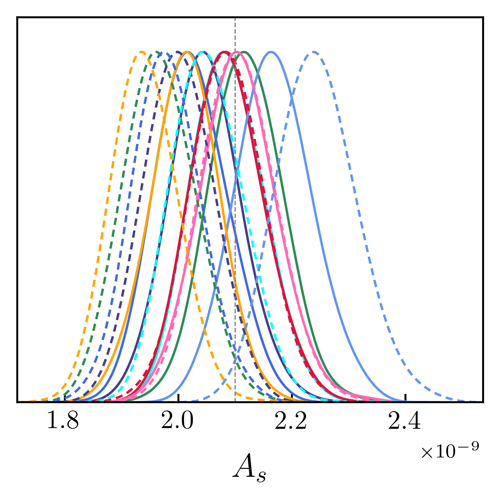
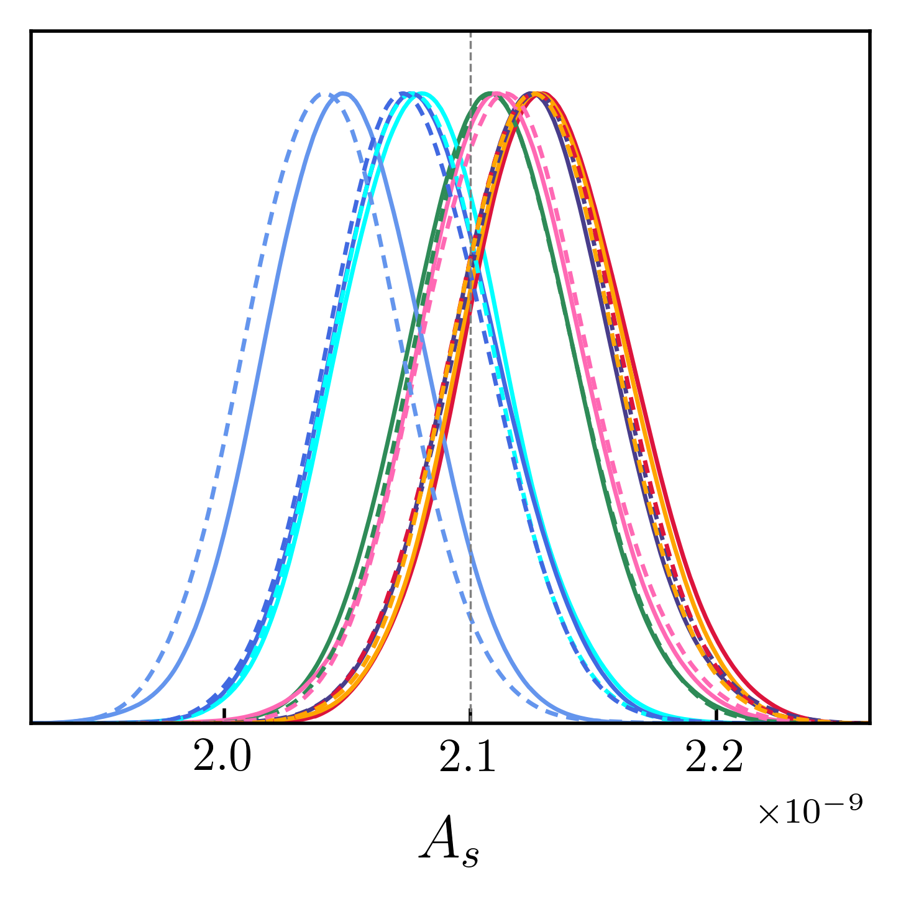
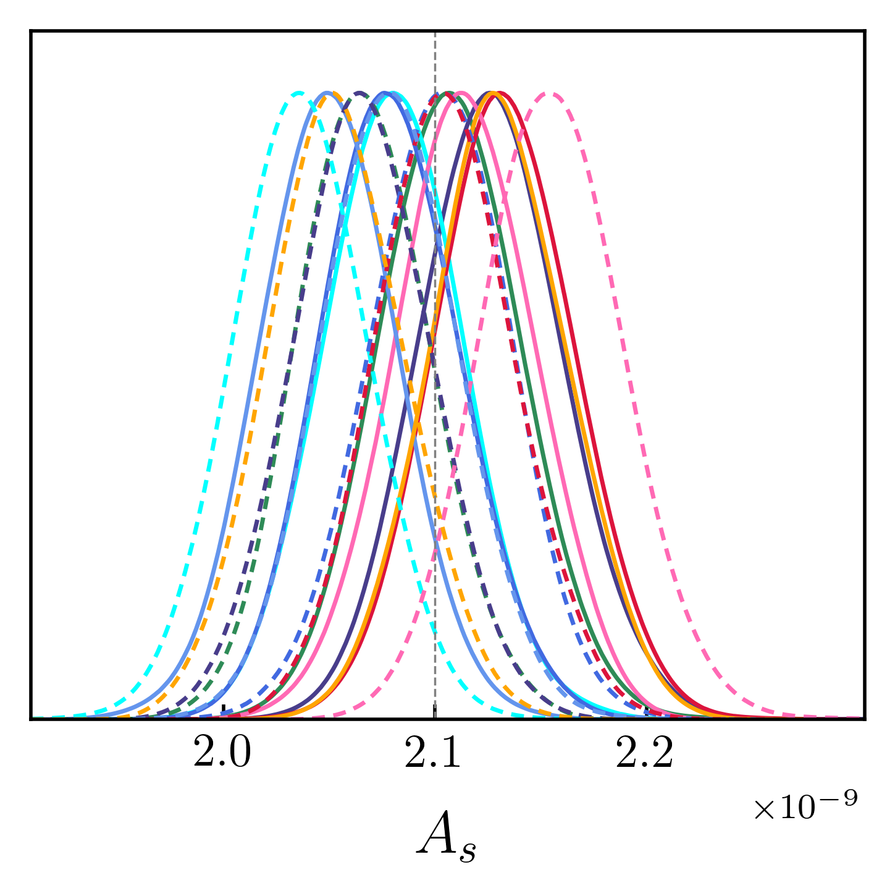

# Tegmark method for recovering Cl's

Here, we have computed a simple implementation of the Tegmartk method to recover 
the Cl values for a masked map without loosing any information, as described in 
[`astro-ph/9611174`](https://arxiv.org/pdf/astro-ph/9611174.pdf). 

The results of this are

Here, we can see that the masked power spectrum is exactly the same as the original unmasked
power spectrum, which shows that the method is indeed lossless.

If we take the average of the power spectrum for 25 maps, then we find

## Applying the Tegmark method to MCMC analyses

Above, we have shown that the Tegmark method allows for lossless power spectra estimation for any masked
convergence maps. Here, we would like to compare the results of running MCMC analyses for masked and unmasked
maps where the recovered power spectra has been computed through either the Pseudo-Cl or the Tegmark method.
Since computing the _E(l)_ matrices takes significant time for high-resolution maps, we first generated the maps
with an Nside of 16 to test that the method gives results that we expected, and then we let the code
generate these matrices for an Nside of 32 which required significant computation time and 
RAM/storage requirements.

### Nside of 16

Here, we present results for maps that were generated using an Nside of 16, and thus an 
_l_max of 32 (as we only go up to 2 * Nside).

#### Pseudo-Cl

Here, the solid lines correspond to the masked maps, and the dashed lines are the unmasked maps.  
This shows that the affect of masking is to primarily reduce the recovered values of As, however a few maps
predict a larger As, which is interesting.

#### Tegmark

Here, we present the same data as above, but now recovering both power spectra using the tegmark method. 
This shows that masking the map has little effect on the recovered power spectra, and so the constraints in As
are basically the same between the masked and unmasked maps.

#### Comparing Pseudo-Cl vs Tegmark

As we recovered the power spectra using our different methods on the same set of maps, we can compare how using
the different methods may affect the recovered power spectra.

##### Unmasked maps

Here, the solid lines are the Tegmark method, and the dashed lines are the Pseudo-Cl method.  
This shows that for unmasked maps, there is negligible difference in the recovered constraints between the 
two methods, which is what we hoped to see.

##### Masked maps

Whereas when we mask the maps, we see the significant differences between the two methods in the recovered spectra.

### Nside of 32

The same procedure was repeated for maps with an Nside of 32, and so an _l_max of 64, which
should increase the constraining power of the likelihoods, and so we should expect to see tighter constraints here.  
Here, we just compare the Tegmark method to the Pseudo-Cl method for our masked and unmasked maps.

##### Unmasked maps

##### Masked maps

Again, we see the usual differences between the two methods. We also see that the constraints are a lot tighter
with our increased Nside, which makes sense!
