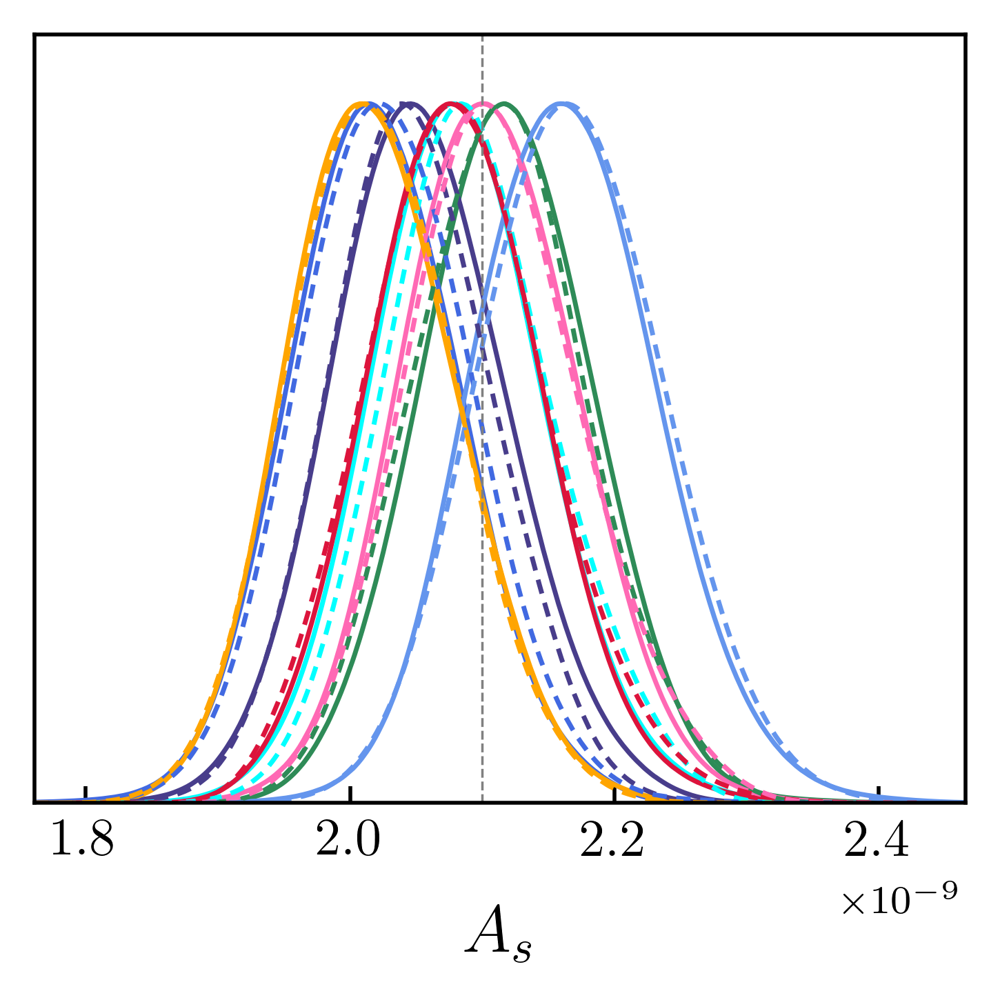
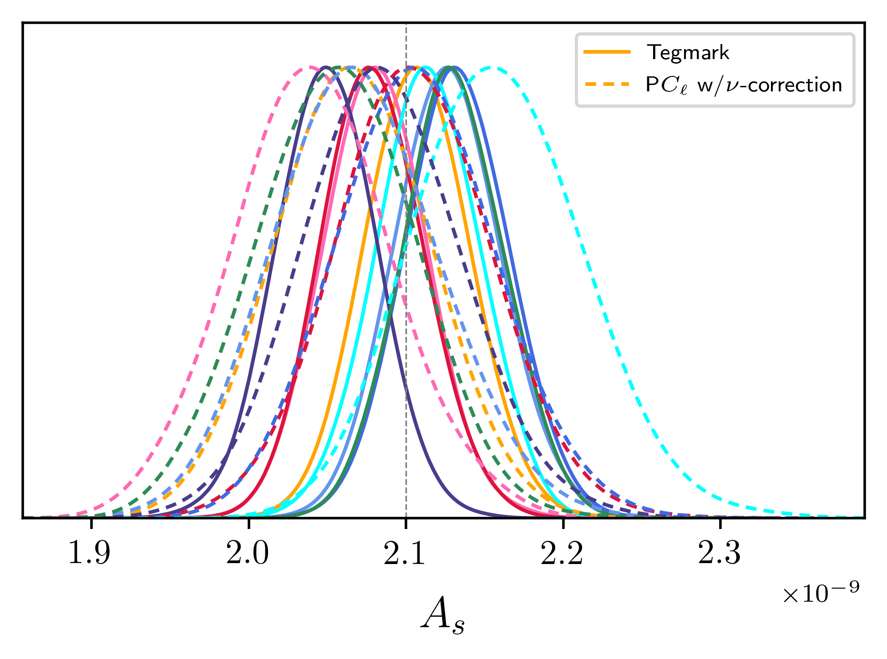

# Tegmark method for recovering Cl's

Here, we have computed a simple implementation of the Tegmartk method to recover 
the Cl values for a masked map without loosing any information, as described in 
[`astro-ph/9611174`](https://arxiv.org/pdf/astro-ph/9611174.pdf). 

The results of this are

Here, we can see that the masked power spectrum is exactly the same as the original unmasked
power spectrum, which shows that the method is indeed lossless.

If we take the average of the power spectrum for 25 maps, then we find

## Applying the Tegmark method to MCMC analyses

Above, we have shown that the Tegmark method allows for lossless power spectra estimation for any masked
convergence maps. Here, we would like to compare the results of running MCMC analyses for masked and unmasked
maps where the recovered power spectra has been computed through either the Pseudo-Cl or the Tegmark method.
Since computing the _E(l)_ matrices takes significant time for high-resolution maps, we first generated the maps
with an Nside of 16 to test that the method gives results that we expected, and then we let the code
generate these matrices for an Nside of 32 which required significant computation time and 
RAM/storage requirements.

### Nside of 16

Here, we present results for maps that were generated using an Nside of 16, and thus an 
_l_max of 32 (as we only go up to 2 * Nside).

#### Pseudo-Cl

Here, the solid lines correspond to the masked maps, and the dashed lines are the unmasked maps.  
This shows that the affect of masking is to primarily reduce the recovered values of As, however a few maps
predict a larger As, which is interesting.

#### Tegmark

Here, we present the same data as above, but now recovering both power spectra using the tegmark method. 
This shows that masking the map has little effect on the recovered power spectra, and so the constraints in As
are basically the same between the masked and unmasked maps.

#### Comparing Pseudo-Cl vs Tegmark

As we recovered the power spectra using our different methods on the same set of maps, we can compare how using
the different methods may affect the recovered power spectra.

##### Unmasked maps

Here, the solid lines are the Tegmark method, and the dashed lines are the Pseudo-Cl method.  
This shows that for unmasked maps, there is negligible difference in the recovered constraints between the 
two methods, which is what we hoped to see.

##### Masked maps

Whereas when we mask the maps, we see the significant differences between the two methods in the recovered spectra.

### Nside of 32

The same procedure was repeated for maps with an Nside of 32, and so an _l_max of 64, which
should increase the constraining power of the likelihoods, and so we should expect to see tighter constraints here.  
Here, we just compare the Tegmark method to the Pseudo-Cl method for our masked and unmasked maps.

##### Unmasked maps

##### Masked maps

Again, we see the usual differences between the two methods. We also see that the constraints are a lot tighter
with our increased Nside, which makes sense!

## Investigating individual power spectra

Looking at the figures above, we can say that *on average* the recovered amplitude of a masked map is smaller
than that of its unmasked map. This makes sense as we know that masking reduces power on the largest-scales that
the 1 / fsky correction does not fix. However, the above plots also show a few maps where the masked
amplitude is **greater** than that of its unmasked counterpart. Here, we wish to look into the individual power
spectra for these maps to see *why* this increase in amplitude for a masked map occurs, which is not what we would
have expected.

### Nside of 16

For our maps which were generated with Nside of 16, we noted that the map corresponding to the light-blue line
in the triangle plots had an increased As value for the masked maps (when using the Pseudo-Cl estimator).
If we look at its power spectrum computed using the Pseudo-Cl estimator for its masked and unmasked versions,
we get the following plot

Here, we see that the unmasked power spectrum has a big dip in power at _l_ = 3 for all spectra, whereas the masked
spectra do not. Additionally, the masked spectra look slight larger at high-l too.

### Nside of 32

For the maps that were generated with an N_side of 32, we noted that now the pink line had a larger As value
for the masked case over its unmasked counterpart. Again, we look at its individual power spectra to find

This shows that for the l=2 and l=3 modes, the unmasked power spectra is smaller than that of the masked ones.

## Small bug in covariance matrix estimation

## A naive implementation of band powers

It is often useful to deal with band powers, which are groups of _l_ values, instead of dealing with each
_l_ individually. This should allow us to significantly cut down on the number of operations necessary, while
still retaining the same constraining power of the full set. Since one of the most demanding tasks with the
quadratic maximum-likelihood estimator is computing the covariance matrix, we can significantly reduce its
computational time by approximating that it's constant over each range of band powers. This cuts down on the 
number of evaluations of the Legendre polynomials, which saves considerable time. A simple implementation
of this has been performed, using 50 band powers each with 5 _l_ values in each band (and so we only have 
one-fifth of the P(l) evaluations necessary), with the results as

This shows that our basic band-power estimation is pretty close to the expected values, and it looks like
this difference decreases at higher _l_ values. It would be good to test this band-power implementation
with higher resolution maps to see if this trend continues. 

## Correlations between different _l_

When using the Pseudo-Cl formalism for masked maps, we saw that there were very strong correlations between the
Cl values at different _l_ values (most notably between _l_ and _l_ ± 2 modes). Here, we would like to see
if there are any observable correlations between different _l_ modes when recovering a masked map using the 
Tegmark method.  
The results presented below are for an ensemble of 1000 random realisations of the same map.

### Pseudo-Cl

### Tegmark method

Here, we can see that the Tegmark method does not induce any observable correlations between different _l_
modes, even when applying it to a masked map. Only at very high _l_ values do we see a _slight_ hint of correlations
between different modes, but this is most likely due to noise as these _Cl_ values are unreliable at such high
_l_ for the given Nside. 

## Statistical quantities for an ensemble of maps

Here, we would like to quantify how the statistical quantities of the Cl values differ between the Pseudo-Cl and
Tegmark methods. To do so, we will look at how the means, variances, and skewness differ between the two
methods when compared to the Γ-function prediction for the Cl values for 5000 realisations of the masked map.

### Averages

Here, we take the ratio of the average Cl at each _l_ with the input values:

This shows that the Tegmark method correctly returns the input power spectra when averaged over many maps while
the Pseudo-Cl method shows this characteristic drop-off at low _l_. Note that both power spectra become unreliable
when going to large _l_ values, and so care must be taken to ensure that all recovered Cl values are reliable
for both methods. 

### Variances

Here, we plot the recovered variances normalised to the Cl value squared. This allows us to easily compare 
the recovered variances to the prediction from the cosmic variances (for the un-cut sky). Note that we produce
two estimates for this ratio, as the variance is defined as the squared-deviation from the mean, we can compute
this either using the numerical variance or the theoretical variance here. Since these are distinct quantities
(especially for the PCl method), we plot both quantities here

This shows that the PCl method consistently produces a larger variance compared to the Tegmark method, which
agrees with the cosmic variance prediction. 

### Skewness

We now look at the next higher-order statistic, the skewness. Here, all values are computed using the numerically
calculated means, so there may be some small bias (especially for the PCl method)

This shows that the PCl method induces some additional skewness to the Cl values that the Tegmark method does 
not. As the Tegmark method reproduces the desired results for the mean, variances, and skewness we can say that
it is an optimal method for recovering Cl values from their underlying  Γ-function distribution.
 
## Looking at the PCl corrections

Above, we have plotted the averages of 5,000 runs of the Tegmark method, and the raw Cl values with the
naive 1/f_sky correction in place. Here, we will apply the actual Pseudo-Cl coupling matrix to the Cl values
to get the fully-correct PCl estimation

Here, we see that when we implement the PCl mode-coupling matrix the PCl estimated values agree extreemly well
with the input power spectra.

## Implementation of ECLIPSE

A new implementation of the quadratic maximum-likelihood estimator called Eclipse has been proposed in a recent
paper [2104.08528](https://arxiv.org/pdf/2104.08528.pdf). This is claimed to be the most efficient implementation
of such QML method that currently exists. Hence, we wish to compare it to our existing Tegmark method, where we
are comparing both the numerical results of this new algorithm and the speed.

The results presented below is for a map generated with an Nside of 32, which allows us to recover the power
spectrum up to an lmax of 95. 

Here, we plot the results using the pseudo-Cl method (both with band-powers and continuous spectra), the existing
Tegmark method, and the new Eclipse method. We see that all three spectra agree very well for most of the _l_ range,
only diverging above _l_ values of around 80, which is where the power spectra would be cut-off anyway.

### Timings comparison

While we have shown that the new Eclipse method is capable of recovering the same power spectra as the Tegmark
method, we now need to see if it is indeed as efficient as they claim to be. Here, we look at the average run
times for three different values of Nside for both methods. Here, we split the timings into two parts: the initial
set-up time which is used to compute the covariance matrix, invert it, and any other operations that only need to be 
done once, and an evaluation time for the Cl values. 

This shows that while the Tegmark method is more time efficient for small values of Nside, the Eclipse method 
thoroughly beats it at an Nside of 32. This trend continues to larger values of Nside, however reliable data has
yet to be obtained. 

## More efficient Eclipse implementation

One of the most time-consuming processes for the Eclipse method is evaluating the spherical harmonics on an
lmax^2 * npix matrix. While the SciPy spherical harmonics are fast, they start returning `NaN`s above l values
of around 75. To overcome this, the `pyshtools` library as used as a replacement which, while accurate, were
very much slower than the SciPy ones. To massively speed up this process, this was instead written in C++ using
the `boost` spherical harmonics, which are both fast and accurate. Additionally, now that C++ was being used,
the evaluations can be easily parallelized using `OpenMP` for massive performance gains. Overall, this improved
performance by a factor of about 300!  
Furthermore, optimisations were made to the Cl evaluation which significantly decreased the run-time too.
For maps with an `Nside` of 64, the total run-time was about an hour, of which the majority is set up work that 
can be precomputed once without having to do this for every map.

### Unfortunate bug

Unfortunately, it seems that my implementation of this Eclipse method has a major bug that when we evaluate the 
power spectrum of a masked map, the _masked_ power spectra is returned and **not** the unmasked one! As can be
seen below, both the Eclipse and PseudoCl give the same power spectra for the masked map...

## The Fisher matrix for the Tegmark method

In some papers, when evaluating the Cl values there is an explicit sum over the inverse Fisher matrix for
different _l_ values, whereas in other methods they simply use 1/F at that specific (l, l) value. Here, we can
evaluate the full Fisher matrix on our grid of _l_ values to see how diagonal it is and how good of an approximation
this is.

Here, we see that this approximation isn't really any good unfortunately.

## Updated MCMC results using Tegmark vs PseudoCl

Above, we saw that when we masked the PseudoCl data, the peaks of the 1D As likelihood contours moved, however
they didn't change is size, as we would expect the masked maps to have broadened contours than their unmasked
counterparts. To do so, we need to modify the Wishart likelihood in the following way: multiply each `nu` 
value by a factor of `f_sky`, and then divide our `W_matrix` (which represents the theory values) by `f_sky`. 
The results of this are

Here, we see the expected broadening of the contours when we include the correct factors of `f_sky`.
